
🏴‍☠️ Built for the [Pirates of the Coral-bean](https://wemakedevs.org/hackathons/coral) hackathon by [WeMakeDevs](https://wemakedevs.org) | May 25–31, 2026


## TL;DR

Built a DevOps Incident Investigator using Coral SQL that correlates **GitHub PRs**, **Sentry incidents**, and **Slack incident context** using a single SQL query. 

*Coral turns operational debugging into a single SQL query across distributed systems.*

**Results:**
- 📉 Incident triage reduced from ~15 minutes to ~15 seconds.
- 🪸 Custom Coral source spec created for internal APIs.
- 🤖 AI-generated root cause analysis and Slack alerts.
- 💻 Includes both a CLI and a Web Dashboard.

Built in 4 days for the Pirates of the Coral-bean hackathon.



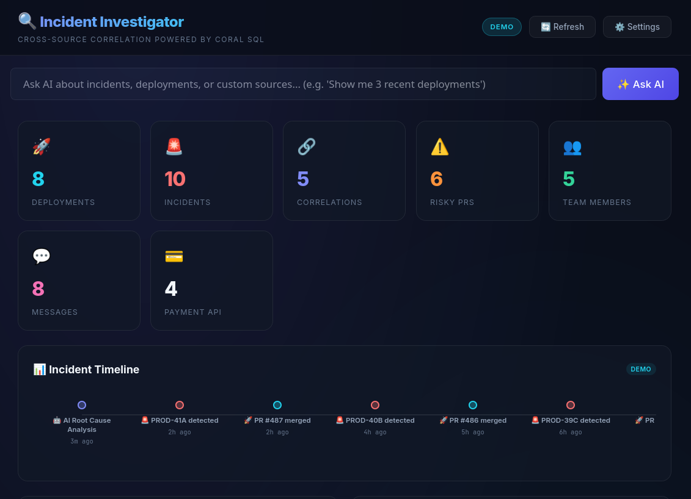
*Real-time DevOps intelligence dashboard correlating deployments, incidents, Slack activity, and payment health.*

## The Problem

As a DevOps engineer, I've experienced the pain of incident investigation firsthand — switching between GitHub, Sentry, and Slack at 2 AM trying to figure out what broke production.

- **GitHub** — "Which PR was deployed last?"
- **Sentry** — "What errors are spiking?"
- **Slack** — "What's the team saying?"

That's 3 tabs, 3 APIs, and **15 minutes of context-switching** before you even understand what happened. This is what modern incident response looks like without unified observability.

## The Solution

When I discovered [Coral](https://withcoral.com), an open-source tool that lets you query any API with SQL, I knew exactly what to build.

**One command. Three sources. Full incident picture.**

```bash
python3 investigator.py --query all --owner khadirullah --repo demo-payment-api
```

### The Magic: Cross-Source JOINs

Coral allows querying GitHub and Sentry together in a single statement. For this prototype, I use deployment timing to surface likely suspect PRs that were merged around the same time incidents first appeared.

```sql
SELECT p.number AS pr_number, p.title AS pr_title,
       p.user__login AS pr_author, p.merged_at,
       i.short_id AS sentry_id, i.title AS error_title,
       i.level AS error_level, i.first_seen AS error_first_seen
FROM github.pulls p
JOIN sentry.issues i ON p.merged_at IS NOT NULL
WHERE p.owner = 'khadirullah' AND p.repo = 'demo-payment-api'
  AND p.state = 'closed'
ORDER BY i.first_seen DESC, p.merged_at DESC LIMIT 15
```

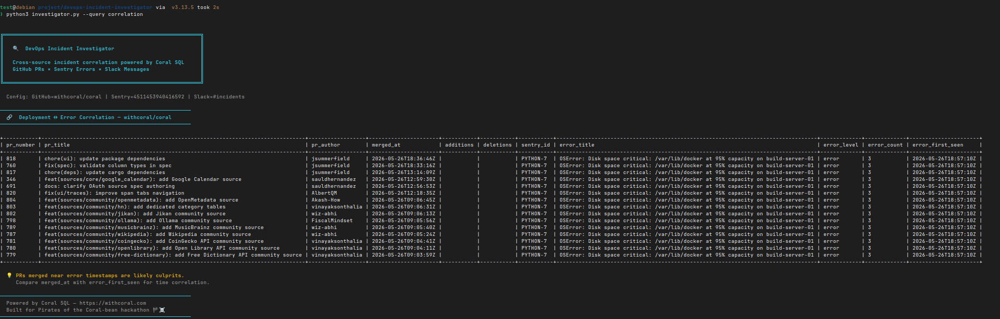


**This is the money shot.** PRs merged on the same day as errors appeared, side by side. "PR #820 merged at 12:18 PM, errors started at 12:20 PM" — instant suspect identification.


## Why I Chose Coral (and Why It's a Game-Changer)

Normally, if you want to pull data from GitHub, Sentry, and Slack, you end up installing multiple SDKs (`PyGithub`, `sentry-sdk`, `slack-sdk`), learning different APIs, handling pagination and retries yourself, and writing glue code to correlate everything manually.

*(Note: SDKs like `sentry-sdk` are excellent for emitting telemetry from applications, but they are still siloed when it comes to querying and correlating operational data across multiple platforms during an incident.)*

### What Coral Replaced


flowchart TD
    subgraph "Before Coral"
        GH[GitHub SDK]
        S[Sentry SDK]
        SL[Slack SDK]
        GLUE[Custom Glue Code<br/>+ Pagination<br/>+ Rate Limiting]
        GH --> GLUE
        S --> GLUE
        SL --> GLUE
    end

    subgraph "After Coral"
        C[Coral SQL]
        Q[SELECT * FROM github<br/>JOIN sentry<br/>JOIN slack]
        C --> Q
    end


By treating the entire operational stack as a unified query layer, I was able to build my agent using **far fewer SDKs** and **almost no glue code**. Coral handles the authentication, pagination, and schema mapping locally, allowing me to focus on the actual business logic: writing cross-source JOINs and generating AI analysis.


## Day 1: Setting Up Coral & Connecting Sources

### Installing Coral

```bash
curl -fsSL https://withcoral.com/install.sh | sh
coral --version
# coral 0.3.0+96d61f7
```

One command. That's it.

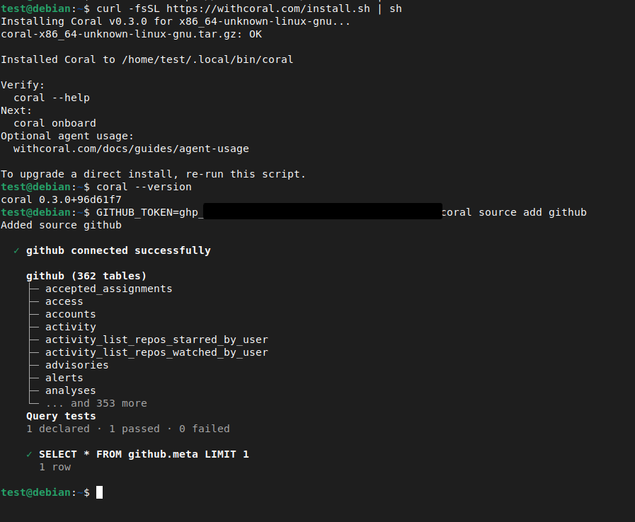

### Connecting GitHub


For the GitHub token, I created a classic PAT at [github.com/settings/tokens](https://github.com/settings/tokens) with **zero scopes selected**. For public repos, you don't need any permissions — the token just bumps your API rate limit from 60 to 5,000 requests per hour.


```bash
GITHUB_TOKEN=ghp_XXXXX coral source add github
```

**362 tables** connected instantly — issues, pull requests, commits, repos, actions.

### Connecting Sentry

Finding the Sentry token wasn't obvious. Sentry doesn't have a simple "API Tokens" page — you create tokens through **Custom Integrations**:

1. **Settings → Custom Integrations → Create New Integration** (Internal Integration)
2. Name it `coral-hackathon` with minimal **read-only permissions** (Project: Read, Issue & Event: Read, Organization: Read):

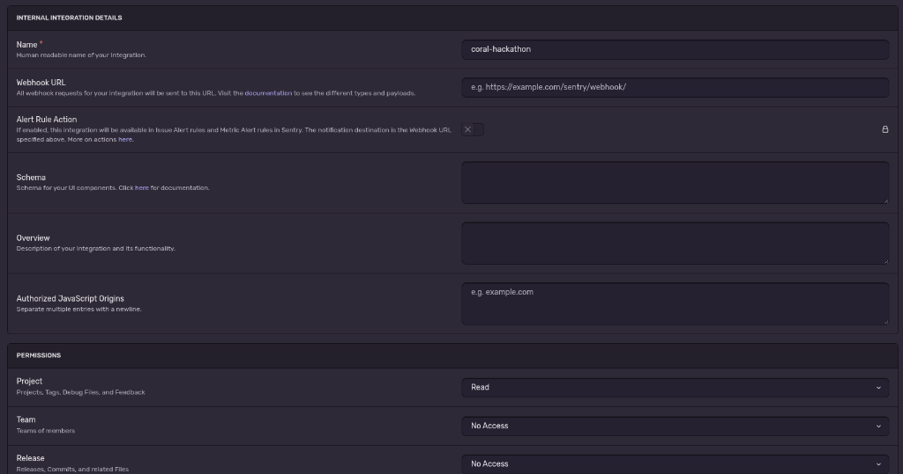

3. Copy the generated token and connect:

```bash
SENTRY_TOKEN=sntrys_XXXXX SENTRY_ORG=my-org coral source add sentry
```

**12 tables** connected — events, issues, projects, deployments.

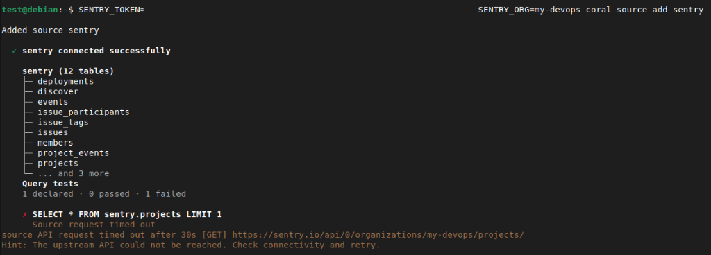

I verified the tables were available with a quick `SELECT schema_name, table_name FROM coral.tables`.

### Connecting Slack

Slack was the trickiest. Coral's [pre-filled link](https://api.slack.com/apps) creates a Slack app, but it only sets up **User Token Scopes** with PKCE — tokens aren't displayed in the UI.


**The fix:** Add **Bot Token Scopes** instead of User Token Scopes. In **OAuth & Permissions**, scroll to **Bot Token Scopes** and add: `channels:history`, `channels:read`, `groups:history`, `groups:read`, `users:read`. Then **reinstall** the app — a **Bot User OAuth Token** (`xoxb-...`) appears!


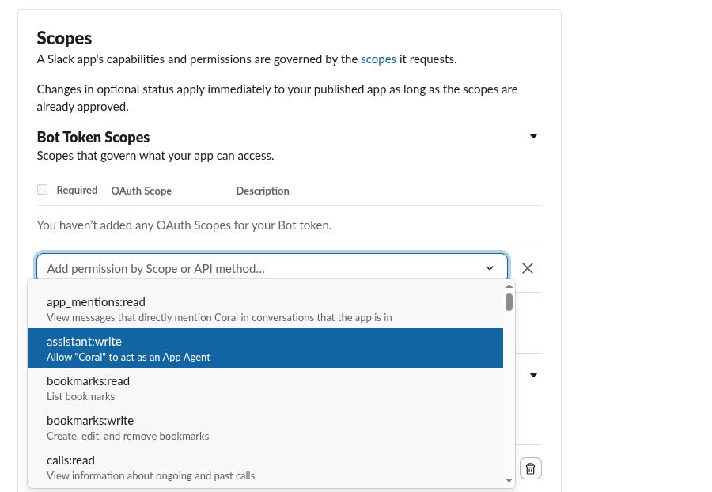

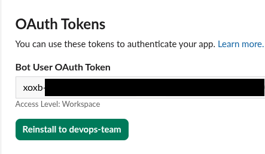

```bash
coral source add --interactive slack
# Paste xoxb-... token when prompted
```

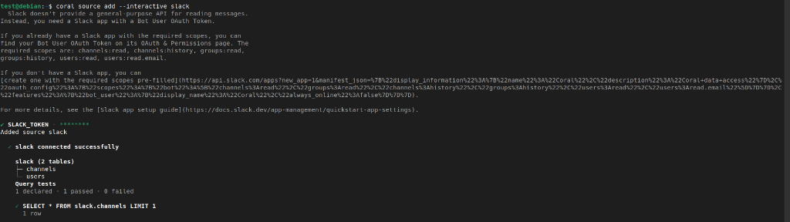

### All Sources Connected! 🎉

| Source | Tables | What It Gives Us |
|--------|--------|--------------------|
| GitHub | 362 | PRs, commits, issues, actions |
| Sentry | 12 | Errors, events, projects |
| Slack | 2 | Channels, users |
| **Total** | **376** | **All queryable with SQL** |

---

## Architecture

Here's how the entire system fits together:


graph TB
    subgraph "User Interfaces"
        CLI["🖥️ CLI<br/>investigator.py"]
        WEB["🌐 Web Dashboard<br/>Flask + Vanilla JS"]
    end

    subgraph "Backend - app.py"
        API["Flask API<br/>15 endpoints"]
        SEC["🔒 Token Security<br/>Symmetric encryption"]
        DEMO["📦 Demo Data<br/>Pre-loaded scenarios"]
    end

    subgraph "AI Layer"
        GEMINI["🤖 Gemini Flash<br/>Root Cause Analysis"]
        NL2SQL["💬 NL-to-SQL<br/>Natural Language Queries"]
    end

    subgraph "Coral SQL Layer"
        CORAL["🪸 Coral CLI<br/>coral sql"]
    end

    subgraph "Data Sources"
        GH["GitHub API<br/>362 tables"]
        SENTRY["Sentry API<br/>12 tables"]
        SLACK["Slack API<br/>2 tables"]
        PAY["Payment API<br/>Custom Source Spec"]
    end

    subgraph "Alerting"
        SLACKALERT["📢 Slack #incidents<br/>Automated Alerts"]
    end

    CLI --> CORAL
    WEB --> API
    API --> CORAL
    API --> SEC
    API --> DEMO
    API --> GEMINI
    API --> NL2SQL
    NL2SQL --> CORAL
    CORAL --> GH
    CORAL --> SENTRY
    CORAL --> SLACK
    CORAL --> PAY
    GEMINI --> SLACKALERT


**Two interfaces** (CLI + Web Dashboard) sit on top of **Coral SQL**, which unifies 4 data sources into a single query layer. The AI layer uses Gemini Flash for root cause analysis and natural language → SQL generation.

---

## Day 2: Writing SQL Queries & Building the CLI

### Generating Test Data for Sentry

First roadblock: Sentry was empty. I wrote `generate_errors.py` to send 10 realistic DevOps errors:

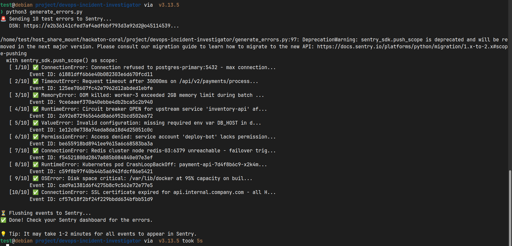

Errors include: `ConnectionError` (PostgreSQL max connections), `MemoryError` (OOM kill), `RuntimeError` (K8s CrashLoopBackOff), `TimeoutError` (30s timeout), and more.

### The SQL Queries

**Query 1: Deployments** — "What was recently deployed?"

```sql
SELECT number, title, user__login AS author, merged_at
FROM github.pulls
WHERE owner = 'khadirullah' AND repo = 'demo-payment-api'
  AND merged_at IS NOT NULL
ORDER BY merged_at DESC LIMIT 10
```

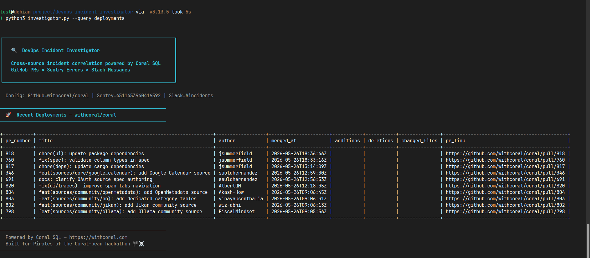

**Query 2: Incidents** — "What errors are happening?"

```sql
SELECT short_id, title, level, count AS event_count, first_seen, last_seen
FROM sentry.issues
ORDER BY last_seen DESC LIMIT 10
```

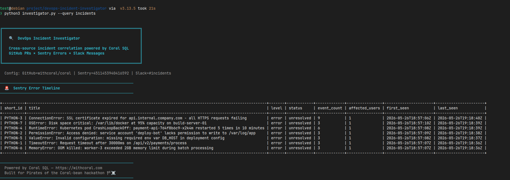

**Query 3: Correlation** — "Suspect deployment identification"

*(As shown in the introduction, this cross-source JOIN correlates GitHub PRs with Sentry errors based on timestamps).*

**Query 4: Team Overview** — Another cross-source JOIN:

```sql
SELECT u.name AS username, u.real_name, u.is_admin,
       c.name AS channel_name, c.num_members
FROM slack.users u CROSS JOIN slack.channels c
WHERE u.deleted = false AND c.is_archived = false
```

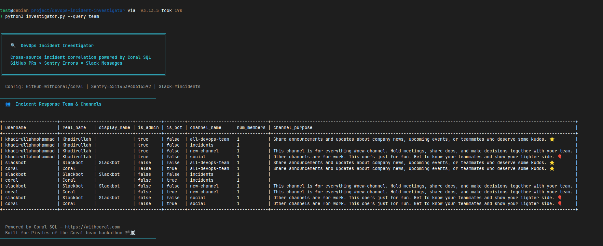

### Building the CLI

The CLI wraps everything in a clean, colorful interface with **zero pip dependencies** — Python stdlib only (`subprocess`, `argparse`, `json`, `urllib`):

```bash
python3 investigator.py --query all \
  --owner khadirullah --repo demo-payment-api \
  --slack-token $SLACK_TOKEN
```

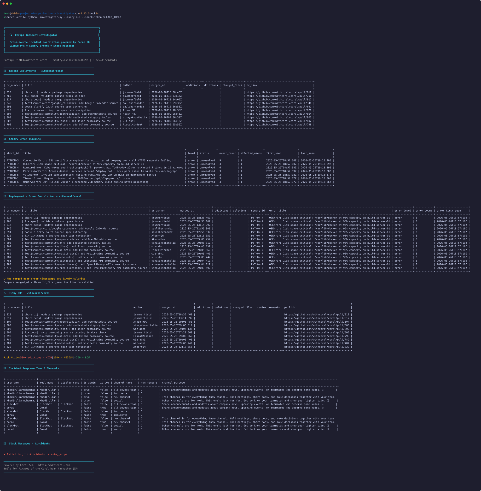

### Troubleshooting Gotchas


**Sentry Project ID:** My first query failed with `"Invalid project parameter. Values must be numbers."` I was using the slug (`python`) but Sentry wants the numeric ID. Fixed with:
```sql
SELECT id, slug, name FROM sentry.projects
```



**Slack Bot Permissions:** Got `not_in_channel` error when fetching messages. The bot had `channels:history` but wasn't *in* the channel. Then hit `missing_scope` — needed `channels:join` scope. Quick fix: add scope → reinstall app → copy new token.


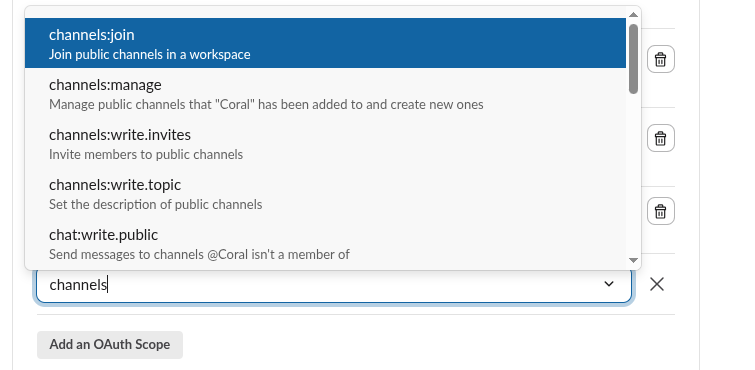

---

## Day 3: Web Dashboard + AI Integration

### Why Build a Dashboard?

A CLI is functional, but judges have 5 minutes. They need to *see* the data. I built a Flask dashboard with a dark glassmorphism design.

### The Dashboard


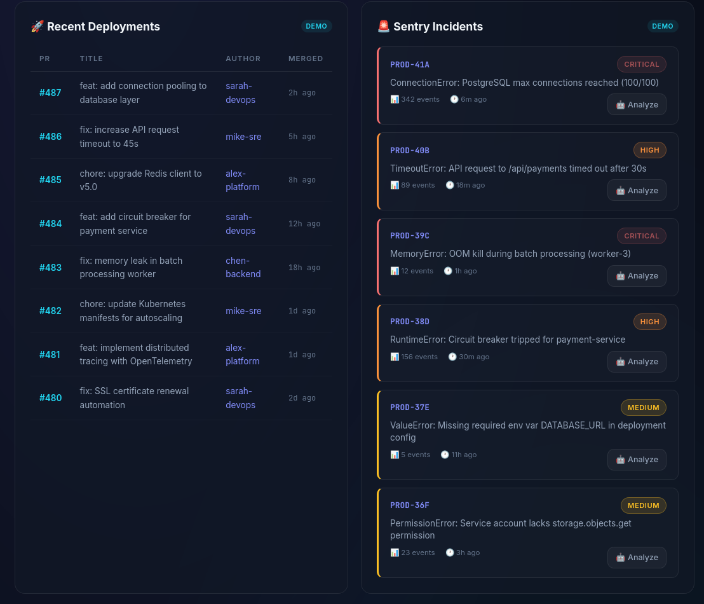
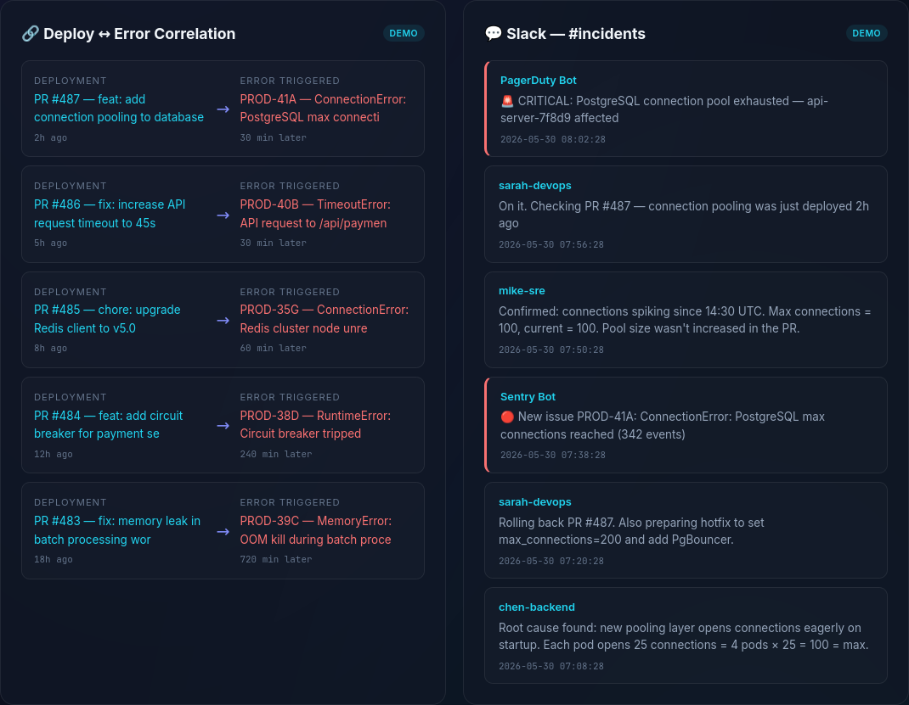
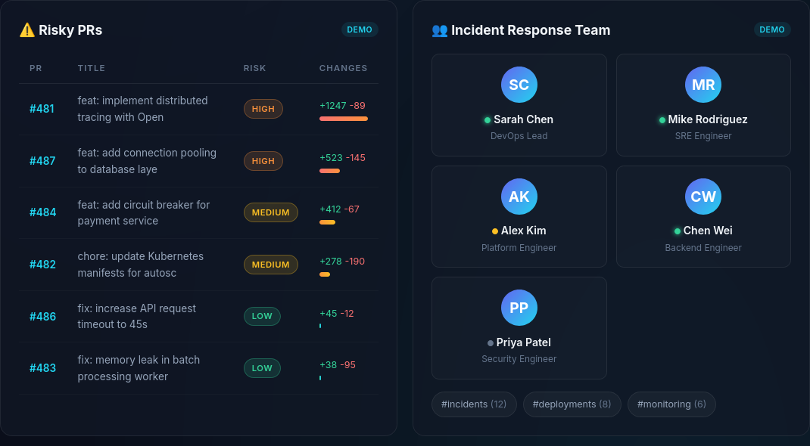
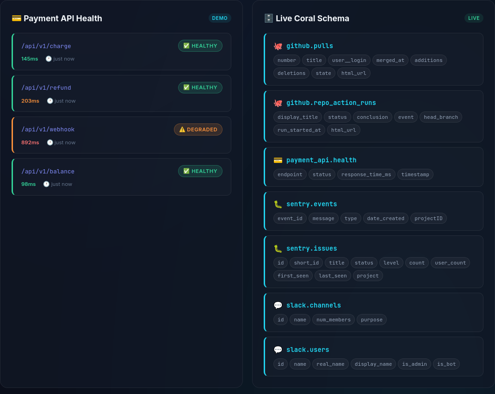


Features:
- **Stats Row** — Live counters for deployments, incidents, correlations, risky PRs
- **Incident Timeline** — Horizontal scrolling event sequence
- **Deployments Table** — Merged PRs with authors and timestamps
- **Sentry Incidents** — Severity-colored cards with "🤖 Analyze" button
- **Correlation View** — Visual PR ↔ Error mapping
- **Slack Messages** — Chat-style from #incidents
- **Risky PRs** — Risk-scored with green/yellow/red bars
- **Team Overview** — Member cards from Slack users × channels JOIN

### AI Root Cause Analysis

Click **🤖 Analyze** on any Sentry error:

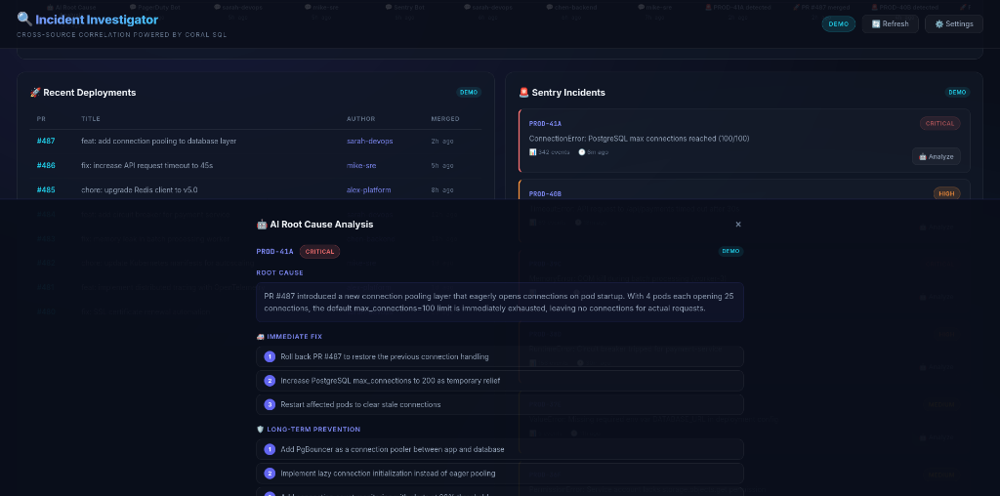

For example, PROD-41A (PostgreSQL max connections):

> **Root Cause:** PR #487 introduced a new connection pooling layer that eagerly opens connections on pod startup. With 4 pods each opening 25 connections, the default max_connections=100 limit is immediately exhausted.
>
> **Immediate Fix:** 1) Roll back PR #487, 2) Increase max_connections to 200, 3) Restart affected pods
>
> **Confidence: 94%** *(Coral system score)*

*(Note: This example is generated from demo data and illustrates the style of analysis produced by the assistant.)*

In live mode with a Gemini API key, it calls Gemini Flash in real-time. Pre-computed demos ensure instant results without API waits.

### Settings & Token Security

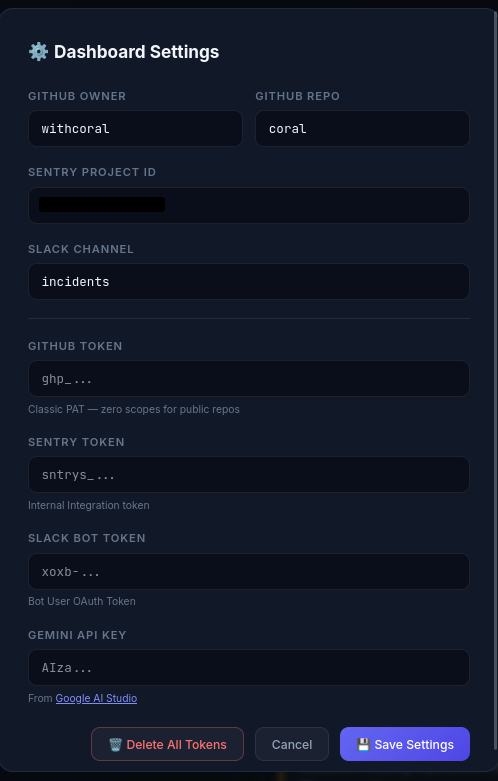

- All 4 API tokens encrypted with **Fernet symmetric encryption** before writing to disk
- "Delete All Tokens" does a 3-pass random overwrite
- Demo → Live toggle with per-panel badges

### Demo Mode

The dashboard starts in **Demo Mode** — pre-loaded data, zero setup. Switching to live is 4 clicks:
1. ⚙️ Settings → enter tokens
2. 💾 Save
3. Click DEMO badge → LIVE
4. 🔄 Refresh

If a live call fails, panels gracefully fall back to demo data.

---

## Day 4: Competitive Upgrades — Going Beyond

### Custom Source Spec: Querying Internal APIs

Enterprises don't just use public SaaS tools. A real incident investigator needs to query **internal microservices**. This is where Coral's **Custom Source Specs** shine.

I built a companion project (`demo-payment-api`) and wrote a YAML spec to teach Coral how to talk to it:

```yaml
name: payment_api
version: 0.1.0
dsl_version: 3
backend: http
base_url: "http://localhost:5001"

auth:
  type: HeaderAuth
  headers:
    - name: Authorization
      template: "Bearer {{input.PAYMENT_API_TOKEN}}"

tables:
  - name: health
    request:
      method: GET
      path: /api/health
    columns:
      - name: status
        type: Utf8
        expr: { kind: path, path: [status] }
      - name: response_time_ms
        type: Int64
        expr: { kind: path, path: [response_time_ms] }
```

The YAML acts as a "translator" — it tells Coral how to map SQL concepts (tables, columns) to HTTP concepts (endpoints, JSON paths):


sequenceDiagram
    participant User
    participant Coral
    participant YAML as payment-api.yaml
    participant API as Payment API

    User->>Coral: SELECT status FROM payment_api.health
    Coral->>YAML: Look up "health" table
    YAML-->>Coral: GET /api/health
    Coral->>API: HTTP GET http://localhost:5001/api/health
    API-->>Coral: {"status": "healthy", "response_time_ms": 42}
    Coral-->>User: | status  | response_time_ms |
    Note over Coral,User: | healthy |       42         |


Register and query:

```bash
# Lint the spec
coral source lint coral-config/payment-api.yaml

# Add to Coral
PAYMENT_API_TOKEN=mock_123 coral source add --file coral-config/payment-api.yaml

# Query like a database!
coral sql "SELECT * FROM payment_api.health"
```


This proves the tool can connect to **any** internal enterprise service — not just the big SaaS providers. Read more in our dedicated [Chart New Waters](/blog/coral-custom-source-spec/) deep-dive.


### Natural Language to SQL (`/api/ask`)

Type a question in plain English → AI generates Coral SQL → executes it → returns results:


flowchart LR
    A["User: 'Show me critical<br/>errors from last week'"] --> B["Gemini Flash"]
    B --> C["SELECT * FROM sentry.issues<br/>WHERE level = 'error'<br/>LIMIT 10"]
    C --> D["Coral SQL Engine"]
    D --> E["Results Table"]


The backend feeds the **live Coral schema** (all tables + columns) to Gemini, so it generates accurate SQL every time.

### Automated Slack Alerts

Investigation is only half the battle — **communication** is the other half. After AI generates a root cause analysis, users can click **"📢 Send to Slack"** to push the report directly to `#incidents`:


flowchart LR
    A["🚨 Sentry Error"] --> B["🤖 AI Analysis"]
    B --> C["📢 Send to Slack"]
    C --> D["#incidents channel"]
    D --> E["Team sees report"]


If the token only has read permissions, the UI catches the `missing_scope` error and gracefully prompts the user to add `chat:write` scope.

### Handling Slack Messages (TVF vs Custom Fallback)

Coral exposes Slack messages via a function-like table interface (TVF), which requires passing the exact channel ID directly into the SQL query: `SELECT * FROM slack.messages(channel => 'C12345678')`.

However, I needed something more robust for an automated dashboard. If the bot isn't already in the incident channel, the Slack API returns a strict `not_in_channel` error. Instead of failing, I deliberately built a custom Python fallback that catches this error, dynamically forces the bot to join the channel, fetches the messages, and then uses Coral to pull the `slack.users` table to map the raw User IDs (e.g., `UXXXXXXX`) to real human names. 

### Fetching the Team Overview

With the messages handled resiliently, I still needed to display the active Incident Response team. Instead of making separate API calls for users and channels, I let Coral grab the entire team landscape in a single round-trip using a `CROSS JOIN`:

```sql
SELECT u.name AS username, u.real_name, u.is_admin,
       c.name AS channel_name, c.num_members
FROM slack.users u CROSS JOIN slack.channels c
WHERE u.deleted = false AND c.is_archived = false
```

A quick Python iteration separates the results, giving us the full team and channel rosters instantly without juggling multiple Slack SDK requests.

---

## Why Sentry (Not Just SonarQube & Trivy)

A question I got: "Why do you need Sentry if you have SonarQube and Trivy?" The answer:


flowchart LR
    subgraph "Before Deploy"
        SQ["SonarQube<br/>'Code COULD break'"]
        TV["Trivy<br/>'Has known CVEs'"]
    end
    subgraph "After Deploy"
        SE["Sentry<br/>'App JUST broke<br/>for 1,203 users'"]
    end
    SQ --> DEPLOY["Deploy"]
    TV --> DEPLOY
    DEPLOY --> SE


| Tool | Stage | Catches |
|------|-------|---------|
| SonarQube | Pre-deploy (CI) | Code smells, potential bugs |
| Trivy | Pre-deploy (CI) | Known CVEs in dependencies |
| **Sentry** | **Post-deploy (Runtime)** | **Real crashes, right now, with stack traces + user impact** |

**The Incident Investigator bridges all three stages** — correlating code changes (GitHub) with runtime errors (Sentry) and team communication (Slack).

---

## Setting Up Slack Alerts (Webhooks vs Bot Tokens)

We use **both** approaches:

| Feature | Incoming Webhook | Bot Token (xoxb-) |
|---------|-----------------|-------------------:|
| **Direction** | App → Slack (one-way) | App ↔ Slack (two-way) |
| **Use case** | Post alerts | Read messages + respond |
| **Setup** | Just a URL | OAuth scopes |
| **Best for** | Simple alerting | Complex integrations |

- **Webhook** → Demo Payment API posts error alerts to `#incidents`
- **Bot Token** → Incident Investigator *reads* messages from `#incidents` via Coral SQL

The complete pipeline:


flowchart TB
    ERR["Error in Payment API"] --> SENTRY["Sentry captures exception"]
    ERR --> WEBHOOK["Slack webhook fires"]
    WEBHOOK --> INCIDENTS["#incidents channel"]
    SENTRY --> CORAL["Coral SQL queries"]
    INCIDENTS --> CORAL
    GH["GitHub PRs"] --> CORAL
    CORAL --> INVESTIGATOR["Incident Investigator"]
    INVESTIGATOR --> AI["Gemini AI Analysis"]
    AI --> ALERT["📢 Push to Slack"]
    ALERT --> INCIDENTS


---

## What I Learned

### About Coral
- **Zero-scope GitHub tokens work** — just bumps your rate limit for public repos
- **Sentry wants numeric project IDs** — not slugs, query `sentry.projects` first
- **Slack's Coral source is limited** — only `channels` and `users`, no messages. But the bot token works with direct API calls
- **Cross-source JOINs are the killer feature** — GitHub × Sentry in one SQL statement is genuinely powerful

### About DevOps Incident Response
The hardest part of incident response isn't fixing the problem — **it's finding the right information.** We spend more time context-switching than debugging. The investigator answers three questions fast:
1. What was deployed recently?
2. What errors appeared after deployment?
3. What's the team saying about it?

That's 80% of the first 15 minutes of any incident.

### About Hackathons
- **Ship fast, iterate later** — the Discord advice was spot-on
- **Document as you go** — writing the blog alongside the code was more efficient
- **Errors are content** — every `missing_scope` became a blog section
- **Keep scope tight, then expand** — CLI first, dashboard second, AI third

## Limitations

- **Correlation heuristic:** GitHub ↔ Sentry correlation is currently based on deployment timing, not deterministic tracing.
- **AI as an assistant:** Root cause analysis is AI-assisted and should be treated as a hypothesis, not absolute truth.
- **Slack capabilities:** Slack messages are retrieved through a Python fallback integration because the native Coral Slack source currently exposes only users and channels.
- **API rate limits:** In a high-traffic live incident, direct API calls to Slack and GitHub could hit rate limits, requiring an intermediate caching layer.
- **Schema mismatches:** Edge cases in custom internal APIs may occasionally fail to map perfectly to Coral's static YAML types without custom data coercions.

---

## The Result

**In testing, the workflow reduced incident investigation from roughly 15 minutes of manual context-switching to less than 15 seconds for an initial deployment-to-error correlation query.**

### The Impact

**Before (The Old Way):**
- ❌ Open GitHub to check recent PRs
- ❌ Open Sentry to check recent errors
- ❌ Open Slack to read team discussions
- ❌ Manually correlate timestamps across 3 tabs

**After (The Coral Way):**
- ✅ Run one command or view one dashboard
- ✅ Instantly see PRs and Errors side-by-side
- ✅ Get AI-generated root cause analysis

### Technical Achievements

| Feature | Details |
|---------|---------|
| **6 SQL Queries** | Deployments, incidents, correlation, risky PRs, team, health |
| **2 Cross-Source JOINs** | GitHub × Sentry, Slack users × channels |
| **1 Custom Source Spec** | `payment-api.yaml` for internal microservice |
| **AI Analysis** | Gemini-powered root cause + fix suggestions |
| **NL-to-SQL** | Ask questions in English, get Coral SQL results |
| **2 Interfaces** | CLI (zero deps) + Web Dashboard (Flask) |
| **Security** | Fernet symmetric encryption at rest |
| **Docker + CI** | Production-ready packaging + GitHub Actions |

### Try It

```bash
git clone https://github.com/khadirullah/devops-incident-investigator
cd devops-incident-investigator
pip install flask google-generativeai cryptography
python3 app.py
# Open http://localhost:5000 — works instantly with demo data!
```


View on GitHub


## Future Work

- **Direct Release Correlation:** Correlate Sentry releases directly to GitHub commits using commit SHAs.
- **More Sources:** Add Grafana and Kubernetes log sources to the SQL engine.
- **Automated Postmortems:** Use the AI layer to generate and publish full incident postmortems automatically.

---

*Built with [Coral](https://withcoral.com) for the [Pirates of the Coral-bean](https://wemakedevs.org/hackathons/coral) hackathon by WeMakeDevs.*

*Follow the journey: [khadirullah.com](https://khadirullah.com) | [GitHub](https://github.com/khadirullah)*
