This started as a simple cleanup task, but it revealed an important Git concept: deleting a file from your working tree does not remove it from repository history.

I was auditing my Hugo blog's deployment when I noticed something: **24 unused PNG screenshots** were being deployed to Cloudflare Pages on every build. They were sitting inside a Hugo page bundle. Hugo page bundles can contain resource files that participate in the build pipeline. Depending on the resource type and how the files are referenced, unused assets may still be processed or copied into generated output. This can accidentally publish assets that are never referenced.

Easy fix, right? Delete the folder, commit, push. Done.

Except it's not done. Those 3MB of PNGs still live in git history. A normal clone can download the old objects as long as they remain reachable through repository references such as branches or tags. They are invisible in the current working tree, but they remain part of reachable history until the references are rewritten. They are still stored in git's object database and reachable through old history references until those references are removed and garbage collection runs.

This post covers how I found them, removed them from history, and verified they're truly gone.


**When you'd actually need this in production:** Someone commits an API key, a 500MB dataset, or build artifacts to the repo. Deleting the file in a new commit doesn't remove it from history. Anyone with repo access can still find it. This is the procedure to purge it completely.


## Quick Answer (TL;DR)

If a secret was exposed:
1. Rotate/revoke it immediately
2. Rewrite history
3. Force push rewritten refs
4. Ask collaborators to refresh clones

For general history cleanup, deleting a file with `git rm` only removes it from future commits. To remove it from all Git history, run:

```bash
git filter-repo \
  --path path/to/file \
  --invert-paths \
  --force
```

Then force-push the rewritten history:

```bash
git push origin main --force-with-lease
```

> `--force-with-lease` is safer because it prevents overwriting remote changes you do not have locally.

Finally, verify the removal and run local garbage collection. Read on for the full investigation and safety walkthrough.

---

## Who should read this?

Choose the section based on your situation:

🟢 **Accidentally committed a large file?**
→ Jump to Cleanup Process

🔴 **Accidentally committed a password/API key?**
→ Rotate the secret first, then follow history rewrite

🔵 **Want to understand Git internals?**
→ Continue through the investigation section

🟣 **Maintaining a production repository?**
→ Read backup, tags, verification, and aftercare sections

---

## Which tool do I need?

| Situation | Tool |
|---|---|
| Remove one recent commit | `git rebase -i` |
| Remove file everywhere | `git filter-repo` |
| Replace leaked secret | `git filter-repo --blob-callback` |
| Huge files | `git filter-repo` or Git LFS |

---

## Why `git rm` Doesn't Fix This

When you run `git rm` and commit, git records: *"this file no longer exists from this commit forward."* But the original blob (the file's content) remains stored in Git's object database because the old commit history still references the blob. Once those references are removed, the object becomes unreachable and can eventually be removed by garbage collection.

```
Commit abc123 ── "Added 24 PNGs"
    └── git stored each PNG as a "blob" object in .git/objects/

Commit def456 ── "Deleted 24 PNGs"  
    └── git recorded "these files are gone from THIS version"
         BUT the blobs from abc123 still exist
```

Think of it like a filing cabinet where old copies remain until Git confirms nothing references them anymore and garbage collection removes them.

---

## Which history rewrite method do you need?

Before running commands, decide what you actually want to remove.




Use git filter-repo:

```bash
git filter-repo --path path/to/file --invert-paths --force
```

Example:
* leaked `.env`
* accidentally committed videos
* generated build files



The file itself is useful, but some content inside it must disappear.

Examples:
* remove a password from `config.yml`
* remove an API key from a JSON file
* remove a private URL

For recent commits, use interactive rebase.
For many commits, use `git filter-repo --blob-callback`.




### The complete workflow


flowchart LR
    A["🔍 Investigate"] --> B["💾 Backup"]
    B --> C["📂 Fresh Clone"]
    C --> D["🧹 filter-repo"]
    D --> E["✅ Verify"]
    E --> F["🚀 Force Push"]
    F --> G["🏷️ Update Tags"]

    style A fill:#1e3a5f,stroke:#60a5fa,color:#e0f2fe
    style B fill:#1e3a5f,stroke:#60a5fa,color:#e0f2fe
    style C fill:#1e3a5f,stroke:#60a5fa,color:#e0f2fe
    style D fill:#7c2d12,stroke:#f97316,color:#fed7aa
    style E fill:#1e3a5f,stroke:#60a5fa,color:#e0f2fe
    style F fill:#7c2d12,stroke:#f97316,color:#fed7aa
    style G fill:#1e3a5f,stroke:#60a5fa,color:#e0f2fe


---

## Step 1: Investigate and Find the Large Files

Before rewriting history, you need to know what you're dealing with.

### Find the biggest files in your entire repo history

```bash
git rev-list --objects --all \
  | git cat-file --batch-check='%(objecttype) %(objectname) %(objectsize) %(rest)' \
  | grep blob \
  | sort -k3 -n -r \
  | head -20
```

> This command is written for Unix-like shells. Windows users may need Git Bash or PowerShell equivalents.

**What each part does:**

| Command | Purpose |
|---|---|
| `git rev-list --objects --all` | Lists every object (blob, tree, commit) across all branches |
| `git cat-file --batch-check` | For each object, prints its type, hash, size, and file path |
| `grep blob` | Filters to only files (not directories or commits) |
| `sort -k3 -n -r` | Sorts by size column, numeric, reverse (biggest first) |

This is the command you run when someone asks "why is our repo 2GB?" It reveals every large file ever committed, even deleted ones.

### Find which commits touched a specific path

In my terminal (and the screenshots below), I originally ran a simple path match:

```bash
git log --oneline -- '*ScreenShots*'
```

While that works in many shells, glob matching (`*`) can behave inconsistently across different operating systems. A safer and more robust command for deep investigation is:

```bash
git log --all --name-only -- '**ScreenShots**'
```


**Why is this second version better?** 
- `--all` ensures you search across every branch in the repository's history (including deleted ones).
- `--name-only` explicitly lists the modified files.
- `**` ensures it matches folders nested deep in the repository structure regardless of your OS shell.


This tells you exactly which commits added, modified, or deleted files matching that pattern. You need this to understand what the history rewrite will affect.

### Find when a file was first added

```bash
git log --diff-filter=A --oneline -- path/to/file.txt
```

| Flag | Purpose |
|---|---|
| `--diff-filter=A` | Show only commits where the file was **A**dded (first committed) |
| `--diff-filter=D` | Show only commits where the file was **D**eleted |
| `--diff-filter=M` | Show only commits where the file was **M**odified |

This is how you trace back to the exact commit that introduced a file. Useful when you need to know "when did this secret/binary first enter the repo?"

### View a file at a specific commit

```bash
# See the file contents as they were at that commit
git show abc123:path/to/file.txt

# See what changed in that specific commit
git show abc123 --stat
```

`git show <commit>:<path>` lets you read any file at any point in history without checking it out. Combine this with `--diff-filter=A` to find the commit, then inspect exactly what was added.

### Check your repo size

```bash
du -sh .git
```

Run this before and after cleanup to verify the blobs are actually gone. In my case: **76MB before**.

### My investigation output

Here's what my actual investigation looked like:


**Note on screenshots:** The commit hashes visible in the screenshots below (such as the commit count and refs) reflect the repository state at the time this cleanup was performed. Since then, additional history rewrites have changed all commit hashes, which is exactly what `git filter-repo` does by design.


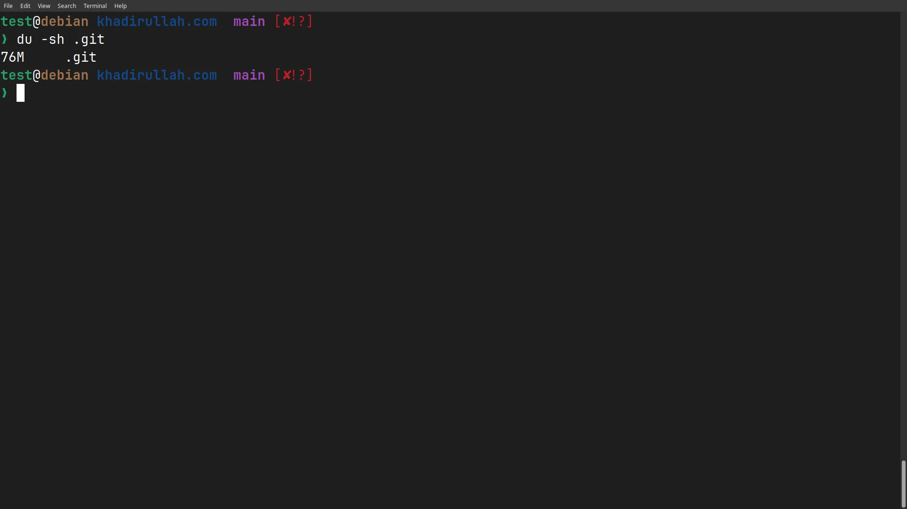

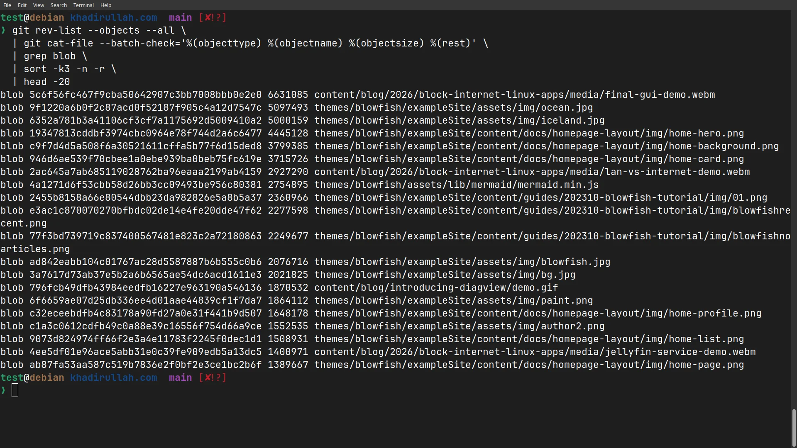

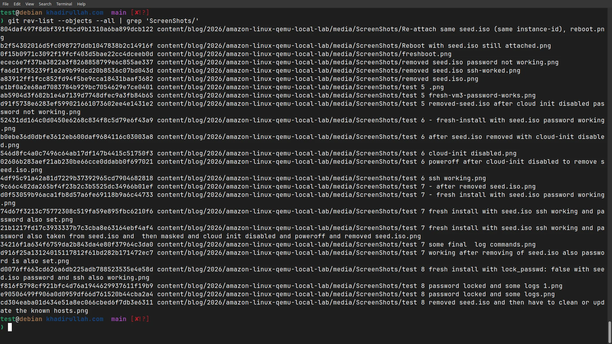

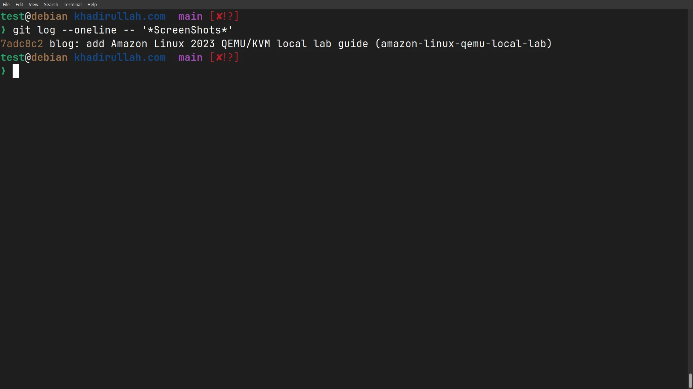

### Check current status and tracking

```bash
# What files are modified, deleted, or untracked?
git status --short

# Which remote branch is your local branch tracking?
git branch -vv
```

`git status --short` gives a compact view where each line starts with a status code:

| Code | Meaning |
|---|---|
| `M` | Modified |
| `D` | Deleted |
| `??` | Untracked (new file git doesn't know about) |
| `A` | Added (staged for commit) |

`git branch -vv` shows whether your local branch is tracking a remote branch. After `filter-repo`, the tracking info is gone, so you'll need to set it up again.

### Use `git filter-repo --analyze` for automated reports

Instead of building the bash pipeline manually, `git filter-repo` has a built-in analysis command that generates reports automatically:

```bash
git filter-repo --analyze
```

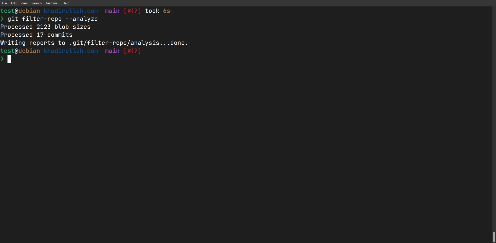

Notice the output says **"Processed 17 commits"**. I ran this while my working tree was still dirty. I hadn't committed the pending changes yet. That matters because `filter-repo` (the actual history rewrite) **requires a clean working tree**. So I had to commit first, which added one more commit, bringing the total to 18.

When I ran `--analyze` again after committing, the analysis directory already existed from the first run:

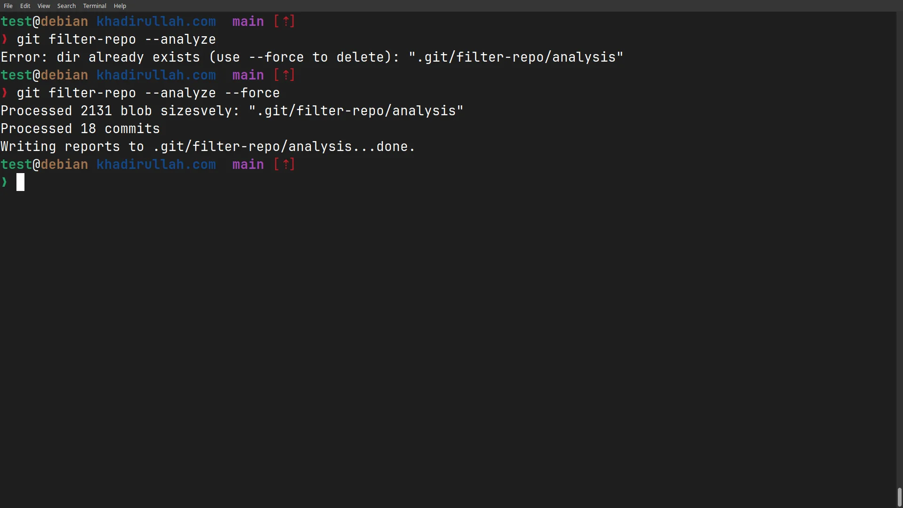

Two things to notice here:
- The `Error: dir already exists` error means you need `--force` to overwrite a previous analysis
- The commit count jumped from **17 → 18** because that extra commit is the one I made to get a clean working tree before running `filter-repo`

This creates a `.git/filter-repo/analysis/` directory with several `.txt` reports. The most useful ones:

```bash
# Which deleted files are eating the most space?
cat .git/filter-repo/analysis/path-deleted-sizes.txt | head -20

# Which deleted directories are the biggest offenders?
cat .git/filter-repo/analysis/directories-deleted-sizes.txt | head -20
```

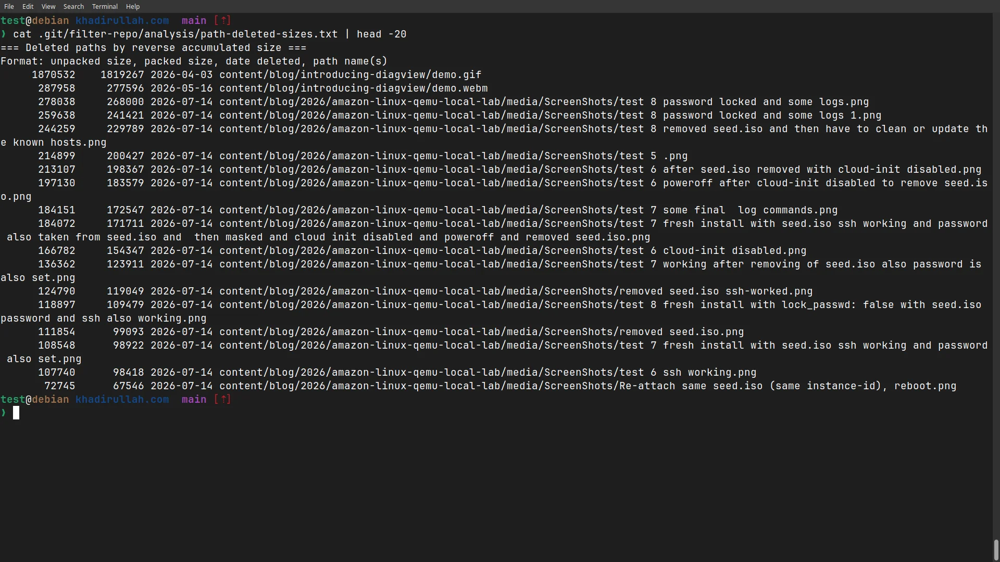

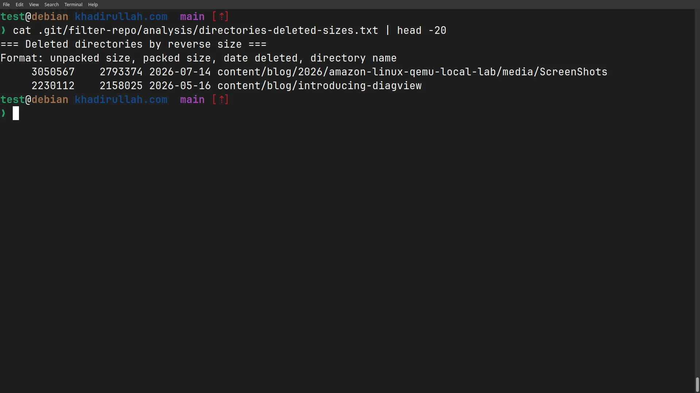

This confirmed what the manual investigation already showed: the `ScreenShots/` directory was the biggest offender among deleted content, totaling ~3MB of wasted space in the object store.

---

## Step 2: Choose Your Tool (filter-branch vs filter-repo)

There are two tools for rewriting git history. Here's the comparison:

### `git filter-branch` (the old way, deprecated)

```bash
git filter-branch --force --index-filter \
  'git rm --cached --ignore-unmatch -r path/to/folder/' \
  --prune-empty --tag-name-filter cat -- --all
```

| Flag | What it does |
|---|---|
| `--force` | Run even if a backup from a previous filter-branch exists |
| `--index-filter` | Runs a git command on every commit's index without checking out files |
| `git rm --cached --ignore-unmatch -r` | Remove from index, don't error if file doesn't exist in that commit, recursive |
| `--prune-empty` | Delete commits that become empty after removing files |
| `--tag-name-filter cat` | Rewrite tags to point to new commit hashes |
| `-- --all` | Apply to all branches and refs |

**Problems:**
- **Slow.** Spawns a shell process per commit. Hours on large repos.
- **Officially deprecated.** Git itself warns you to use `filter-repo` instead.
- **Creates backup refs** in `refs/original/` you must manually clean up.
- **Fragile quoting.** Easy to break with special characters in paths.

### `git filter-repo` (the modern way, recommended)

```bash
git filter-repo --path path/to/folder/ --invert-paths --force
```

| Flag | What it does |
|---|---|
| `--path <path>` | Select all files matching this path |
| `--invert-paths` | Flip the selection: exclude instead of include |
| `--force` | Override safety checks and allow the rewrite to run in situations where filter-repo would normally stop |

**Advantages:**
- **Often significantly faster, especially on repositories with many commits.** Processes the entire history in memory.
- **No manual cleanup.** No backup refs left behind.
- **Safer.** `git filter-repo` may remove the `origin` remote as a safety measure, especially when it detects a clone that looks like it came directly from a remote repository. This reduces the chance of accidentally pushing rewritten history before verifying the results.
- **Simple syntax.** One readable line.

**Install it:**
```bash
# Debian/Ubuntu
sudo apt install git-filter-repo

# Or via pip
pip install git-filter-repo
```

---

## Before You Rewrite History: Make a Backup

Before running any destructive commands, create a backup clone of your repository. If you make a mistake, you can safely restore from this clone.

```bash
git clone --mirror https://github.com/your-username/your-repo.git repo-backup.git
```

> **Why use `--mirror` instead of a normal clone?** A mirror clone creates a complete, 1:1 backup of the repository, including all branches, tags, remote-tracking references, and the complete object database. Unlike a regular clone, which creates a working copy and checks out only the default branch, a mirror clone copies **all Git references (`refs/*`)** and is intended specifically for backup and repository migration, making it the safest choice before rewriting history. Like all Git clones, it only backs up committed repository data, not uncommitted working directory changes.

If the rewrite unexpectedly goes wrong, you can restore from this backup:

```bash
# To get a working local copy back:
git clone repo-backup.git restored-repo
```

> The restored repository starts as a normal clone of the mirror backup.

A mirror backup is a recovery point. Do not continue normal development inside the mirror repository.

> ⚠️ **Warning:** `git push --mirror` updates **all** references on the remote (branches, tags, and other refs) to exactly match the mirror repository. Use it only when you intentionally want to restore the entire repository to the backed-up state.

```bash
# To restore the remote repository to its original state:
cd repo-backup.git
git push --mirror https://github.com/your-username/your-repo.git
```

---

## When to Actually Use This

Rewriting git history is a destructive operation. Use it only when:

| Scenario | Urgency | Action |
|---|---|---|
| **Leaked secret** (API key, password) | 🔴 Immediate | Rotate the secret first, then filter-repo |
| **Huge binary** (500MB video, dataset) | 🟡 Moderate | Filter-repo when clone times become a problem |
| **Legal/compliance** requirement | 🟡 Moderate | Filter-repo as directed |
| **3MB of PNGs** (my case) | 🟢 Low | Optional cleanup, but a useful exercise for learning history rewriting |

---

## Step 3: The Cleanup Process

Here's the exact process I followed on my repo. In my case, the path to remove was `content/blog/2026/amazon-linux-qemu-local-lab/media/ScreenShots/`.

### 3.1: Commit and push all current work first

```bash
git add -A
git commit -m "your commit message"
git push origin main
```

**Why?** Before rewriting history, commit or stash any important local changes. `git filter-repo` performs destructive history rewriting and may refuse to run in some repository states to prevent accidental data loss. It also may remove the `origin` remote as a safety measure, especially when it detects that the repository appears to be a normal clone of a remote repository. Push your latest changes so they're safe on the remote before rewriting.

### 3.2: Run filter-repo

⚠️ **Before running this command:**
- Create a backup
- Make sure your working tree is clean
- Confirm the path you are removing
- Understand that commit hashes will change

```bash
git filter-repo --path content/blog/2026/amazon-linux-qemu-local-lab/media/ScreenShots/ --invert-paths --force
```

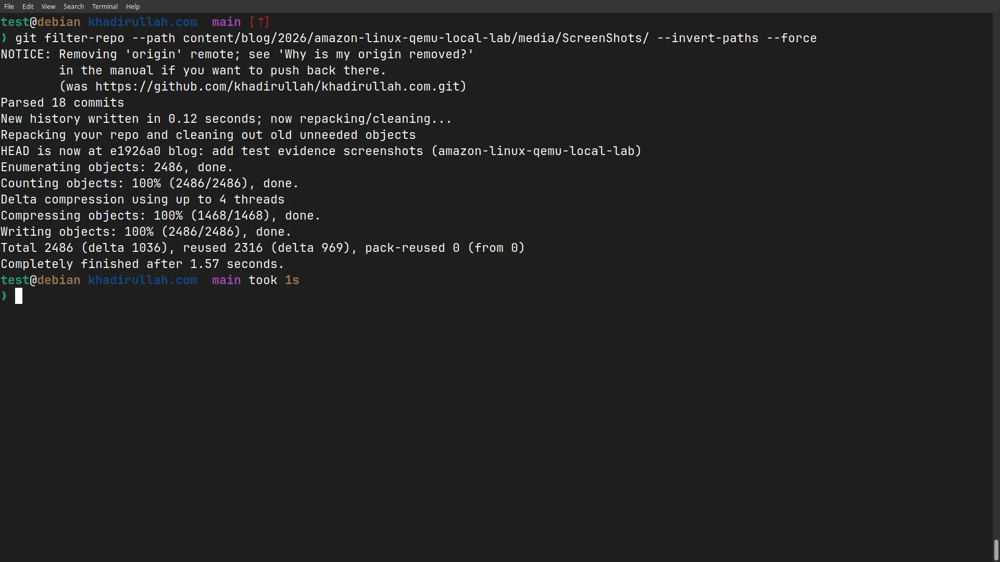

**What happens under the hood:**

1. Walks through every commit in your repo
2. For each commit, checks: "does this commit contain files in the specified path?"
3. If yes, rewrites that commit *without* those files
4. Every commit after it also gets a new hash (because its parent changed)
5. The old blobs become orphaned, and no commit points to them anymore

```
BEFORE:
  abc123 (has PNGs) → def456 → ghi789

AFTER:
  NEW_A (no PNGs) → NEW_B → NEW_C
```

Commit messages, authors, and timestamps usually remain unchanged unless explicitly modified. The edited commit receives a new hash. Every descendant commit also receives a new hash because their parent commit reference changed.

Notice the `NOTICE: Removing 'origin' remote` message. Since `git filter-repo` removed the `origin` remote in this case as a safety measure, we will add the remote back after verifying the rewritten history.

### 3.3: Add the remote back and force push

Since `filter-repo` removed our remotes as a safety feature, we need to add the remote back and force push the rewritten history.

```bash
git remote add origin https://github.com/your-username/your-repo.git

# In my screenshots, I used a standard force push because I was the only one working on this repo:
git push origin main --force

# However, the generally recommended, safer command is:
git push origin main --force-with-lease
```

> **Note:** If your branch is protected, Git may reject the force push. You may need to temporarily allow force pushes or perform the rewrite through your repository's administrative workflow.

**Why do we have to force push at all?** Every commit hash changed. Git sees the rewritten history as completely different commits. Normal `git push` says *"add my new commits on top of what's there"*, but there is no shared history to build on; the histories have diverged. Force pushing tells the remote: *"replace the existing branch history with this rewritten version."*

**Why is `--force-with-lease` better than `--force`?** A standard `--force` blindly overwrites the remote branch. If a collaborator pushed a new commit while you were running `filter-repo`, `--force` will delete their work. `--force-with-lease` checks the remote first and aborts if there are new commits you haven't seen yet.

The force push output looks like this:

```text
Enumerating objects: 52, done.
Counting objects: 100% (52/52), done.
Delta compression using up to 4 threads
Compressing objects: 100% (28/28), done.
Total 52 (delta 24), reused 48 (delta 22)
remote: Resolving deltas: 100% (24/24), done.
To https://github.com/your-username/your-repo.git
 + a1b2c3d...e5f6g7h main -> main (forced update)
```

That last line with `(forced update)` confirms the rewritten branch history replaced the old one on the remote.





### Important: Push rewritten tags too

> **Transparency Note:** My personal blog repository did not use tags, so I did not need to run these tag commands during my cleanup. However, repositories that use tags need to handle them separately. A tag that still points to an old commit can keep rewritten history reachable, and updating tags may also trigger tag-based CI/CD workflows. The following is the standard procedure for synchronizing rewritten tags.

`git filter-repo` rewrites the commits that branches and tags reference. However, tags need separate attention because remote tag references are not updated when you only force-push a branch.

If your repository uses tags, verify them after the rewrite and push updated tags explicitly. If you only run:

```bash
git push origin main --force
```

only the `main` branch is updated. Existing remote tags will continue pointing to the old commits.

Those old tag references can keep the old history reachable, including files you intended to remove.

Push the rewritten tags:

> For repositories with many tags, prefer updating specific tags rather than force-pushing the entire tag namespace.
> Example: `git push origin v1.0.0 --force`

*(If you still want to push all tags):*

```bash
git push origin --force --tags
```

> Note: This updates existing tags but does not remove remote tags that no longer exist locally.
> ⚠️ **Avoid this on shared repositories unless you have verified the tag namespace.** Updating tags can affect releases and automation.

> ⚠️ **Does pushing tags rerun CI/CD? Yes.**
> A normal branch force push (`git push origin main --force`) usually triggers workflows configured for push events on branches. A tag update (`git push origin --force --tags`) can trigger workflows configured with:
>
> ```yaml
> on:
>   push:
>     tags:
>       - '*'
> ```
>
> If your pipeline publishes releases, Docker images, or deployments from tags, verify the workflow before updating tags.

This updates existing local tags on the remote, but it does not delete remote tags that were removed locally. Use `git push origin --delete <tag-name>` for those cases.

For example, if you had a tag:

```text
v1.0.0 -> old commit containing deleted files
```

After `filter-repo`, your local tag becomes:

```text
v1.0.0 -> rewritten commit without deleted files
```

Running:

```bash
git push origin --force --tags
```

updates the remote tag:

```text
Remote before:
v1.0.0 -> old history

Remote after:
v1.0.0 -> rewritten history
```

### Removing tags that no longer exist locally

`git push --force --tags` updates tags that exist locally, but it does **not automatically delete remote tags that were removed during the rewrite**.

If you deleted a tag locally and want it removed from the remote:

```bash
git push origin --delete <tag-name>
```

Example:

```bash
git push origin --delete old-release
```

Before:

```text
Remote tags:
v1.0.0
v1.1.0
old-release
```

Local tags after cleanup:

```text
v1.0.0
v1.1.0
```

After deleting:

```text
Remote tags:
v1.0.0
v1.1.0
```

The `old-release` tag no longer keeps the old history reachable.





If you intentionally want the remote tag namespace to **exactly match** your local tags (deleting any remote tags that don't exist locally) you can use an explicit refspec with pruning:

> 🔴 **Danger: This command deletes remote tags.** Any tag that exists on the remote but is missing from your local repository will be permanently removed from the remote. If your local repo is not the complete source of truth for tags (e.g., other team members create release tags, or CI creates tags), you will lose those tags. **Only use this if you are the sole maintainer of the tag namespace.**

```bash
git push --prune origin refs/tags/*:refs/tags/*
```

This tells Git:

* Push every local tag to the matching remote tag
* **Delete** remote tags that no longer exist locally

This does not prune Git objects. It prunes remote **tag references** that are missing locally.

**Example:**

Remote tags before:

```text
v1.0.0
v1.1.0
v2.0.0
```

Local tags after filter-repo cleanup:

```text
v1.0.0
v2.0.0
```

After running the prune command:

```text
Remote tags:
v1.0.0
v2.0.0
```

The remote `v1.1.0` tag is deleted because it does not exist locally.

> 🔴 **Before running this command, verify your local tags are correct.** Run `git tag -l` locally and compare against the remote with `git ls-remote --tags origin`. If any tags are missing locally that should be kept, do not use this command. Use individual `git push origin --delete <tag-name>` instead.





> ⚠️ **Never run `git pull` between filter-repo and force push.** Pulling downloads the old history from the remote and tries to merge it with your rewritten history, defeating the entire purpose. If you accidentally pull, restore from a backup and redo the filter-repo step.





Even after all branches and tags are updated, hosting providers such as GitHub may retain unreachable objects for a period before garbage collection. In repositories with open or historical pull requests, additional internal references may also temporarily keep rewritten commits reachable.

**Working with collaborators:** Anyone who has already cloned this repository still has the old commits locally. They should re-clone the repository or carefully reset their local branches after the rewrite. Continuing to push from the old clone can accidentally reintroduce the removed history.


### 3.4: Restore upstream tracking

After rewriting history and re-adding the remote, verify your upstream tracking configuration. If it is missing, restore it with:

```bash
git branch --set-upstream-to=origin/main main
```

**What this does:** Tells git that your local `main` branch should track `origin/main`. Now `git pull` and `git push` work without specifying the branch every time.

You can verify tracking is restored:

```bash
git branch -vv
# Should show: main 7fe75b2 [origin/main] your latest commit message
```

### 3.5: Clean up local storage

```bash
git reflog expire --expire=now --all
git gc --prune=now --aggressive
```

**Why?** Even after filter-repo, old commits may still be reachable through reflogs until they expire. Git keeps these references as a safety mechanism, preventing garbage collection of the underlying objects. These commands:

- `reflog expire` → clears the safety net (we've verified everything is correct)
- `gc --prune=now` → removes unreachable objects that are no longer referenced by commits, branches, tags, or reflogs
- `--aggressive` → recompresses all objects for optimal packing

Before running this, make sure you have a backup or are confident the rewrite is correct. After garbage collection, recovering deleted objects becomes much harder.

This removes unreachable objects from your local repository. Remote hosting services run their own garbage collection schedules, so old objects may remain temporarily on platforms such as GitHub.


**Note:** The `--aggressive` flag is optional. It performs expensive recompression and is usually unnecessary for large repositories unless you specifically want maximum packing. It can take several minutes on large repositories, so don't panic if it appears to hang. On my 18-commit repo it took about 6 seconds.


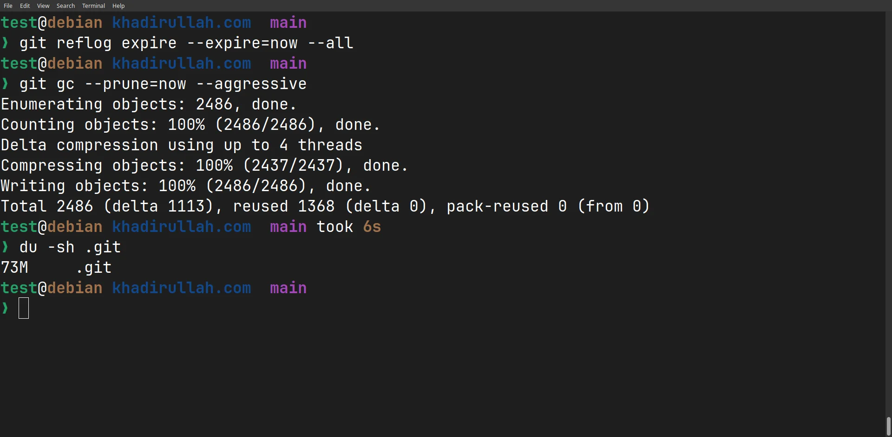

---

## Step 4: Verify

```bash
# Check repo size (should be smaller)
du -sh .git

# Confirm files are gone from history (should return nothing)
git log --all --oneline -- 'path/to/deleted/folder/'

# Confirm no matching objects in the store
git rev-list --objects --all | grep 'path/to/deleted/folder/' 
# Should return nothing

# Confirm commit count is the same
git log --oneline | wc -l

# Verify tags point to rewritten commits
git show-ref --tags

# Optional: view all refs visually
git log --all --oneline --decorate

# Verify unreachable objects are gone locally
git fsck --full --no-reflogs
```

> `git fsck` checks for unreachable objects. After a successful cleanup, the removed blobs should no longer appear as reachable objects.

If your repository uses tags, verify they point to the rewritten commits before considering the cleanup complete.

Here's my actual verification output:

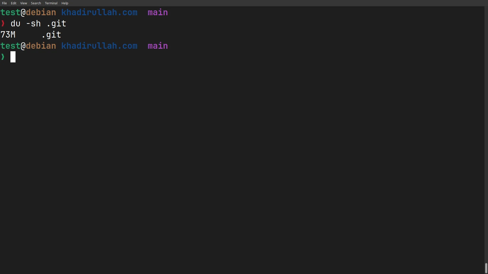

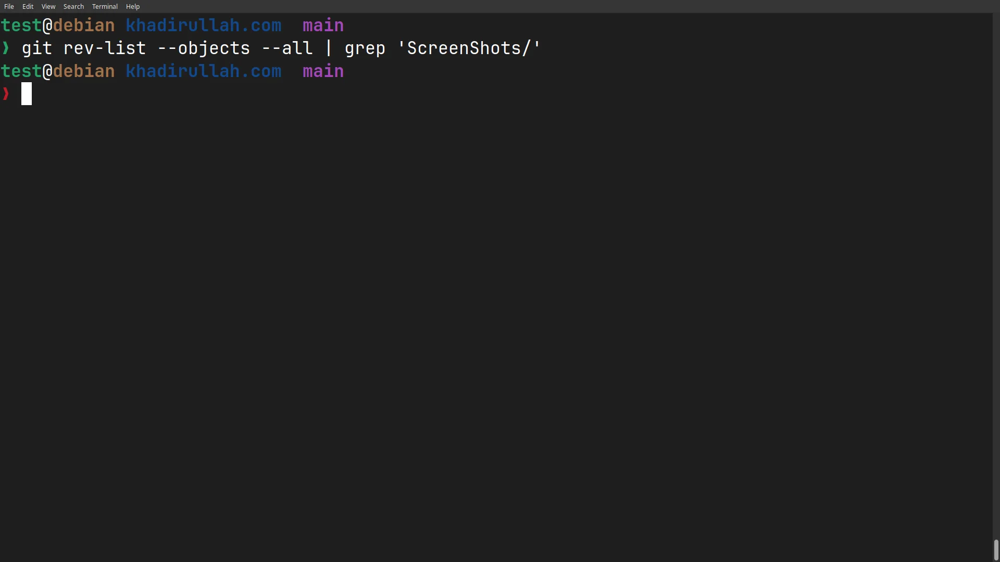

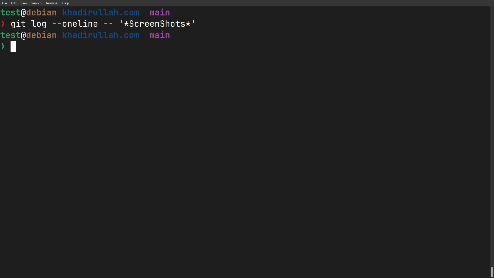

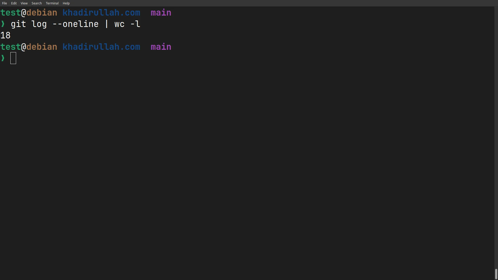

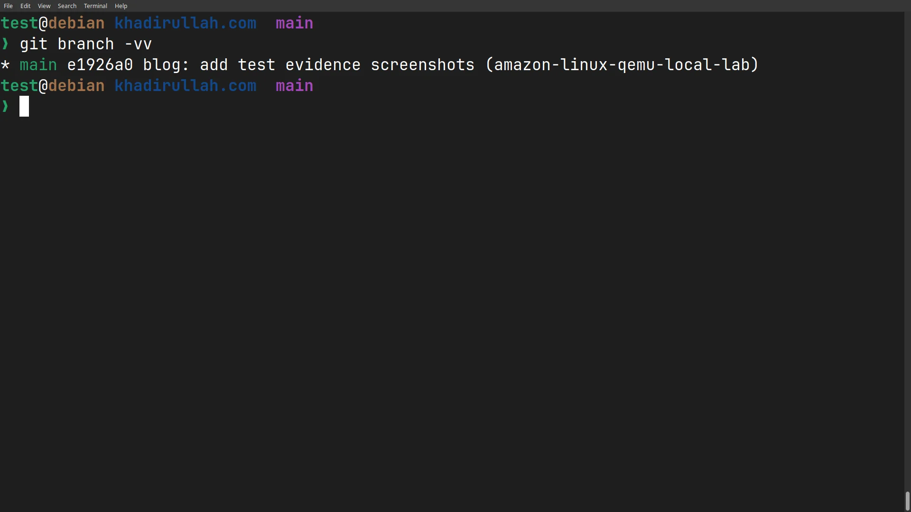

My results:

| Metric | Before | After |
|---|---|---|
| `.git` size | 76 MB | 73 MB |
| ScreenShots in history | 24 files across 1 commit | None |
| Commit count | 18 | 18 |

> **Why did the commit count stay the same?** Although every rewritten commit received a new hash, the total number of commits stayed the same because `git filter-repo` rewrote existing commits rather than removing them. The count changes only if commits become empty and are removed, for example when using pruning options that remove commits with no remaining changes.

The PNG files themselves were around 3MB, and we saw a corresponding 3MB drop (76MB to 73MB) in the repository size.

---

## Why My Repository Only Shrunk 3MB

You might wonder why removing 24 PNGs totaling 3MB only reduced the repository size from 76MB to 73MB. Git does not store files as simple 1-to-1 copies on disk. It packs objects, uses delta compression, and deduplicates identical files. In larger repositories, removing a 3MB directory does not always reduce the `.git` folder by exactly 3MB. The real value of this process is understanding how to remove unwanted history, especially secrets or large artifacts that can be hundreds of megabytes.

---


## Prevention: Stop It from Happening Again

The real DevOps skill isn't the cleanup, it's making sure you never need it:

### `.gitignore`

Block common offenders before they're ever committed:

```gitignore
# Build artifacts
public/
resources/

# Large media you don't want in git
*.psd
*.mp4
*.zip
```

### Pre-commit hooks

Use [pre-commit](https://pre-commit.com/) to block large files automatically:

```yaml
# .pre-commit-config.yaml
repos:
  - repo: https://github.com/pre-commit/pre-commit-hooks
    rev: v4.6.0
    hooks:
      - id: check-added-large-files
        args: ['--maxkb=500']
```

### Git LFS

For repos that legitimately need large files (design assets, datasets), use [Git LFS](https://git-lfs.com/) to store them outside the git object database.

---

## Advanced: Removing Specific Content from Git History

Sometimes the problem is not an entire file.

Example:
- A config file contains both safe settings and a leaked password
- Deleting the whole file would remove useful history
- You only need to remove the sensitive line

There are two approaches depending on the situation:

| Problem | Tool |
|---|---|
| Remove a folder from every commit | `git filter-repo --path --invert-paths` |
| Replace a leaked password everywhere | `git filter-repo --blob-callback` |
| Fix one recent commit before pushing | `git rebase -i` |

For example, imagine you committed this file months ago:

```text
config.txt

DATABASE_HOST=db.example.com
DATABASE_USER=app
DATABASE_PASSWORD=mysecretpassword
LOG_LEVEL=info
```

You still need the configuration file and its history, but the password string itself must disappear from every previous commit.





If the commit is recent enough that rewriting the following commits is practical, interactive rebase is the simplest approach. If the commit has already been pushed to a shared branch, coordinate with your team before force pushing.

> ⚠️ **Important:** Interactive rebase rewrites commit hashes. Avoid using it on shared branches unless you understand the impact. The commit hash of that commit and all later commits will change, and collaborators will need to synchronize with the rewritten history.

```bash
# Find the commit that added the lines
git log --diff-filter=A --oneline -- config.txt
# Output: abc123 feat: add database configuration

# Start interactive rebase from one commit BEFORE the target
git rebase -i abc123~1
```

**What `abc123~1` means:** The `~1` suffix means "one commit before `abc123`." Rebase needs to start from the commit *before* the one you want to edit, because it replays commits starting from that point forward.

Your editor opens with a list of commits:

```text
pick abc123 feat: add database configuration
pick def456 fix: update logging
pick ghi789 docs: update README
```

Change `pick` to `edit` for the target commit:

```text
edit abc123 feat: add database configuration
pick def456 fix: update logging
pick ghi789 docs: update README
```

Save and close. Git pauses at that commit. Now edit the file:

```bash
# Remove the 2 offending lines from config.txt
nano config.txt

# Stage the fix
git add config.txt

# Amend the paused commit (keeps the same message)
git commit --amend --no-edit

# Continue replaying the remaining commits
git rebase --continue
```

**What happened:** Git rewound history to `abc123`, let you edit it, then replayed all subsequent commits on top. The rewritten history no longer contains those 2 lines.

> ⚠️ **After any rebase that changes history, you need to force push:**
>
> ```bash
> git push origin main --force
> ```





If the sensitive content appears in multiple commits or you need to search-and-replace across the entire history:

```bash
git filter-repo --blob-callback '
if b"DB_PASSWORD=example_password" in blob.data:
    blob.data = blob.data.replace(
        b"DB_PASSWORD=example_password",
        b"DB_PASSWORD=REDACTED"
    )
' --force
```

This scans blobs during the history rewrite process and replaces the matching byte sequence wherever it appears. Use this when the sensitive value may exist across multiple commits and you do not know exactly which commits contain it.

> ⚠️ **Security Warning:** This only replaces the exact byte sequence you provide; it does not automatically detect secrets. If the value was a real password, API key, or token, rotate it immediately before or during the cleanup process. Rewriting Git history removes references from the repository, but anyone who accessed the secret before the rewrite may still have it.





---

## Quick Reference Card

| Task | Command |
|---|---|
| Find largest files in history | `git rev-list --objects --all \| git cat-file --batch-check='%(objecttype) %(objectname) %(objectsize) %(rest)' \| grep blob \| sort -k3 -n -r \| head -20` |
| Find commits that touched a path | `git log --all --oneline -- 'path/*'` |
| Check repo size | `du -sh .git` |
| Check file status (compact) | `git status --short` |
| Check branch tracking | `git branch -vv` |
| Find when a file was first added | `git log --diff-filter=A --oneline -- path/to/file` |
| View file at a specific commit | `git show <commit>:path/to/file` |
| Analyze repo for large/deleted files | `git filter-repo --analyze` |
| Verify objects exist in history | `git rev-list --objects --all \| grep 'path/to/check/'` |
| Purge a path from all history | `git filter-repo --path <path> --invert-paths --force` |
| Re-add remote after filter-repo | `git remote add origin <url>` |
| Force push rewritten history | `git push origin main --force` |
| Restore upstream tracking | `git branch --set-upstream-to=origin/main main` |
| Edit a specific past commit | `git rebase -i <commit>~1` |
| Replace specific content across history | `git filter-repo --blob-callback '<script>' --force` |
| Clear reflog and garbage collect | `git reflog expire --expire=now --all && git gc --prune=now` |

`--aggressive` can be added when deeper repacking is needed, but it is slower and usually unnecessary.

---

## Aftercare: Repository Consumers

After rewriting history:

- Developers should delete old clones or re-clone
- CI runners with cached repositories should be refreshed
- Docker build caches should be rebuilt if they copied repository contents
- Forks and mirrors may still contain the old objects

---

## Copy-Paste Summary

```bash
# Backup
git clone --mirror <repo-url>

# Analyze
git filter-repo --analyze

# Remove path
git filter-repo --path <path> --invert-paths --force

# Verify
git log --all -- <path>

# Push rewritten history
git push origin main --force-with-lease
```

---

## Conclusion

Most developers rarely need to rewrite Git history. It becomes important when something goes wrong and you need to understand what is actually stored inside your repository.

In my case, the problem was only a few unused PNG screenshots. They were not causing a major issue, but they gave me a chance to understand how Git objects work, why deleted files can still remain in history, and how history rewriting, verification, and garbage collection fit together.

The main thing I learned is that removing a file from the current branch is not the same as removing it from repository history. Git is designed to preserve history, which is one of its strengths, but accidental commits remain part of repository history until their references are removed and garbage collection makes the objects unreachable.

A leaked secret, a large binary file, or unwanted build artifacts can become a much bigger problem than a few screenshots. In those situations, knowing how to investigate the repository, create a backup, rewrite history safely, and verify the result can save a lot of time.

History rewriting should still be treated carefully. It changes commit hashes, requires force pushing, and can affect other people working with the repository. Anyone who already cloned the repository may still have the old history locally. After a rewrite, collaborators should re-clone or carefully reset their local branches before pushing new changes. Before doing it on an important project, make sure you understand the impact and have a recovery plan.

For future projects, preventing the problem is always easier than cleaning it up later. A proper `.gitignore`, pre-commit checks, secret scanning, and Git LFS for large files can prevent many of these situations before they happen.

Accidental commits happen in real-world software projects. Understanding how Git stores data and knowing how to recover from these situations is a valuable skill.

---

## References & Documentation

- [git-filter-repo (Official GitHub)](https://github.com/newren/git-filter-repo) : The recommended tool for rewriting git history
- [Git Documentation: git-filter-branch](https://git-scm.com/docs/git-filter-branch) : The deprecated predecessor (includes the recommendation to use filter-repo)
- [GitHub Docs: Removing sensitive data](https://docs.github.com/en/authentication/keeping-your-account-and-data-secure/removing-sensitive-data-from-a-repository) : GitHub's official guide for purging secrets
- [GitHub Docs: About secret scanning](https://docs.github.com/en/code-security/secret-scanning/about-secret-scanning) : Prevent secrets from being committed in the first place
- [Git Internals: Git Objects](https://git-scm.com/book/en/v2/Git-Internals-Git-Objects) : How blobs, trees, and commits work under the hood
- [pre-commit framework](https://pre-commit.com/) : Automate checks before every commit
- [Git LFS](https://git-lfs.com/) : Large File Storage for git repos

