I needed to update my Hugo theme (Blowfish) from v2.97.0 to the latest version. The theme was supposed to be a git submodule. My `.gitmodules` file said so. So I ran the standard update command:

```bash
git submodule update --remote --merge
```

Nothing happened. No output, no errors, no update.

I tried the manual approach:

```bash
cd themes/blowfish
git pull origin main
```

It pulled from **my site repository**, not the Blowfish theme repository. Something was fundamentally broken.

This post covers how I diagnosed the problem, fixed the submodule, and then dealt with the Cloudflare Pages deployment failure that came immediately after.


**Backstory:** I originally set up the Blowfish theme using `git submodule add`, and my `.gitmodules` was correctly configured from the start. But at some point while troubleshooting config issues, I deleted the `themes/` folder and copy-pasted the theme files back manually. I didn't realize that this single action silently destroyed the submodule — Git replaced the submodule's internal `160000 commit` gitlink with a regular `040000 tree` entry, turning it into ordinary tracked files. The `.gitmodules` file stayed behind untouched, so everything *looked* correct. It wasn't until I tried to update the theme months later that I discovered the mismatch.

Hugo themes support multiple installation methods — **git submodule**, **manual copy**, and **Hugo modules**. Manually copying files into `themes/` is a [perfectly valid installation method](https://blowfish.page/docs/installation/). The problem arises specifically when your repo has a `.gitmodules` entry claiming a submodule exists, but Git's index tracks the files as regular committed files. That state conflict is what causes `git submodule update` to silently do nothing.



**Related:** After fixing this submodule issue, I discovered that the old theme files were still bloating my git history. I wrote a separate guide on how I cleaned them up: [Removing Objects From Git History with git filter-repo](/blog/git-filter-repo-clean-history/).


## Quick Answer (TL;DR)

If `git submodule update` does nothing and `git submodule status` returns empty output, your theme was committed as regular files, not as a proper submodule.

**Fix it:**

```bash
# 1. Remove the fake submodule files
git rm -rf themes/blowfish

# 2. Clean cached submodule data
rm -rf .git/modules/themes/blowfish

# 3. Remove the stale .gitmodules entry
git config --file .gitmodules --remove-section submodule.themes/blowfish

# 4. Commit the removal
git add .gitmodules
git commit -m "fix: remove improperly tracked theme files"

# 5. Re-add as a proper submodule
git submodule add https://github.com/nunocoracao/blowfish.git themes/blowfish
git commit -m "feat: add blowfish theme as proper git submodule"
```

Then update `HUGO_VERSION` in your deployment platform to match the version the new theme requires.

---

## The Symptoms

Three clues told me this wasn't a real submodule:

### 1. No `.git` file inside the theme directory

A properly initialized submodule has a `.git` **file** (not a directory) that points to the parent repo's `.git/modules/` folder:

```bash
ls -la themes/blowfish/.git
```

```text
# Expected (proper submodule):
-rw-r--r-- 1 user user 43 Jul 15 00:55 themes/blowfish/.git

# What I got:
ls: cannot access 'themes/blowfish/.git': No such file or directory
```

### 2. `git submodule status` returned nothing

```bash
git submodule status
```

```text
# Expected:
 1f14448333d43207780f1a97317562a3b9ddbbd0 themes/blowfish (v2.104.0)

# What I got:
(empty, no output at all)
```

### 3. Git commands inside the theme directory operated on the parent repo

```bash
cd themes/blowfish
git remote -v
```

```text
# Expected:
origin  https://github.com/nunocoracao/blowfish.git (fetch)

# What I got:
origin  https://github.com/khadirullah/khadirullah.com (fetch)
```

The `themes/blowfish/` directory had no git identity of its own. Git treated it as part of the parent repository.

---

## The Root Cause

Hugo themes can be installed in three ways: as a **git submodule**, as **manually copied files**, or as a **Hugo module**. All three are valid — even the Blowfish theme [documents all three methods](https://blowfish.page/docs/installation/).

In my case, I originally installed Blowfish as a proper submodule using `git submodule add`. But later, while troubleshooting config issues, I deleted the `themes/` folder and copy-pasted the theme files back manually. What I didn't realize is that this single action silently destroyed the submodule.

### Why deleting and re-adding files breaks a submodule

Internally, Git tracks a proper submodule as a special entry called a **gitlink** — a `160000 commit` object that points to a specific commit in the external repository:

```text
# What a proper submodule looks like in Git's index:
160000 commit abc123...    themes/blowfish
^^^^^^
# This is a gitlink — Git knows this is an external repo
```

When you delete a submodule directory and copy-paste the files back manually, Git replaces the gitlink with a **regular tree** — a `040000 tree` object that treats the files as part of your main repository:

```text
# What happened after I deleted and copy-pasted:
040000 tree 6aaaa7...    themes/blowfish
^^^^^^
# This is a regular directory — Git treats these as your own files
```

These mode numbers are part of Git's internal file type system (derived from Unix file permissions). Here's a quick reference:

| Mode | Type | What it means |
|---|---|---|
| `100644` | `blob` | Regular file (not executable) |
| `100755` | `blob` | Executable file |
| `040000` | `tree` | Regular directory — files are stored in your repo |
| `160000` | `commit` | **Gitlink (submodule)** — only a commit hash is stored, files live in the external repo |
| `120000` | `blob` | Symbolic link |

You can check what mode Git is using for any path with `git ls-tree HEAD <path>`. If your submodule shows `040000 tree` instead of `160000 commit`, it's broken.

The `.gitmodules` file isn't affected by this — it stays behind, still claiming the submodule exists. But Git's index now disagrees, creating a silent conflict.

The result was a contradictory state:

- `.gitmodules` said *"there's a submodule at `themes/blowfish`"*
- Git's index said *"these are regular tracked files"*
- No submodule metadata existed in `.git/modules/`

This kind of mismatch can happen to anyone — all it takes is deleting and re-adding theme files without using `git submodule add`. The `.gitmodules` file alone doesn't make something a submodule. Git needs the full submodule registration.


**⚠️ Actions that silently destroy a submodule:**
- Deleting the submodule directory and copy-pasting files back
- Running `rm -rf themes/your-theme` followed by manually adding files
- Using your file manager to drag-and-drop theme files into the directory
- Any operation that replaces the directory without going through `git submodule add`

**The safe way to reinstall a submodule** is to always use `git submodule deinit` + `git rm` to remove it, and `git submodule add` to re-add it.



flowchart TD
    A["git submodule add URL themes/blowfish"] --> B["✅ Proper submodule\n(160000 commit gitlink)"]
    C["Copy files into themes/blowfish/\n(no .gitmodules entry)"] --> D["✅ Valid manual install\n(040000 tree)"]
    E["Delete submodule dir + copy files back\n(stale .gitmodules remains)"] --> F["❌ Broken state\n(.gitmodules ≠ Git index)"]

    B --> G["git submodule update works"]
    D --> H["Update manually by\nre-downloading the theme"]
    F --> I["git submodule update\nsilently does nothing"]

    style A fill:#1e3a5f,stroke:#60a5fa,color:#e0f2fe
    style B fill:#14532d,stroke:#4ade80,color:#dcfce7
    style C fill:#1e3a5f,stroke:#60a5fa,color:#e0f2fe
    style D fill:#14532d,stroke:#4ade80,color:#dcfce7
    style E fill:#7c2d12,stroke:#f97316,color:#fed7aa
    style F fill:#7f1d1d,stroke:#ef4444,color:#fecaca
    style G fill:#14532d,stroke:#4ade80,color:#dcfce7
    style H fill:#14532d,stroke:#4ade80,color:#dcfce7
    style I fill:#7f1d1d,stroke:#ef4444,color:#fecaca


---

## The Fix

The solution is to remove the tracked files, clean up submodule metadata, and re-add the theme as a proper submodule.

### Step 1: Remove the theme files from git tracking

```bash
git rm -rf themes/blowfish
```

This removes all the theme files from git's index and from disk. The `-rf` flag handles the recursive directory removal.

### Step 2: Clean cached submodule data

```bash
rm -rf .git/modules/themes/blowfish
```

This removes any partial submodule metadata that might exist from a previous failed initialization attempt. If the directory doesn't exist, the command silently succeeds.

### Step 3: Remove the old `.gitmodules` entry

```bash
git config --file .gitmodules --remove-section submodule.themes/blowfish
```

This cleans up the stale submodule configuration. If you had other submodules, their entries remain untouched.

### Step 4: Stage and commit the removal

```bash
git add .gitmodules
git commit -m "fix: remove improperly tracked theme files"
```

At this point, your repository has no theme, which is correct. The next step brings it back properly.

### Step 5: Re-add as a proper submodule

```bash
git submodule add https://github.com/nunocoracao/blowfish.git themes/blowfish
```

This does three things:
1. Clones the latest version of the Blowfish repository into `themes/blowfish/`
2. Creates a `.git` file inside `themes/blowfish/` pointing to `.git/modules/themes/blowfish/`
3. Updates `.gitmodules` with the correct submodule entry

### Step 6: Commit the proper submodule

```bash
git commit -m "feat: add blowfish theme as proper git submodule"
```

### Step 7: Verify

```bash
# Check the submodule is recognized
git submodule status
# Output: 1f14448333d43207780f1a97317562a3b9ddbbd0 themes/blowfish (v2.104.0)

# Check the .git file exists
ls -la themes/blowfish/.git
# Output: -rw-r--r-- 1 user user 43 Jul 15 00:55 themes/blowfish/.git

# Check the theme version
cat themes/blowfish/package.json | grep version
# Output: "version": "2.104.0",

# Build the site
hugo serve
```

---

## Future Updates Now Just Work

With the submodule properly set up, updating the theme is a single command:

```bash
git submodule update --remote --merge
```

To pin the submodule to track the `main` branch (recommended for themes that follow semantic versioning):

```bash
git config -f .gitmodules submodule.themes/blowfish.branch main
git add .gitmodules
git commit -m "fix: pin blowfish submodule to main branch"
```

After updating, always test your site before pushing:

```bash
hugo serve
```

Theme updates can introduce breaking changes: new shortcodes, renamed partials, or changed CSS classes. Review the theme's changelog before updating to a major version.

---

## Quick Diagnostic Checklist

If your Hugo theme submodule isn't behaving correctly, run through these checks:

| Check | Command | Expected (working) | Broken |
|---|---|---|---|
| `.git` file exists | `ls themes/your-theme/.git` | File exists (43 bytes) | `No such file` |
| Submodule status | `git submodule status` | Shows commit hash + path | Empty output |
| Remote URL | `cd themes/your-theme && git remote -v` | Theme repo URL | Your site repo URL |
| Theme version | `cat themes/your-theme/package.json \| grep version` | Current version | Outdated version |

If any of these fail, your theme is not a real submodule. Follow the fix above.

---

## Why This Matters

> **Note:** If you intentionally installed your Hugo theme by copying files (without submodules), this section doesn't apply to you. Manual installs work fine — you just update by re-downloading the theme. This guide is specifically for repos where `.gitmodules` claims a submodule exists but Git doesn't actually track one.

A broken submodule is invisible until you need it. Your site builds fine, your deployments work, everything looks normal. The problem only surfaces when you try to update, and by then, you've been shipping an outdated theme for months.

For Hugo sites specifically:
- **Security patches** in the theme won't reach you
- **New shortcodes** (like `accordion` in Blowfish v2.100+) won't be available
- **Hugo version compatibility** fixes won't apply, and your build warnings pile up
- **CI/CD pipelines** that run `git submodule update --init --recursive` will either fail silently or clone an empty directory

---

## The "Gotcha": Cloudflare Pages Deployment Failure After Fixing

I fixed the submodule locally, everything worked in `hugo serve`, so I committed and pushed the fix.

And then my Cloudflare Pages deployment immediately crashed.

### What happened

Locally, everything built perfectly because I was running a modern version of Hugo:

```bash
$ hugo version
hugo v0.164.0-ce2470e7012b5ab5fc4e10ebe4027e9f8d9e00dc+extended linux/amd64 BuildDate=2026-07-06T16:39:30Z VendorInfo=gohugoio
```

But on Cloudflare Pages, the build failed with this error:

```text
2026-07-15T10:22:25.178761Z Detected the following tools from environment: hugo@extended_0.152.2
2026-07-15T10:22:27.074274Z WARN  Module "blowfish" is not compatible with this Hugo version
2026-07-15T10:22:27.211531Z Error: error building site: render: failed to render pages:
  execute of template failed: template: index.html:3:47:
  executing "index.html" at <site>: can't evaluate field Locale in type *langs.Language
```

When I updated the Blowfish theme submodule to the latest version, it pulled in code that required Hugo `0.158.0` or higher. However, in my Cloudflare Pages **Settings > Environment variables**, I had hardcoded `HUGO_VERSION` to `0.152.2` months ago.

Because Cloudflare was forced to use an older Hugo version, it couldn't understand the new `Locale` fields in the updated theme templates, causing the entire build to fail.

### Diagnosing the failure

The first clue was in the Cloudflare Pages deployment dashboard. The build settings showed `HUGO_VERSION` was stuck at the old value:

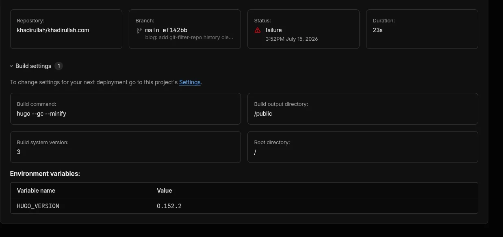

GitHub's integration also reported the failure immediately:

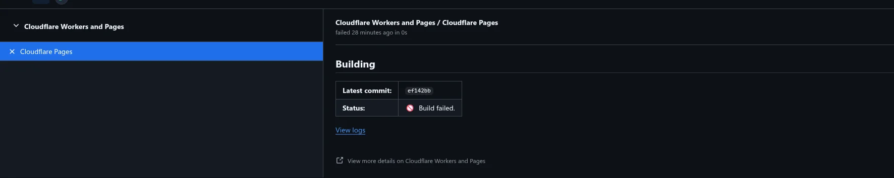

### Step-by-step fix on Cloudflare Pages

Here is exactly how to fix the Hugo version mismatch on Cloudflare Pages:

**1. Go to Settings > Variables and Secrets**

In the Cloudflare Pages dashboard, navigate to your project's **Settings** tab, then find **Variables and Secrets** in the sidebar. You'll see the old `HUGO_VERSION` value:

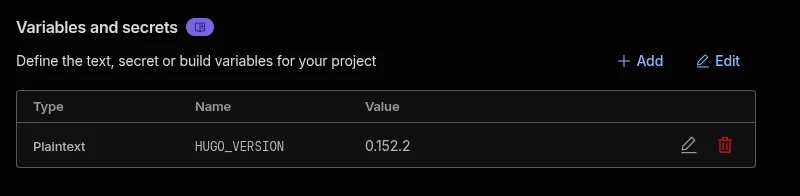

**2. Edit the `HUGO_VERSION` variable**

Click **Edit**, then update the value to match your local Hugo version. In my case, I changed it from `0.152.2` to `0.164.0`:

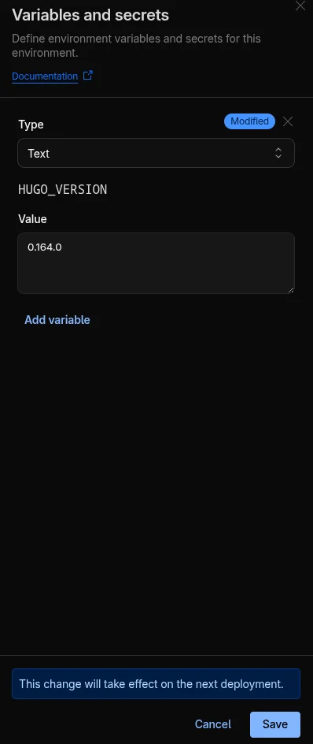

**3. Verify the saved value**

After saving, confirm the variable shows the updated version:

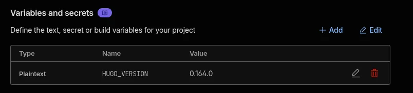


**Important:** If you look at the build settings right now on a previous deployment, they may *still* show the old version. The new value only takes effect on the **next** deployment.


**4. Navigate to the failed deployment**

Go to the **Deployments** page. You'll see the failed deployment listed:

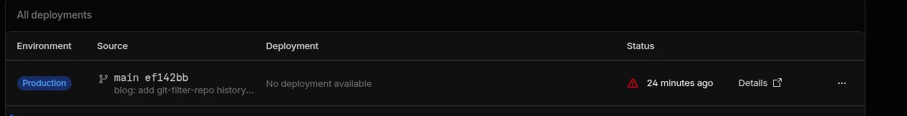

**5. Retry the deployment**

Click **View Details** on the failed deployment, then click **Manage deployment** and select **Retry deployment**:

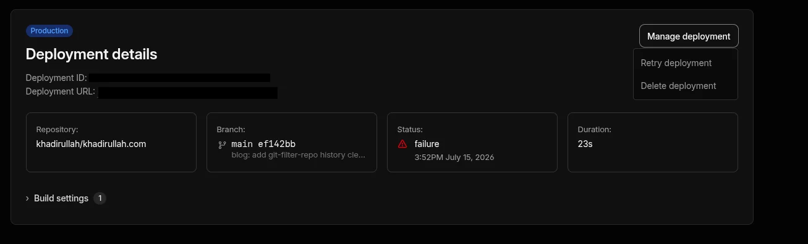

**6. Watch it build**

The retried deployment will pick up the new Hugo version. You'll see the status change to "active":

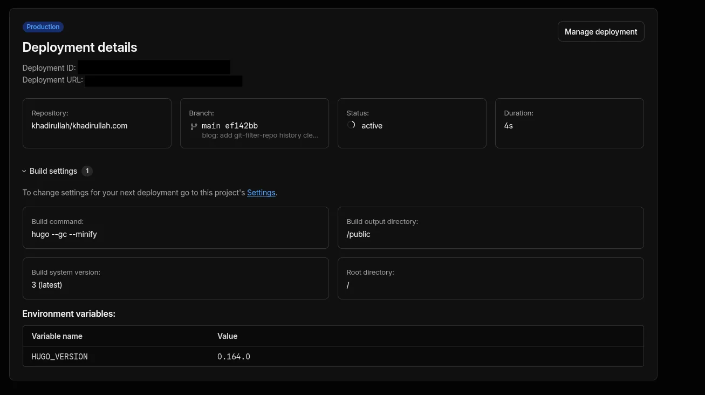

**7. Confirm success**

After the build completes, the deployment status should show "success":

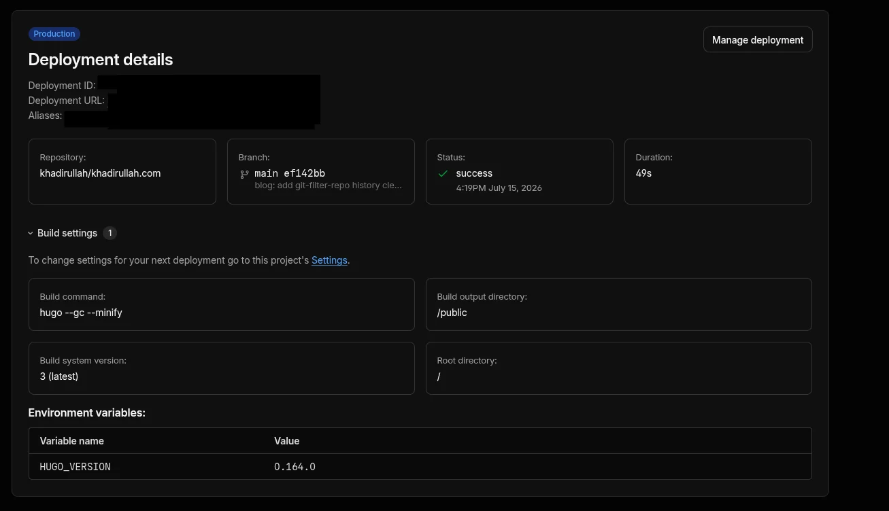

The build log confirms everything worked. All four stages (initialize, clone repo, build, deploy) passed:

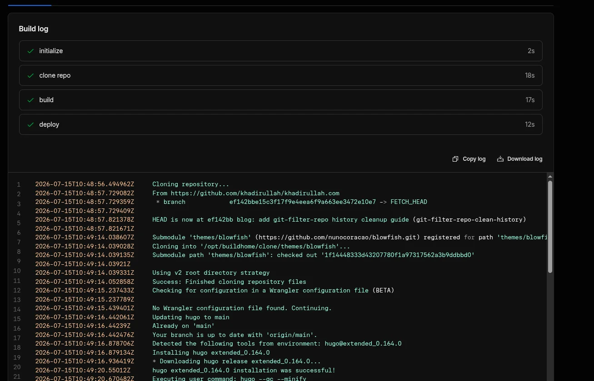

Notice line 6 in the build log: *"Submodule 'themes/blowfish' (https://github.com/nunocoracao/blowfish.git) registered for path 'themes/blowfish'"*. This confirms Cloudflare is now properly cloning the submodule during the build process. Before the fix, the theme files were just regular files in the repo, so no submodule cloning happened.

**8. Verify on GitHub**

GitHub's integration also updates to show the successful deployment:

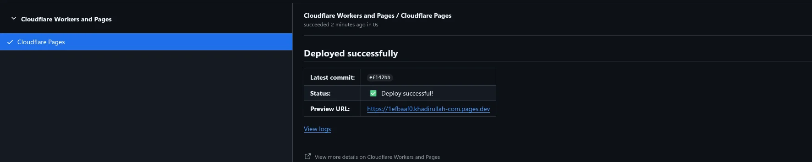

**9. Final state**

The deployments page now shows both the failed (old) and successful (retried) deployments:

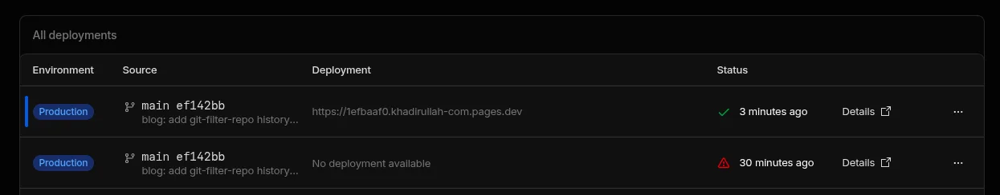

### Other deployment platforms

If you're not using Cloudflare Pages, update the Hugo version in your platform's configuration:

| Platform | Where to update |
|---|---|
| **Cloudflare Pages** | Settings → Variables and Secrets → `HUGO_VERSION` |
| **GitHub Actions** | `.github/workflows/*.yml` → `hugo-version` in the hugo-setup action |
| **Netlify** | `netlify.toml` → `HUGO_VERSION` environment variable |
| **Vercel** | `vercel.json` or Project Settings → Environment Variables |





Hugo themes declare minimum version requirements in their `config.toml` or `module.toml`. When a theme updates to use new Hugo features (like the `Locale` field added in Hugo 0.158.0), older Hugo versions can't parse the templates.

This is especially common with actively maintained themes like Blowfish that take advantage of new Hugo APIs soon after they're released.

The timeline in my case:

1. **Months ago:** Set `HUGO_VERSION=0.152.2` in Cloudflare Pages
2. **July 2026:** Fixed the submodule, which pulled Blowfish v2.104.0
3. **Blowfish v2.104.0** requires Hugo ≥ 0.158.0
4. **Cloudflare** tried to build with Hugo 0.152.2 → template error

The fix: always check the theme's minimum Hugo version after updating, and keep your deployment platform's Hugo version in sync with your local version.




**Pin your Hugo version in your repo**, not just in your deployment platform:

```toml
# In your site's config/_default/config.toml or hugo.toml
[module]
  [module.hugoVersion]
    extended = true
    min = "0.158.0"
```

This makes Hugo print a clear warning if someone tries to build with an incompatible version, instead of failing with a cryptic template error.

You can also add a version check to your CI pipeline:

```bash
REQUIRED_VERSION="0.158.0"
CURRENT_VERSION=$(hugo version | grep -oP '\d+\.\d+\.\d+' | head -1)
if [ "$(printf '%s\n' "$REQUIRED_VERSION" "$CURRENT_VERSION" | sort -V | head -n1)" != "$REQUIRED_VERSION" ]; then
  echo "ERROR: Hugo $CURRENT_VERSION is below minimum $REQUIRED_VERSION"
  exit 1
fi
```





---

## Cleaning Up the Old Theme Files From Git History

After fixing the submodule, I noticed that the old theme files (hundreds of files from the improperly committed copy) were still taking up space in my git history. Even though they were removed from the current working tree, the old commits still referenced them.

If you find yourself in the same situation and want to clean up the bloat, I've written a detailed guide on how to do it: **[Removing Objects From Git History with git filter-repo](/blog/git-filter-repo-clean-history/)**.

---

## Summary

| Problem | Solution |
|---|---|
| `git submodule update` does nothing | Theme was committed as regular files. Remove and re-add properly |
| `.gitmodules` exists but `git submodule status` is empty | The submodule was never properly registered with `git submodule add` |
| Deployment fails after fixing the submodule | Update `HUGO_VERSION` in your deployment platform to match the new theme's requirements |
| Old theme files still in git history | Use `git filter-repo` to purge them ([guide](/blog/git-filter-repo-clean-history/)) |

Fix it once, and every future update is one command.
