I wanted a personal website — a place to publish blog posts, share my projects, and have a professional online presence. I didn't want WordPress, I didn't want to pay for hosting, and I didn't want to manage a server just for a blog.

After some research, I landed on **Hugo** (static site generator) + **Blowfish** (theme) + **Cloudflare Pages** (free hosting). This post walks through exactly how I set it all up.

## Why Hugo?

| Option | Why I Skipped It |
|--------|-----------------|
| WordPress | Needs a server, database, PHP. Overkill for a blog. Security headaches. |
| Ghost | Needs hosting and a database. Paid plans for managed hosting. |
| Jekyll | Slower build times. Ruby dependency. |
| Next.js | Overkill — I don't need React for static blog posts. |
| **Hugo** | ✅ Fast, no dependencies, single binary, massive theme ecosystem, Markdown-based. |

Hugo generates static HTML files from Markdown. No database, no server-side code, no PHP. Just HTML, CSS, and JS files that any CDN can serve.

## Why Blowfish?

I tried several Hugo themes before settling on [Blowfish](https://blowfish.page/). Here's what sold me:

- **Dark mode by default** — looks professional, easy on the eyes
- **Profile layout** — homepage shows my photo, bio, and links
- **Built-in features** — search, table of contents, code copy, breadcrumbs, related content
- **Shortcodes** — timeline, alerts, GitHub repo cards, mermaid diagrams, buttons
- **Responsive** — works well on mobile without extra effort
- **Active maintenance** — regularly updated with new features

## Project Setup

### Installing Hugo

Hugo is a single binary. On Fedora:

```bash
sudo dnf install hugo
```

On Debian/Ubuntu:

```bash
sudo apt install hugo
```

On macOS (Homebrew):

```bash
brew install hugo
```

Verify:

```bash
hugo version
```

Many Hugo themes, including Blowfish, require the **extended** version of Hugo for SCSS/SASS support.

### Creating the Site

```bash
hugo new site khadirullah.com
cd khadirullah.com
git init
```

### Adding Blowfish as a Git Submodule

```bash
git submodule add -b main https://github.com/nunocoracao/blowfish.git themes/blowfish
```

Using a Git submodule means the theme stays in its own repository. When Blowfish gets updated, I can pull the latest version without modifying my site's code.

Blowfish also supports Hugo Modules, but I chose Git submodules because they're simpler to understand and work well with standard Git workflows.

## Configuration

Hugo + Blowfish uses a multi-file configuration system inside `config/_default/`. Here's what each file does:

### hugo.toml — Core Site Settings

```toml
theme = "blowfish"
baseURL = "https://khadirullah.com/"
defaultContentLanguage = "en"
enableRobotsTXT = true
enableEmoji = true
buildDrafts = false

[outputs]
  home = ["HTML", "RSS", "JSON"]  # JSON enables search

[sitemap]
  changefreq = 'weekly'
  filename = 'sitemap.xml'
```

Key decisions:
- `enableRobotsTXT = true` — generates a `robots.txt` for search engines
- `JSON` output — enables Blowfish's built-in search feature
- `buildDrafts = false` — draft posts don't get published

### languages.en.toml — Author and Site Info

```toml
title = "Khadirullah Mohammad"

[params.author]
   name = "Khadirullah Mohammad"
   email = "contact@khadirullah.com"
   headline = "DevOps & Cloud Engineer"
   bio = "Former IT fixer turned DevOps Engineer..."
   links = [
     { github = "https://github.com/khadirullah" },
     { linkedin = "https://linkedin.com/in/khadirullah" },
     { email = "mailto:contact@khadirullah.com" },
   ]
```

### params.toml — Theme Customization

```toml
colorScheme = "ocean"
defaultAppearance = "dark"
autoSwitchAppearance = false

enableSearch = true
enableCodeCopy = true
smartTOC = true

[homepage]
  layout = "profile"
  showRecent = true
  showRecentItems = 5
  cardView = true

[article]
  showHero = true
  heroStyle = "big"
  showTableOfContents = true
  showReadingTime = true
  sharingLinks = ["linkedin", "x-twitter", "reddit", "email"]
```

Key decisions:
- `colorScheme = "ocean"` — a blue-toned dark theme
- `layout = "profile"` — homepage shows my avatar, bio, and social links
- `heroStyle = "big"` — blog posts get a large featured image at the top
- `sharingLinks` — readers can share posts directly to LinkedIn, X, Reddit, or email

## Content Structure

Hugo uses a specific directory structure:

```
content/
├── _index.md              # Homepage content
├── about/
│   └── index.md           # About page
└── blog/
    ├── _index.md           # Blog listing page
    ├── block-internet-linux-apps/
    │   ├── index.md        # The blog post (Markdown)
    │   ├── featured.svg    # Hero image for the post
    │   └── media/          # Screenshots and videos
    └── introducing-diagview/
        ├── index.md
        ├── featured.webp
        └── demo.webm
```

Each blog post lives in its own directory. This keeps images, videos, and the post itself together — no messy `/static/images/post-name/` paths.

### Writing a Blog Post

Every post starts with **front matter** — metadata in YAML format:

```yaml
---
title: "How to Block Internet Access for Any Linux App"
date: 2026-03-25
draft: false
description: "A deep-dive guide to restricting internet..."
summary: "Block outbound internet for specific Linux apps..."
tags: ["linux", "ufw", "firewall", "security"]
categories: ["Tutorials"]
---
```

- `draft: true` → post exists locally but doesn't get published
- `tags` → appear at the bottom of the post, help readers find related content
- `categories` → used for grouping (I use "Tutorials" and "Projects")
- `description` → used for SEO `<meta>` tag
- `summary` → shown on the blog listing page

Then the content is just standard Markdown — headings, code blocks, tables, links. Blowfish also supports shortcodes for richer content like alerts, timelines, mermaid diagrams, and GitHub repo cards.

## Deployment on Cloudflare Pages

### Why Cloudflare Pages?

| Option | Cost | Why I Chose/Skipped |
|--------|------|---------------------|
| GitHub Pages | Free | Good, Simple and reliable, but less flexible than Cloudflare Pages for build configuration and edge/CDN features |
| Netlify | Free tier | Good, but 100GB bandwidth limit on free tier |
| Vercel | Free tier | Designed for Next.js/React, overkill for static HTML |
| AWS S3 + CloudFront | Pay per use | Too complex for a blog, billing anxiety |
| **Cloudflare Pages** | ✅ **Free tier** | Global CDN, generous bandwidth limits, automatic HTTPS, custom domains, and Git-based deployments|

### Setting Up Cloudflare Pages

1. **Push your Hugo site to GitHub** — the entire project, including content and config
2. **Go to Cloudflare Dashboard → Pages → Create a project**
3. **Connect your GitHub repository**
4. **Set the build settings:**

| Setting | Value |
|---------|-------|
| Framework preset | Hugo |
| Build command | `hugo` |
| Build output directory | `public` |
| Environment variable | `HUGO_VERSION` = `0.147.6` (or your version) |
| Environment variable | `HUGO_ENV` = `production` |


**Important:** Set the `HUGO_VERSION` environment variable to match your local Hugo version. Cloudflare's default Hugo version is old and may not support newer features. Check your version with `hugo version`.


5. **Click "Save and Deploy"** — Cloudflare builds your site and gives you a `.pages.dev` URL

### Custom Domain Setup

After the initial deploy:

1. **Go to your Cloudflare Pages project → Custom domains**
2. **Add `khadirullah.com`** — Cloudflare automatically creates the DNS record (since I already use Cloudflare DNS)
3. **Add `www.khadirullah.com`** — redirects to the root domain
4. **HTTPS** — automatic, no configuration needed

### Automated Deployments

This is the best part: **every time I push to the `main` branch, Cloudflare automatically builds and deploys the updated site.** No manual steps, no SSH, no FTP.



```bash
# Write a new blog post
hugo new content blog/my-new-post/index.md
# Edit the post...

# Deploy
git add .
git commit -m "Add new blog post"
git push origin main
# Done — Cloudflare builds and deploys automatically
```

Build time is usually under 30 seconds. The site is live globally on Cloudflare's CDN within a minute.

## The Resume Page

My [resume](/resume/) is a standalone HTML page inside `static/resume/index.html`. It doesn't use Hugo's templating — it's pure HTML + CSS with:

- **Print-optimized CSS** — `window.print()` generates a clean PDF
- **Inter font** from Google Fonts
- **Responsive design** — works on mobile
- **A "Save as PDF" button** — uses the browser's print dialog

Since it's in the `static/` directory, Hugo copies it as-is to the output — no Markdown processing.

## What I Learned

1. **Static sites are enough for blogs** — I don't need a database, a CMS, or server-side code. Markdown → HTML → CDN. Simple.
2. **Git submodules for themes** — keeps the theme updatable without mixing it into my code
3. **Cloudflare Pages free tier is genuinely usable** — generous bandwidth limits, automatic HTTPS, and Git-push deploys. For a static personal site, the free tier has been more than enough.
4. **Content next to assets** — Hugo's page bundle structure (`post-name/index.md` + images in the same folder) is much cleaner than maintaining a separate global images directory.
5. **Write in Markdown, publish everywhere** — the same Markdown files can be rendered by Hugo, GitHub, VS Code, or any Markdown reader

## The Stack

| Layer | Tool | Cost |
|-------|------|------|
| Static site generator | Hugo | Free |
| Theme | Blowfish | Free (open source) |
| Hosting | Cloudflare Pages | Free |
| DNS | Cloudflare | Free |
| Domain | khadirullah.com | ~$10/year |
| Version control | Git + GitHub | Free |
| Email | Zoho Mail | Free tier |
| **Total** | | **~$10/year** (domain only) |

## Resources & Documentation

If you're interested in building your own setup like this, here are the official docs that helped me along the way:
- **[Hugo Documentation](https://gohugo.io/documentation/)** — The official docs for the Hugo static site generator.
- **[Blowfish Theme Docs](https://blowfish.page/docs/)** — Excellent documentation for configuring the Blowfish theme, including all shortcodes and layout options.
- **[Cloudflare Pages](https://developers.cloudflare.com/pages/)** — Guide on deploying frameworks and static sites on Cloudflare Pages.

---

The source code for this website is public: 
