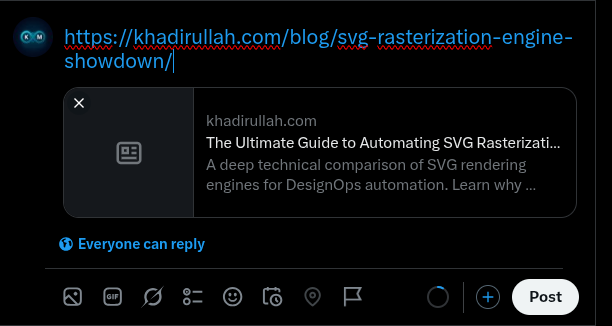
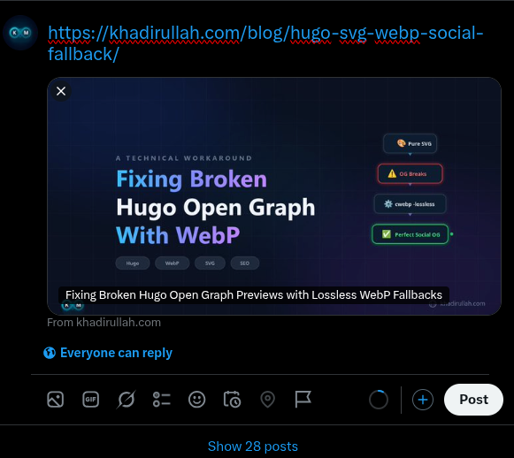
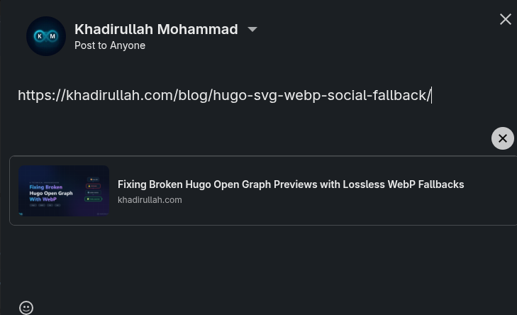
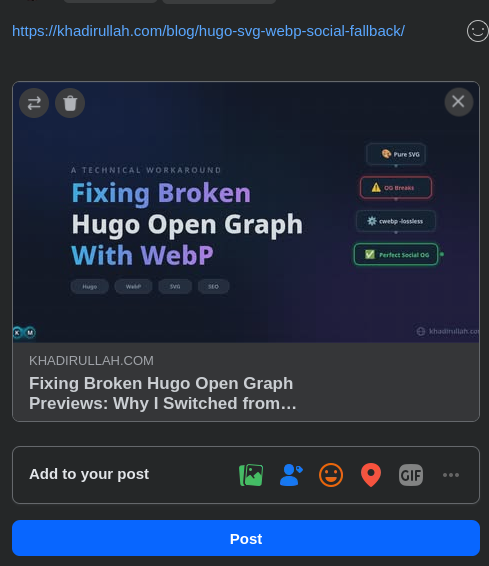
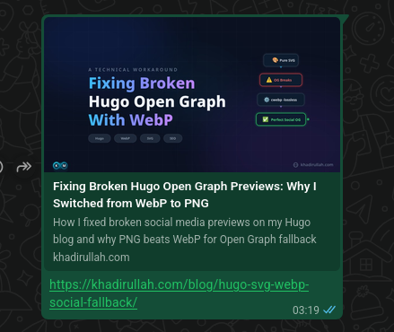

Vector graphics (SVGs) are the holy grail of modern web design. They render with pixel-perfect clarity on any screen size, maintain incredibly small file sizes, and can be styled with CSS. However, if you rely on SVGs for your website's featured images, you'll quickly run into a frustrating problem: **they completely break Open Graph (OG) social media previews**.

When you share a link on LinkedIn, Twitter, or WhatsApp, their scrapers look for a rasterized image to display in the preview card. Unfortunately, none of these platforms support SVG files for Open Graph images. The result? A broken or missing preview card that severely hurts your click-through rate.

Here is the engineering solution I implemented to fix this on my Hugo website (using the Blowfish theme), and the surprising discovery I made about why **Lossy WebP (`-q 90`), not Lossless WebP**, is the optimal format for social fallback images.

## 1. The Lossless WebP Trap vs. Lossy WebP

The obvious solution to the SVG problem is to provide a rasterized fallback image (like a PNG or JPEG). However, standard image compression often introduces ugly color banding and blurriness around sharp text, ruining the premium feel of the vector original.

WebP is a modern image format that provides superior compression. Naturally, my first instinct was to use **lossless WebP** (`cwebp -lossless`) to preserve exact pixel clarity. For this blog post, a metadata-stripped PNG went from **135 KB** to **87 KB** as a lossless WebP (a **35% reduction**).

I initially used lossless WebP for all my social fallbacks. It seemed like the perfect solution. But after real-world testing across platforms, I ran into a critical issue: **Twitter/X does not render Lossless WebP in Open Graph preview cards**.

### Why Lossless WebP Fails on Twitter
WebP actually uses two completely different compression engines depending on your flags:
* **Lossless WebP (`-lossless`)**: Encodes image data using the **VP8L** container format stream.
* **Lossy WebP (`-q 85` to `-q 90`)**: Encodes image data using standard **VP8** keyframes.

Twitter's backend image processing crawler natively parses VP8 lossy streams, but quietly fails or drops **VP8L Lossless WebP** chunk headers, resulting in a completely blank card in Tweet Composer.

By switching from lossless WebP to **Lossy WebP (`cwebp -q 90`)**, the file size dropped even further to **~30 KB** (a **78% reduction** from PNG) while remaining visually indistinguishable from the vector original and rendering perfectly across all scrapers.

### Format Comparison for Open Graph Fallbacks

| Feature | PNG | Lossless WebP (`-lossless`) | Lossy WebP (`-q 90`) |
|---|---|---|---|
| **Twitter/X Support** | ✅ Universal | ❌ Blank Preview Card | ✅ Fully Supported |
| **LinkedIn / Meta / WhatsApp** | ✅ Universal | ✅ Supported | ✅ Fully Supported |
| **File Size** | ~135 KB | ~87 KB (~35% smaller) | **~30 KB (~78% smaller)** |
| **Quality** | Lossless | Lossless | Crisp (Indistinguishable) |
| **Best For** | Archival assets | Internal site images | **Social media preview cards** |

To generate a crisp Lossy WebP social fallback, strip EXIF metadata using `exiftool` and convert with `cwebp -q 90`:

```bash
# Step 1: Strip all EXIF metadata from the rasterized PNG
exiftool -all= -overwrite_original input.png

# Step 2: Convert to Lossy WebP (q=90 VP8 format for Twitter compatibility)
cwebp -q 90 input.png -o social-fallback.webp
```

> **Important:** Most social media platforms require OG images to be at least **1200×630 pixels**. Make sure your rasterized source image is rendered at this resolution before converting to WebP.

> **Note:** If you want to automate this conversion pipeline, check out my deep-dive [Ultimate Guide to Automating SVG Rasterization](/blog/svg-rasterization-engine-showdown/) to see a rendering compatibility comparison of the best command-line tools for the job.

## 2. The Hugo vs. Blowfish Conflict

Now that we have our crisp fallback image, we need to tell Hugo to use it for Open Graph tags, while still using `featured.svg` for the actual website layout.

This is where things get tricky, especially if you are using a feature-rich theme like Blowfish. 

Blowfish automatically searches for images in your page bundle using greedy wildcards (like `*feature*` or `*cover*`). If you name your fallback image `featured.webp` alongside your `featured.svg`, the theme's logic might accidentally prioritize the WebP image and render it on your webpage instead of the SVG!

## 3. The "Social Fallback" Solution

To solve this conflict, we need a two-step approach that "blinds" the theme from accidentally using the fallback image on the frontend, while explicitly feeding it to the SEO scrapers.

**Step 1: Rename the fallback image.**  
Instead of naming it `featured.webp`, name it something the theme's wildcard search won't catch, such as `social-fallback.webp`.

**Step 2: Explicitly define the image in Front Matter.**  
In your Hugo blog post's Markdown file, use the `images` array in the YAML front matter to explicitly point the Open Graph templates to this specific file.

```yaml
---
title: "Your Awesome Blog Post"
date: 2026-07-19
images: ["social-fallback.webp"]
---
```

### The Result

With this setup:
1. Your website's frontend continues to perfectly render the crisp, lightweight `featured.svg`.
2. Hugo's built-in SEO templates generate `<meta property="og:image" content=".../social-fallback.webp">` and `<meta name="twitter:image" content=".../social-fallback.webp">` in the `<head>` of your HTML.
3. When shared on LinkedIn, Twitter, Facebook, or WhatsApp, scrapers pull the lightweight 30 KB WebP image.

You get the best of both worlds: vector rendering on your site and pristine, fast-loading social media preview cards.

## 4. Verification Across Platforms

After deploying changes, verify that the `og:image` and `twitter:image` tags are being picked up correctly.

### The Problem: Lossless WebP Fails on Twitter

While testing with Lossless WebP (`-lossless`), Twitter/X failed to render the image, showing a blank generic icon in Tweet Composer despite valid metadata tags:



### The Fix: Lossy WebP (`-q 90`) Works Natively

After converting the social fallback image using Lossy WebP (`cwebp -q 90`), here is how each platform rendered the preview card:








All four platforms rendered the Lossy WebP fallback perfectly. Twitter/X, which previously showed a blank preview with Lossless WebP, now displays the full image card.

### Summary Checklist

* **Use Lossy WebP (`-q 90`)** for Open Graph social fallbacks for guaranteed Twitter/X compatibility and ~78% file size savings over PNG.
* **Avoid Lossless WebP (`-lossless`)** for OG images due to Twitter scraper VP8L decoding issues.
* **Name the file `social-fallback.webp`** to avoid Blowfish theme resource matching collisions with `featured.svg`.
* **Add `images: ["social-fallback.webp"]`** to your YAML front matter to feed Hugo SEO templates.
