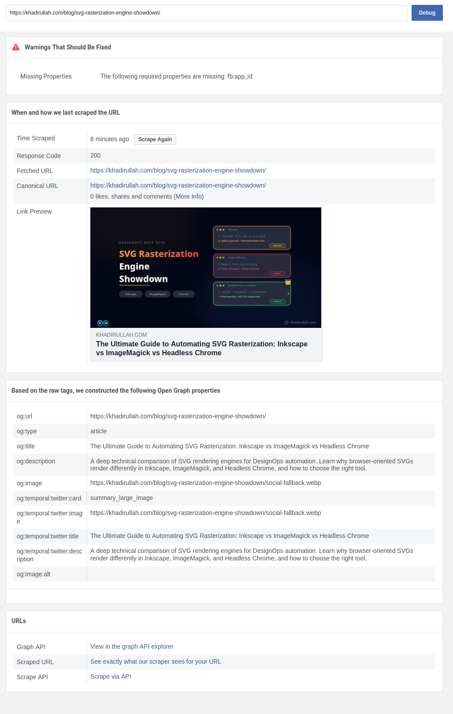
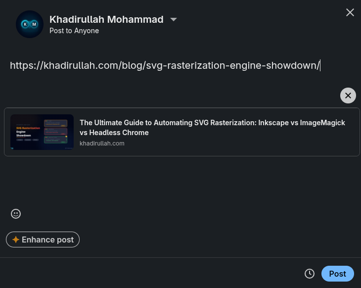
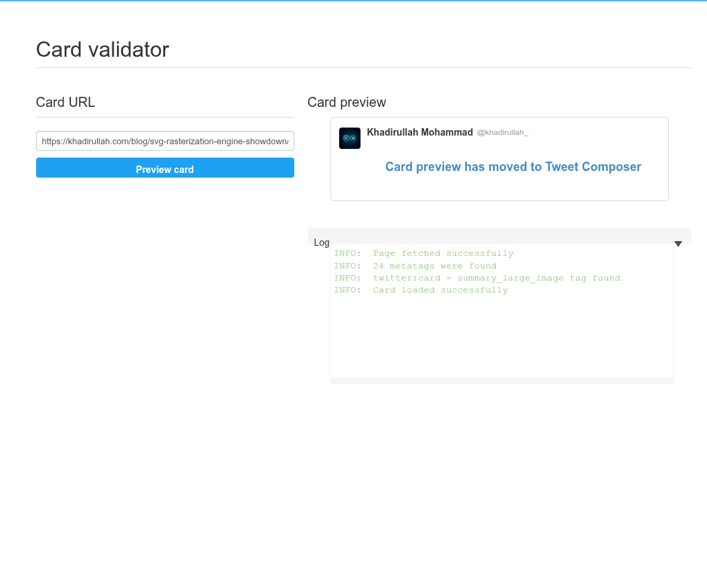
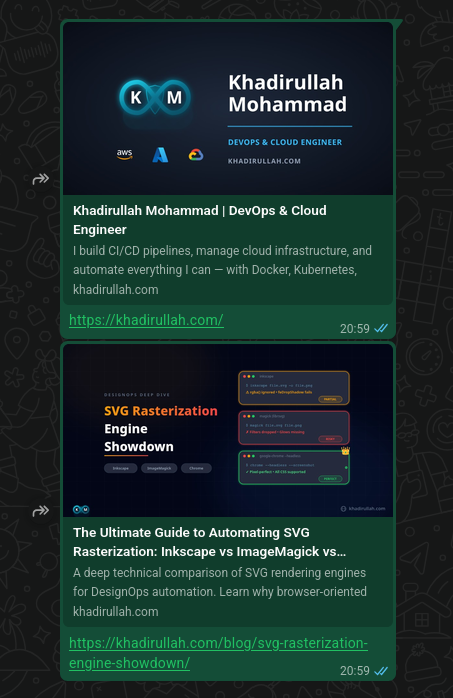

Vector graphics (SVGs) are the holy grail of modern web design. They render with pixel-perfect clarity on any screen size, maintain incredibly small file sizes, and can be styled with CSS. However, if you rely on SVGs for your website's featured images, you'll quickly run into a frustrating problem: **they completely break Open Graph (OG) social media previews**.

When you share a link on LinkedIn, Twitter, or WhatsApp, their scrapers look for an image to display in the preview card. Unfortunately, most of these platforms do not support SVG files for Open Graph images. The result? A broken or missing preview card that hurts your click-through rate.

Here is the exact engineering solution I implemented to fix this on my Hugo website (using the Blowfish theme) without sacrificing the crispness of my SVGs.

## 1. The Lossy Compression Trap

The obvious solution to the SVG problem is to provide a rasterized fallback image (like a PNG or JPEG). However, standard image compression often introduces ugly color banding and blurriness, especially around sharp text, ruining the premium feel of the vector original.

WebP is a modern image format that provides superior compression. But if you just use standard WebP conversion, it defaults to *lossy* compression. 

The secret weapon here is **lossless WebP**. Lossless WebP compresses pixel data without discarding any color details, preserving the exact pixel clarity of the original vector render while being significantly smaller than an equivalent PNG. For example, this blog post's own social fallback image went from **135 KB** as a PNG to **87 KB** as a lossless WebP (a **35% reduction**) with zero visible difference to the naked eye.

The conversion is a two-step process. First, strip all EXIF metadata from the rasterized PNG using `exiftool` to reduce file size and remove unnecessary data. Then convert to lossless WebP using `cwebp`:

```bash
# Step 1: Strip all EXIF metadata from the PNG
exiftool -all= -overwrite_original input.png

# Step 2: Convert to lossless WebP
cwebp -lossless -q 100 input.png -o output.webp
```

> **Important:** Most social media platforms require OG images to be at least **1200×630 pixels**. Make sure your rasterized PNG is rendered at this resolution before converting to WebP.

> **Note:** If color accuracy is critical (e.g. for brand assets), you can preserve the ICC color profile while still dropping other metadata by using `cwebp -metadata icc -lossless -q 100 input.png -o output.webp` and skipping the `exiftool` step.

This gives you a perfectly crisp, lightweight image ready for social media scrapers.

### What About PNG?

If you don't want to install `cwebp` or deal with an extra conversion step, **PNG works perfectly fine** as a social fallback format. Every social media platform supports PNG natively, and a metadata-stripped PNG is already a high-quality, lossless image.

```bash
# Simple PNG approach: just strip metadata and use the PNG directly
exiftool -all= -overwrite_original screenshot.png
# Rename and use as your social fallback
mv screenshot.png social-fallback.png
```

Then in your front matter:
```yaml
images: ["social-fallback.png"]
```

**PNG vs Lossless WebP: when to use which:**

| | PNG | Lossless WebP |
|---|---|---|
| **Platform support** | ✅ Universal (every scraper) | ✅ All major platforms (LinkedIn, Twitter, WhatsApp, Slack) |
| **File size** | ~135 KB (this post's image) | ~87 KB (~35% smaller) |
| **Quality** | Lossless, pixel-perfect | Lossless, pixel-perfect |
| **Extra tools needed** | None (just `exiftool`) | `cwebp` |
| **Best for** | Simplicity, maximum compatibility | Optimized page weight, faster load times |

For most blogs, the difference is negligible. Use WebP if you want maximum optimization; use PNG if you want simplicity. Both are lossless and both render identically on social media.

> **Note:** If you want to automate this conversion pipeline, check out my deep-dive [Ultimate Guide to Automating SVG Rasterization](/blog/svg-rasterization-engine-showdown/) to see a rendering compatibility comparison of the best command-line tools for the job.

## 2. The Hugo vs. Blowfish Conflict

Now that we have our crisp `output.webp`, we need to tell Hugo to use it for Open Graph tags, while still using the `featured.svg` for the actual website layout.

This is where things get tricky, especially if you are using a feature-rich theme like Blowfish. 

Blowfish automatically searches for images in your page bundle using greedy wildcards (like `*feature*` or `*cover*`). If you name your fallback image `featured.webp` alongside your `featured.svg`, the theme's logic might accidentally prioritize the WebP image and render it on your webpage instead of the SVG!

## 3. The "Social Fallback" Solution

To solve this conflict, we need a two-step approach that "blinds" the theme from accidentally using the fallback image on the frontend, while explicitly feeding it to the SEO scrapers.

**Step 1: Rename the fallback image.**
Instead of naming it `featured.webp`, name it something the theme's wildcard search won't catch, such as `social-fallback.webp`.

**Step 2: Explicitly define the image in Front Matter.**
In your Hugo blog post's Markdown file, use the `images` array in the YAML front matter to explicitly point the Open Graph templates to this specific file.

```yaml
---
title: "Your Awesome Blog Post"
date: 2026-07-19
images: ["social-fallback.webp"]
---
```

### The Result

With this setup:
1.  Your website's frontend continues to perfectly render the crisp, lightweight `featured.svg`.
2.  The Hugo SEO templates generate `<meta property="og:image" content=".../social-fallback.webp">` tags in the `<head>` of your HTML.
3.  When shared on LinkedIn or Twitter, their scrapers pull the perfectly crisp, lossless WebP image.

You get the best of both worlds: flawless vector rendering on your site and pristine social media preview cards.

## 4. Verify It Works

After deploying your changes, verify that the `og:image` tag is being picked up correctly. Here is how each platform handles verification:

### Facebook/Meta: Sharing Debugger (Gold Standard)

The [Sharing Debugger](https://developers.facebook.com/tools/debug/) is the most reliable verification tool. Paste your URL and hit "Debug." It shows you the exact `og:image` URL that scrapers see, renders a full link preview, and lists every Open Graph property it extracted.

Here is what a successful result looks like for my SVG rasterization blog post. Notice the `og:image` property pointing to `social-fallback.webp`:



Use the "Scrape Again" button to force a cache refresh if the preview looks stale.

### LinkedIn: Post Composer Preview

LinkedIn has retired its Post Inspector tool (the URL now shows a blank white page). The only way to verify your LinkedIn preview is to paste the URL directly into the LinkedIn post composer. The preview card renders before you hit "Post."



### Twitter/X: Card Validator (Limited)

The legacy [Card Validator](https://cards-dev.twitter.com/validator) still validates your meta tags in the logs, but **no longer renders image previews** (Twitter removed this feature in Aug 2022). The logs will confirm `twitter:card = summary_large_image tag found` and `Card loaded successfully`, which means your tags are correctly configured.



To see your actual Twitter Card image, paste the URL into [Tweet Composer](https://twitter.com/intent/tweet). The preview renders inline without posting.

### WhatsApp: Paste and Check

WhatsApp is the simplest to verify. Just paste the link into any chat. WhatsApp fetches the Open Graph data and displays the preview inline, complete with the image, title, and description.



> **Tip:** If any platform shows a stale or missing image, Meta's Sharing Debugger has a "Scrape Again" button to force a cache refresh. For Twitter, appending a dummy query parameter (e.g. `?v=2`) to your URL forces a fresh crawl.

> **Note:** In my testing, LinkedIn and Twitter showed opposite quirks: LinkedIn dropped the homepage OG image while rendering the blog post image correctly, and Twitter did the exact opposite. Facebook and WhatsApp handled both flawlessly. Platform scrapers are inconsistent by nature, so don't panic if one platform behaves differently. As long as Meta's Sharing Debugger confirms your `og:image` tag is correct, you've done your part.
