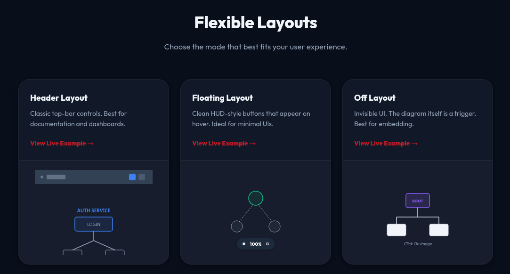
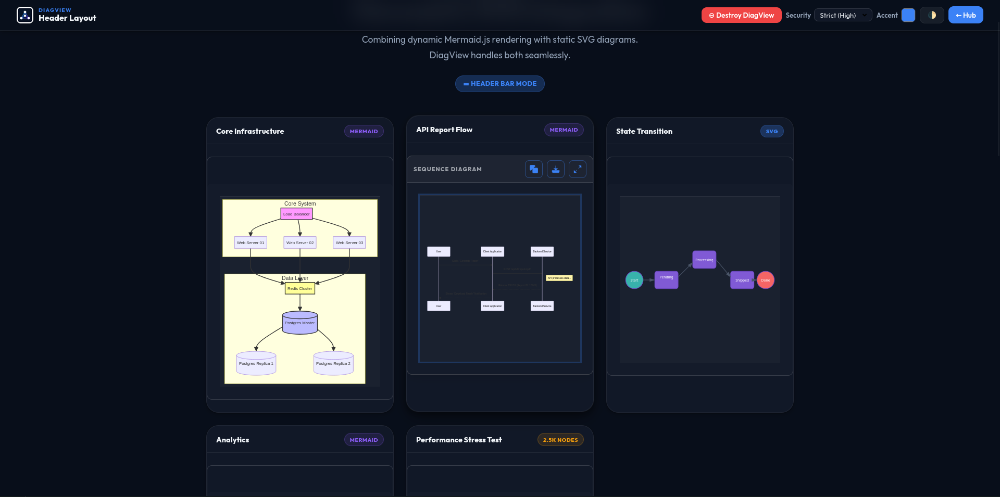
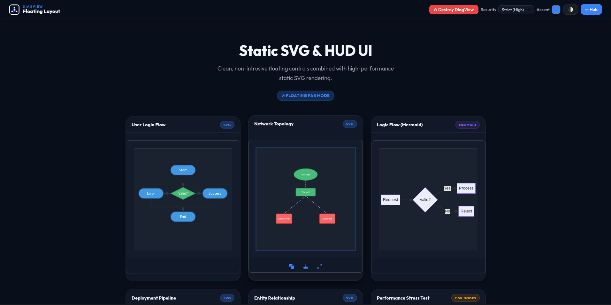
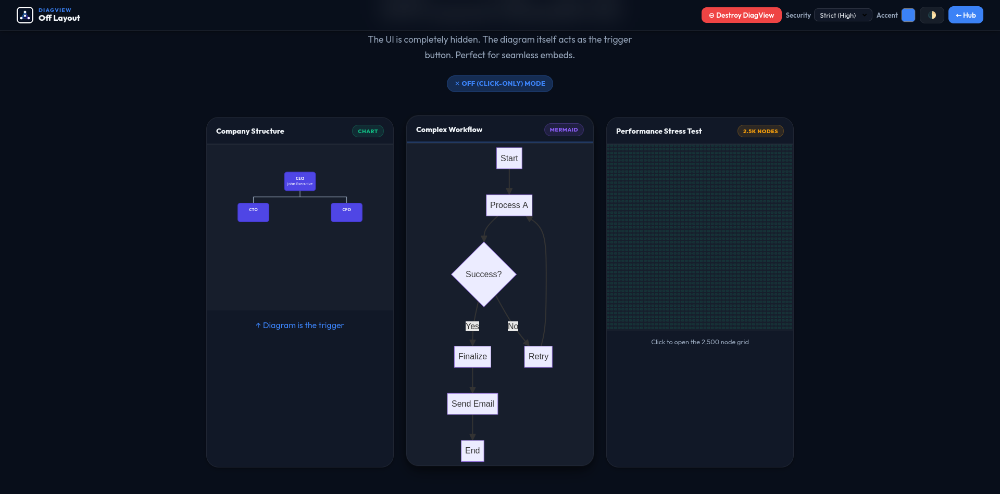
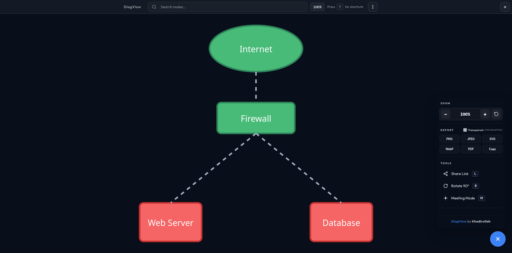
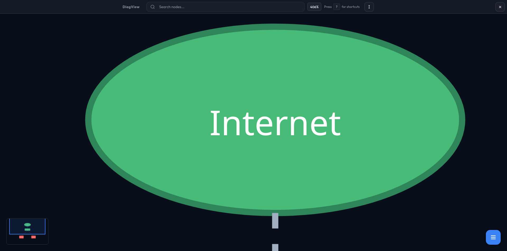
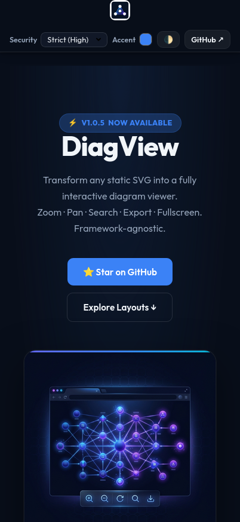

As developers, we love clear documentation. Use Case diagrams, Cloud Architectures, Flowcharts — they are the lifeblood of understanding complex systems. Tools like Mermaid.js, PlantUML, and Draw.io are fantastic for *creating* them.

But **viewing** them? That experience is often stuck in the past.

If you export a complex architecture diagram as an SVG and embed it on your docs site, it's just a static image. The text is too small to read, you can't search for that one specific microservice, and if you zoom with your browser, the whole page breaks.

I looked for a library to solve this. I found **D3.js** (too complex for just viewing) and **Leaflet** (too heavy for a diagram). I didn't want to write hundreds of lines of code just to let a user zoom into a flowchart.

So, I built **DiagView**.

> **Update (Aug 31, 2026):** DiagView v1.0.10 and v1.0.11 shipped a major precision pass — pixel-exact share-link restore at any zoom, fully working rotation (live, minimap, share links, rememberZoom), sharp mobile rendering at any zoom level, a hardened SVG sanitizer, and a headless-Chrome geometry test harness. See the [release notes](https://github.com/khadirullah/diagview/releases) for the full story.

## Demo



## What is DiagView?

**DiagView** is a feature-rich, interactive wrapper that gives your static SVGs superpowers.

It is built on top of the excellent [panzoom](https://github.com/timmywil/panzoom) library, which handles the low-level matrix math for smooth 60fps zooming and panning. But while panzoom gives you the engine, DiagView gives you the entire car.

### Feature Overview

| Feature | Description |
|---------|-------------|
| 🔍 **Deep Search** | Traverses the SVG DOM to find and highlight matching nodes with pulsing glow |
| 📤 **Multi-Format Export** | PNG, SVG, PDF, JPEG, WebP, or copy to clipboard |
| 🗺️ **Smart Minimap** | Accurate portrait/landscape scaling; click-to-navigate |
| 🔄 **Rotation** | 90° rotation steps with correct Panzoom recalibration |
| 📝 **Text Select Mode** | Toggle SVG text selection for copying node labels (press `T`) |
| 🎯 **Meeting Mode** | Built-in laser pointer for remote presentations |
| 🔗 **Precision Share Links** | Generate URLs that preserve exact zoom/pan position |
| ⌨️ **Keyboard Navigation** | Full keyboard control — zoom, pan, search, rotate, share |
| 🌗 **Auto-Theming** | Detects Tailwind, Bootstrap, and system dark/light mode |
| 📱 **Mobile-First Touch** | Pinch-to-zoom, double-tap to reset, Visual Viewport sync |
| 🔒 **SVG Sanitization** | Three-tier security model (strict/permissive/off) |
| 🎭 **3 Layout Modes** | Header toolbar, floating FAB, or invisible click-to-open |
| 🔧 **Per-Diagram Overrides** | Set layout, accent, scale per diagram via `data-*` attributes |
| 🌐 **Shadow DOM Support** | Works inside Shadow DOM roots |
| 🔄 **Remember Zoom** | Persist zoom/pan state per diagram across modal opens |
| 🏷️ **Watermarks** | Customizable watermarks on export (corner, background, four-sides) |
| 📦 **4 Button Styles** | Transparent, accent, solid, neutral — match any UI |

## The Landscape: Why Wasn't This Already Solved?

Before writing any code, I scoured npm and GitHub. Here's what I found:

**D3.js** — The titan of data visualization. But D3 is for *creating* graphics from data, not for *viewing* pre-made SVGs.

**svg-pan-zoom** — A focused library for adding pan/zoom to SVGs. But it's just the engine — no UI, no search, no export.

**Leaflet.js** — The standard for interactive maps. Overkill for a simple flowchart.

**The gap was clear:** I needed a batteries-included solution — something that would just *work* with a single `init()` call.

## Quick Start

### CDN (Fastest)

```html
<!-- Panzoom (required for zoom/pan) -->
<script src="https://cdn.jsdelivr.net/npm/@panzoom/panzoom@4.5.1/dist/panzoom.min.js"></script>

<!-- DiagView (auto-updates within v1) -->
<script src="https://cdn.jsdelivr.net/npm/diagview@1/dist/diagview.umd.min.js"></script>

<!-- Your diagram -->
<div class="diagram">
  <svg><!-- Your SVG content --></svg>
</div>

<!-- Initialize -->
<script>
  DiagView.init();
</script>
```

### NPM

```bash
npm install diagview @panzoom/panzoom
```

```javascript
import DiagView from 'diagview';

DiagView.init({
  layout: 'floating',
  accentColor: '#3b82f6',
});
```

## Flexible Layouts

DiagView supports three layout modes to fit your design:



| Layout | Best For |
|--------|----------|
| **Header** | Classic top-bar controls, documentation sites |
| **Floating** | Clean HUD-style buttons on hover, minimal UIs |
| **Off** | Invisible UI, the diagram itself is the trigger |

### Header Layout

A full-width toolbar is always visible above the diagram. Best for documentation sites and dashboards where discoverability matters.



### Floating Layout

A circular FAB button appears at the bottom-right. Controls hover in at the bottom of the diagram card. Clean and minimal.



### Off Layout

No controls are rendered. The diagram itself is the trigger — clicking it opens the fullscreen viewer.



## Per-Diagram Overrides

Any diagram can override the global configuration using `data-diagview-*` attributes. This lets you mix layout modes and accent colors on a single page:

```html
<!-- Purple accent with header layout for this diagram only -->
<div class="diagram"
  data-diagview-layout="header"
  data-diagview-accent="#8b5cf6"
  data-diagview-scale="6"
  data-title="My Architecture">
  <svg>...</svg>
</div>

<!-- This diagram uses the global defaults -->
<div class="diagram">
  <svg>...</svg>
</div>
```

| Attribute | Values | Description |
|-----------|--------|-------------|
| `data-diagview-layout` | `header` \| `floating` \| `off` | Layout for this diagram only |
| `data-diagview-accent` | Any CSS color | Accent color for this diagram only |
| `data-diagview-scale` | `1`–`10` | Export resolution for this diagram only |
| `data-diagview-sanitize` | `strict` \| `permissive` \| `off` | SVG sanitization mode |
| `data-diagview-allow-remote` | `true` \| `false` | Allow remote CSS/fonts in SVG |
| `data-diagview-watermark` | `true` \| `false` | Enable watermark for this diagram |
| `data-diagview-watermark-text` | Any string | Custom watermark text |
| `data-title` | Any string | Title shown in header layout |

## Keyboard Shortcuts

All shortcuts are active when the fullscreen modal is open:

| Key | Action |
|-----|--------|
| `Esc` | Close fullscreen |
| `Space` / `0` | Reset zoom — fit to screen |
| `+` / `=` | Zoom in |
| `-` / `_` | Zoom out |
| `↑ ↓ ← →` | Pan diagram |
| `Shift` + arrows | Fast pan (3× speed) |
| `F` | Focus search input |
| `T` | Toggle text-select mode |
| `R` | Rotate 90° clockwise |
| `M` | Toggle meeting mode (laser pointer) |
| `L` | Copy share link to clipboard |
| `?` | Show/hide keyboard shortcuts panel |

## Under the Hood: Technical Decisions

### The Search Engine

This was the feature I was most proud of. The search system:

1. **Pre-Caches Candidates** — On first open, queries all text elements and stores them in a WeakMap
2. **Uses Dirty Checking** — Before writing to the DOM, checks if values have changed
3. **Batches Updates** — All DOM mutations are wrapped in requestAnimationFrame

The result? Searching through diagrams with **2,500+ nodes** is instant.

### Fullscreen View

Clicking any diagram opens it in a fullscreen modal with all controls — zoom, pan, search, export, rotate, share, and minimap:



### Text Select Mode

Press `T` in fullscreen and all SVG text nodes become selectable. You can highlight and copy node labels, edge text, or any text content inside the diagram. Press `T` again to disable. This is useful when you need to copy a specific service name or ID from a complex architecture diagram.

### Minimap

When a diagram is zoomed in so that parts of it are outside the viewport, a minimap automatically appears in the corner. It shows your current viewport position within the full diagram, and you can **click anywhere on the minimap to jump to that area**. The minimap correctly handles both portrait and landscape diagrams.



### Rotation

Press `R` to rotate the diagram 90° clockwise. This is particularly useful for tall diagrams (like vertical flowcharts) that would be easier to read horizontally. The rotation recalibrates the Panzoom instance so zoom and pan continue to work correctly after rotation.

### SVG Sanitization

DiagView includes a three-tier security model for SVG content:

| Mode | What It Blocks | When to Use |
|------|---------------|-------------|
| **strict** (default) | `<script>`, `<iframe>`, `<animate>`, inline event handlers, dangerous URL schemes, `<style>` injection — while preserving `<foreignObject>` so Mermaid htmlLabels render intact | Untrusted SVGs (user-uploaded, third-party) |
| **permissive** | `<script>`, `<iframe>`, `<object>` only | Semi-trusted SVGs (your own diagrams with animations) |
| **off** | Nothing | Fully trusted SVGs only |

### Watermarks

Watermarks are applied **only during export/download** — they never appear in the interactive viewer. You can configure them globally or per-diagram:

```javascript
DiagView.init({
  watermark: {
    enabled: true,
    text: "Confidential",
    style: "corner",        // "corner" | "background" | "both"
    position: "bottom-right", // 6 positions + "four-sides"
    opacity: 0.2,
  },
});
```

### The Export System

The export module handles edge cases:

- **Robust Dimension Calculation** — Uses getBBox() to find actual content area
- **Cross-Origin Font Handling** — Inlines Google Fonts for consistent exports
- **High-DPI Scaling** — Up to 10x resolution for print-quality images
- **Transparent Background** — PNG and WebP support transparent backgrounds
- **PDF Export** — Lazy-loads jsPDF from CDN only when needed

### Export Formats

| Format | Transparent | Notes |
|--------|-------------|-------|
| PNG | ✅ | High-res raster; default 4× scale |
| SVG | ✅ | Fully scalable vector |
| JPEG | ❌ | Smallest file size |
| WebP | ✅ | Modern format; good compression |
| PDF | ❌ | Requires jsPDF (lazy-loaded from CDN) |
| Copy | ❌ | Copies PNG to system clipboard |

### Optional Panzoom Dependency

I made panzoom an **optional** peer dependency:

- **With panzoom:** Full zoom, pan, touch gestures
- **Without panzoom:** Fullscreen, search, and export still work

This keeps DiagView usable even in constrained environments.

### Mobile Support

DiagView is fully optimized for mobile — pinch-to-zoom, double-tap to reset, and Visual Viewport sync for stability on iOS and Android:



### Button Styles

Four built-in styles for the diagram card buttons:

| Style | Look |
|-------|------|
| **accent** (default) | Colored with your accent color |
| **transparent** | Transparent with subtle hover |
| **solid** | Solid background |
| **neutral** | Muted, blends into the background |

```javascript
DiagView.init({
  ui: {
    buttons: { style: "transparent" }
  }
});
```

## CI/CD Pipeline

One thing I invested heavily in was the **automation pipeline**. Every push to the repository triggers a GitHub Actions workflow that:

1. **Lints** the code with ESLint
2. **Runs the full Jest suite** (195+ unit tests as of v1.0.11)
3. **Builds** the UMD and ESM bundles with Rollup
4. **Publishes to npm** on tagged releases (semantic versioning)
5. **Deploys documentation** to GitHub Pages

```yaml
# Simplified GitHub Actions workflow
on:
  push:
    tags: ['v*']  # Triggers on version tags like v1.0.6

jobs:
  test:
    runs-on: ubuntu-latest
    steps:
      - uses: actions/checkout@v4
      - run: npm ci
      - run: npm run lint
      - run: npm test          # full unit suite
      - run: npm run build

  publish:
    needs: test
    runs-on: ubuntu-latest
    steps:
      - run: npm publish       # Pushes to npm registry
```

The pipeline ensures that **no broken code gets published**. If any test fails, the publish step never runs. This is the same pattern used in production CI/CD — just applied to an open-source package.

The project also uses:
- **Husky** — pre-commit hooks that run lint-staged
- **lint-staged** — runs ESLint + Prettier only on changed files
- **release-it** — automated version bumping, changelog generation, and npm publishing
- **size-limit** — CI fails if the bundle exceeds a **40 KB budget** (minified + brotli)

## Bundle Size

| Metric | Size |
|--------|------|
| **UMD Minified** | ~134 KB |
| **ESM Minified** | ~140 KB |
| **Gzipped (Transfer)** | **~38 KB** |

For context, that's smaller than a single hero image. And it includes all CSS, SVG icons, and the entire UI framework.

## Framework Support

DiagView is framework-agnostic — it works with plain HTML, React, Vue, Svelte, Angular, or any framework that renders SVGs to the DOM. It also supports Shadow DOM and Mermaid.js integration.

## Full Configuration

```javascript
DiagView.init({
  // Layout
  layout: 'floating',           // 'header' | 'floating' | 'off'

  // Theme (null = auto-detect)
  accentColor: null,
  backgroundColor: null,
  textColor: null,

  // UI
  ui: { buttons: { style: 'accent' } },
  showKeyboardHelp: true,
  showBranding: true,
  showMinimap: true,
  animateOpen: true,

  // Interaction
  naturalPanning: false,
  immersiveMode: false,
  rememberZoom: false,
  printFriendly: true,

  // Zoom limits
  maxZoomScale: 25,
  minZoomScale: 0.05,

  // Export
  highResScale: 4,               // 1–10
  mobileScale: 2,                // 1–5
  maxPixels: 16777216,           // 16MP safety cap

  // Security
  security: {
    mode: 'strict',
    allowOverrides: true,
    allowRemoteResources: false,
  },

  // Watermarks (export only)
  watermark: {
    enabled: false,
    text: '',
    style: 'corner',
    position: 'bottom-right',
    opacity: 0.2,
  },

  // Callbacks
  onExport: null,
  onError: null,
  onZoomChange: null,
  onOpen: null,
  onClose: null,
});
```

## Try It Out

I built this to scratch my own itch. If you write technical documentation for a living, I think you'll find it useful too.

- 🧪 **Live Demo:** [khadirullah.github.io/diagview](https://khadirullah.github.io/diagview/)
- ⭐ **GitHub:** [github.com/khadirullah/diagview](https://github.com/khadirullah/diagview)
- 📦 **NPM:** [npmjs.com/package/diagview](https://www.npmjs.com/package/diagview)

Have feedback or found a bug? [Open an issue on GitHub](https://github.com/khadirullah/diagview/issues).

---

