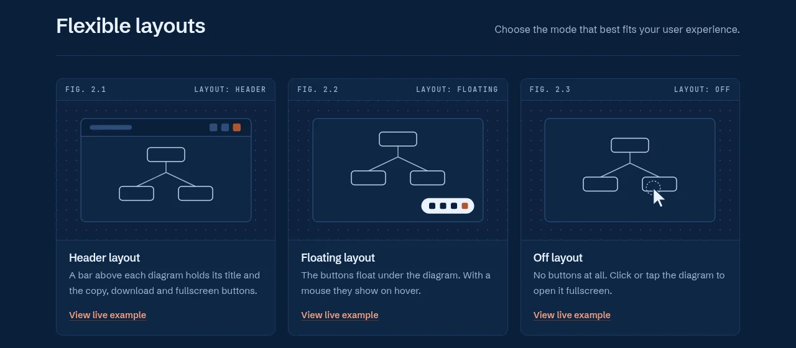
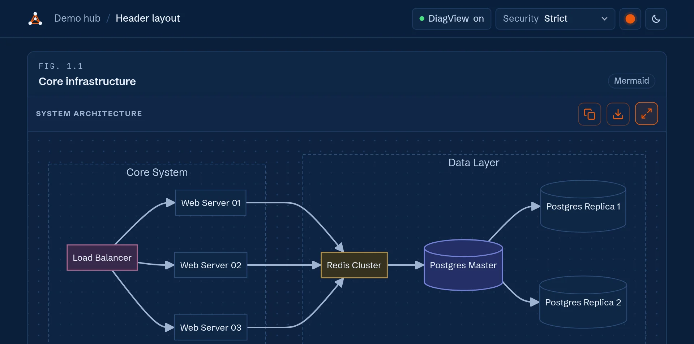
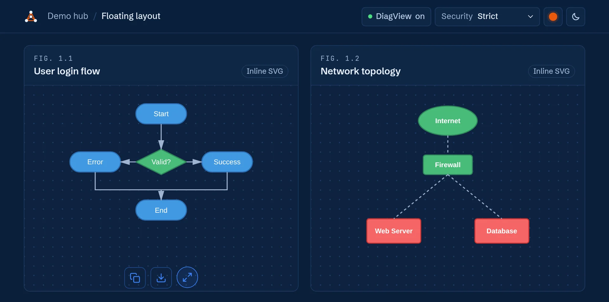
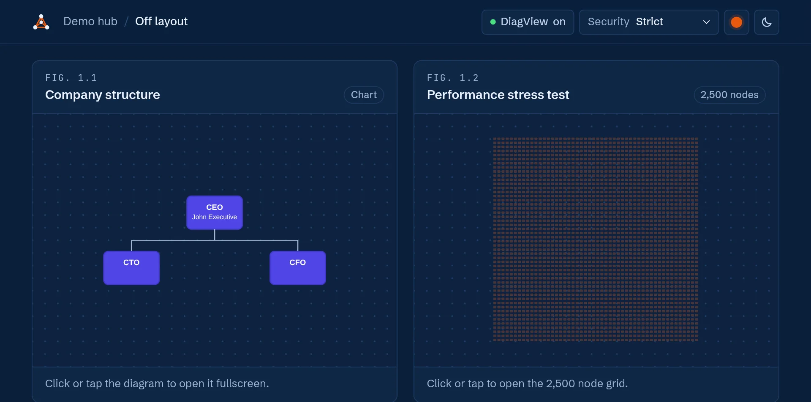
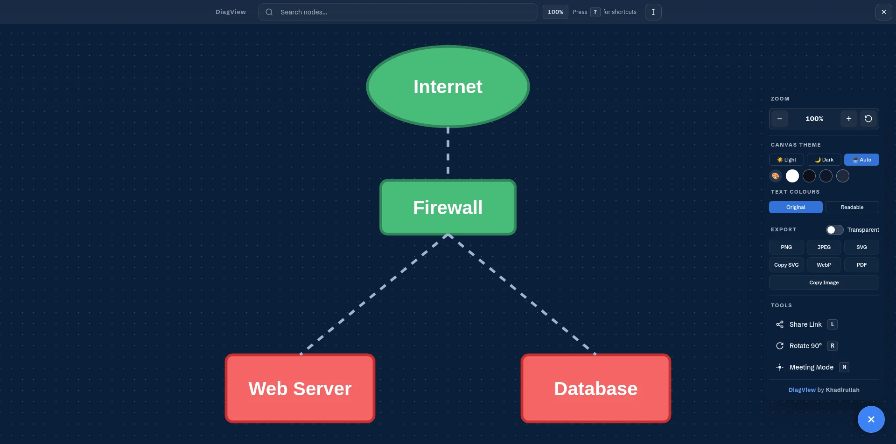
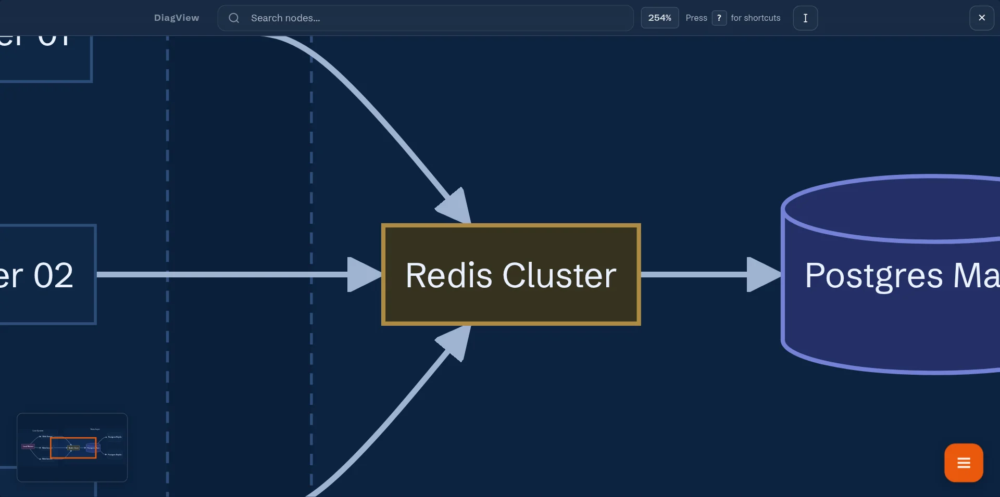
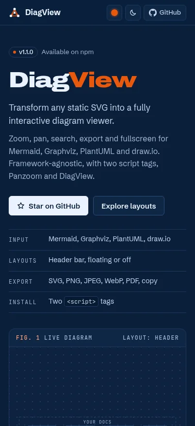


As developers, we love clear documentation. Use Case diagrams, Cloud Architectures and Flowcharts are the lifeblood of understanding complex systems. Tools like Mermaid.js, PlantUML, and Draw.io are fantastic for *creating* them.


But **viewing** them? That experience is often stuck in the past.

If you export a complex architecture diagram as an SVG and embed it on your docs site, it's just a static image. The text is too small to read, you can't search for that one specific microservice, and if you zoom with your browser, the whole page breaks.

I looked for a library to solve this. I found **D3.js** (too complex for just viewing) and **Leaflet** (too heavy for a diagram). I didn't want to write hundreds of lines of code just to let a user zoom into a flowchart.

So, I built **DiagView**.


**Update (Sep 30, 2026):** DiagView v1.1.0 adds a Readable switch for faint labels, a dot grid and seven new options. SVG exports now embed only the fonts their labels use, and about 120 bugs are fixed. [What's new in 1.1.0](#whats-new-in-110) below covers the highlights, and the [v1.1.0 release notes](https://github.com/khadirullah/diagview/releases/tag/v1.1.0) list everything.


## Demo



For a narrated tour of every feature, watch the walkthrough below. It runs 2:31 and has English subtitles.



## What is DiagView?

**DiagView** is a feature-rich, interactive wrapper that gives your static SVGs superpowers.

It is built on top of the excellent [panzoom](https://github.com/timmywil/panzoom) library, which handles the low-level matrix math for smooth 60fps zooming and panning. But while panzoom gives you the engine, DiagView gives you the entire car.

### Feature Overview

| Feature | Description |
|---------|-------------|
| 🔍 **Deep Search** | Traverses the SVG DOM to find matching nodes, outlines each match and fades the rest |
| 🖼️ **Canvas Themes** | Auto, light, dark or custom canvas, an optional dot grid, and Readable mode for faint labels |
| 📤 **Multi-Format Export** | PNG, SVG, PDF, JPEG and WebP, or copy as an image or as SVG markup |
| 🖨️ **Print Friendly** | Printing the page hides the toolbars, menu and viewer and keeps the diagrams. For paper, export SVG, which scales to any size, or PNG and PDF at up to 10x |
| 🗺️ **Smart Minimap** | Accurate portrait/landscape scaling; click-to-navigate |
| 🔄 **Rotation** | 90° rotation steps with correct Panzoom recalibration |
| 📝 **Text Select Mode** | Toggle SVG text selection for copying node labels (press `T`) |
| 🎯 **Meeting Mode** | Built-in laser pointer for remote presentations |
| 🔗 **Precision Share Links** | Generate URLs that preserve exact zoom/pan position |
| ⌨️ **Keyboard Navigation** | Zoom, pan, search, rotate and share from the keyboard. `Tab` reaches diagrams and the links inside them |
| 🌗 **Auto-Theming** | Detects Tailwind, Bootstrap, and system dark/light mode |
| 📱 **Mobile-First Touch** | Pinch-to-zoom, double-tap to reset, Visual Viewport sync |
| 🔒 **SVG Sanitization** | Three-tier security model (strict/permissive/off) |
| 🎭 **3 Layout Modes** | Header toolbar, floating FAB, or invisible click-to-open |
| 🔧 **Per-Diagram Overrides** | Set layout, export scale, sanitizing and watermark per diagram via `data-*` attributes |
| 🌐 **Shadow DOM Support** | Works inside Shadow DOM roots |
| 🔄 **Remember Zoom** | Keep zoom, pan and rotation per diagram between opens, until reload |
| 🏷️ **Watermarks** | Export-only watermarks in a corner, across the background or on four sides, on the diagram or in the margin |
| 📦 **4 Button Styles** | Transparent, accent, solid or neutral, to match any UI |

## What's new in 1.1.0


Across export, search, the minimap, share links and keyboard use.
Jest, across 40 suites.
Chromium, Firefox and WebKit.




A Text Colours switch recolours labels under 4.5:1 contrast and keeps each hue. Exports get the same colours, so prints stay readable.


SVG files embed only the fonts the labels use. Large Mermaid diagrams export to PNG and PDF in Chrome again.


`Tab` reaches each diagram and the links inside it. Focus goes back where it was when the viewer closes.



### New options

```javascript
DiagView.init({
  canvasGrid: "dots",                 // dot grid behind the diagram in the viewer
  rotateKeepsView: true,              // rotating keeps the centre and on-screen size
  warningColor: "#f59e0b",            // colour of warning notices
  exportFonts: "used",                // "used" | "all" | "none"
  exportSearchHighlight: false,       // export the plain diagram during a search
  security: { exportMode: "strict" }, // clean every export in strict mode
  watermark: { placement: "margin" }, // corner and side marks outside the diagram
});
```


Upgrading from 1.0.x? Most pages need no changes. If you use `onExport`, watermark positions or `require("diagview")`, read "Before you upgrade" in the [release notes](https://github.com/khadirullah/diagview/releases/tag/v1.1.0) first.


## The Landscape: Why Wasn't This Already Solved?

Before writing any code, I scoured npm and GitHub. Here's what I found:

**D3.js.** The titan of data visualization. But D3 is for *creating* graphics from data, not for *viewing* pre-made SVGs.

**svg-pan-zoom.** A focused library for adding pan/zoom to SVGs. But it's just the engine, with no UI, no search and no export.

**Leaflet.js.** The standard for interactive maps. Overkill for a simple flowchart.

**The gap was clear:** I needed a batteries-included solution, something that would just *work* with a single `init()` call.

## Quick Start




```html
<!-- Panzoom (required for zoom/pan) -->
<script src="https://cdn.jsdelivr.net/npm/@panzoom/panzoom@4.5.1/dist/panzoom.min.js"></script>

<!-- DiagView (auto-updates within v1) -->
<script src="https://cdn.jsdelivr.net/npm/diagview@1/dist/diagview.umd.min.js"></script>

<!-- Your diagram -->
<div class="diagram">
  <svg><!-- Your SVG content --></svg>
</div>

<!-- Initialize -->
<script>
  DiagView.init();
</script>
```




```bash
npm install diagview @panzoom/panzoom
```

```javascript
import DiagView from 'diagview';

DiagView.init({
  layout: 'floating',
  accentColor: '#3b82f6',
});
```




## Flexible Layouts

DiagView supports three layout modes to fit your design:



| Layout | Best For |
|--------|----------|
| **Header** | Classic top-bar controls, documentation sites |
| **Floating** | Clean HUD-style buttons on hover, minimal UIs |
| **Off** | Invisible UI, the diagram itself is the trigger |

### Header Layout

A bar above the diagram holds its title and the copy, download and fullscreen buttons. With a mouse, the bar shows when you hover the diagram. On touch screens it stays visible. Best for documentation sites and dashboards.



### Floating Layout

The copy, download and fullscreen buttons float under the diagram with no title bar. With a mouse they show on hover. On touch screens they stay visible.



### Off Layout

No controls are rendered. The diagram itself is the trigger. Clicking it opens the fullscreen viewer.



## Per-Diagram Overrides

Any diagram can override the global configuration using `data-diagview-*` attributes. This lets you mix layout modes and export sizes on a single page:

```html
<!-- Header layout and a larger export for this diagram only -->
<div class="diagram"
  data-diagview-layout="header"
  data-diagview-scale="6"
  data-title="My Architecture">
  <svg>...</svg>
</div>

<!-- This diagram uses the global defaults -->
<div class="diagram">
  <svg>...</svg>
</div>
```

| Attribute | Values | Description |
|-----------|--------|-------------|
| `data-diagview-layout` | `header` \| `floating` \| `off` | Layout for this diagram only |
| `data-diagview-scale` | `1` to `10` | Export resolution for this diagram only |
| `data-diagview-sanitize` | `strict` \| `permissive` \| `off` | SVG sanitization mode |
| `data-diagview-allow-remote` | `true` \| `false` | Keep remote CSS and fonts under `strict` |
| `data-diagview-watermark` | `true` \| `false` | Turn the watermark on or off for this diagram |
| `data-diagview-watermark-text` | Any string | Custom watermark text |
| `data-diagview-watermark-style` | `corner` \| `background` \| `both` | Watermark style for this diagram |
| `data-diagview-watermark-pos` | `top-left` \| `...` \| `four-sides` | Watermark position for this diagram |
| `data-diagview-watermark-placement` | `diagram` \| `margin` | Corner and side text on the diagram or in the margin |
| `data-diagview-watermark-opacity` | `0` to `1` | Watermark opacity for this diagram |
| `data-title` | Any string | Title shown in header layout, and the export file name |

The accent colour is one per page. Set it with `accentColor` in `init()` or with the `--diagram-accent` CSS variable. v1.1.0 removed the old `data-diagview-accent` attribute because it never changed a colour.

## Keyboard Shortcuts

All shortcuts are active when the fullscreen viewer is open. While the search box has focus, keys type into it and only `Esc` acts as a shortcut.

| Key | Action |
|-----|--------|
| `Esc` | Close help, search or menu, then the viewer |
| `Space` / `0` | Reset zoom to fit the screen |
| `+` / `=` | Zoom in |
| `-` / `_` | Zoom out |
| `↑ ↓ ← →` | Pan diagram |
| `Shift` + arrows | Fast pan (3× speed) |
| `F` | Open search |
| `T` | Toggle text-select mode |
| `R` | Rotate 90° clockwise |
| `M` | Toggle meeting mode (laser pointer) |
| `L` | Copy share link to clipboard |
| `?` | Show/hide keyboard shortcuts panel |
| `Ctrl` / `Cmd` / `Alt` + any key | Left to the browser, so `Ctrl`+`F` still searches the page |

On the page, `Tab` stops on a diagram with the `off` layout and `Enter` opens it. In the viewer, `Tab` also stops on links inside the diagram.

## Under the Hood: Technical Decisions

### The Search Engine

This was the feature I was most proud of. The search system:

1. **Pre-Caches Candidates.** On first open, queries all text elements and stores them in a WeakMap
2. **Uses Dirty Checking.** Before writing to the DOM, checks if values have changed
3. **Batches Updates.** All DOM mutations are wrapped in requestAnimationFrame

The result? Searching through diagrams with **2,500+ nodes** is instant. Each match keeps the diagram's own colours and gets a 3px outline in blue or amber, whichever shows up on the canvas. Everything else fades to 15%.

### Fullscreen View

Clicking any diagram opens it in a fullscreen modal with zoom, pan, search, export, rotate, share and minimap controls.



### Text Select Mode

Press `T` in fullscreen and all SVG text nodes become selectable. You can highlight and copy node labels, edge text, or any text content inside the diagram. Press `T` again to disable. This is useful when you need to copy a specific service name or ID from a complex architecture diagram.

### Minimap

When a diagram is zoomed in so that parts of it are outside the viewport, a minimap automatically appears in the corner. It shows your current viewport position within the full diagram, and you can **click anywhere on the minimap to jump to that area**. The minimap correctly handles both portrait and landscape diagrams.



### Rotation

Press `R` to rotate the diagram 90° clockwise. This is particularly useful for tall diagrams (like vertical flowcharts) that would be easier to read horizontally. The rotation recalibrates the Panzoom instance so zoom and pan continue to work correctly after rotation.

### SVG Sanitization

DiagView includes a three-tier security model for SVG content:

| Mode | What It Blocks | When to Use |
|------|---------------|-------------|
| **strict** (default) | `<script>`, `<iframe>`, `<animate>`, inline event handlers, dangerous URL schemes, `<style>` injection. It keeps `<foreignObject>` so Mermaid htmlLabels render intact | Untrusted SVGs (user-uploaded, third-party) |
| **permissive** | `<script>`, `<iframe>`, `<object>` only | Semi-trusted SVGs (your own diagrams with animations) |
| **off** | Nothing | Fully trusted SVGs only |

### Watermarks

Watermarks are applied **only during export/download**. They never appear in the interactive viewer. You can configure them globally or per-diagram:

```javascript
DiagView.init({
  watermark: {
    enabled: true,
    text: "Confidential",
    style: "corner",          // "corner" | "background" | "both"
    position: "bottom-right", // "top-left" | "top-right" | "bottom-left" | "bottom-right" | "center" | "four-sides"
    placement: "diagram",     // "diagram" | "margin" (corner and side text outside the diagram)
    opacity: 0.2,
  },
});
```

### The Export System

The export module handles edge cases:

- **Robust Dimension Calculation.** Uses getBBox() to find actual content area
- **Font Embedding.** Embeds only the page fonts the labels use. `exportFonts: "all"` embeds every font, `"none"` embeds none
- **High-DPI Scaling.** Up to 10x resolution for print-quality images
- **Transparent Background.** PNG and WebP support transparent backgrounds
- **PDF Export.** Lazy-loads jsPDF from CDN only when needed

### Export Formats

| Format | Transparent | Notes |
|--------|-------------|-------|
| PNG | ✅ | High-res raster. Default scale is 4, or 2 on touch devices and narrow screens |
| SVG | ✅ | Fully scalable vector |
| JPEG | ❌ | Smallest file size |
| WebP | ✅ | Modern format; good compression |
| PDF | ❌ | Requires jsPDF (lazy-loaded from CDN) |
| Copy Image | ❌ | Copies PNG to system clipboard |
| Copy SVG | ✅ | Copies the SVG markup to the clipboard as text |

### Optional Panzoom Dependency

I made panzoom an **optional** peer dependency:

- **With panzoom:** Full zoom, pan, touch gestures
- **Without panzoom:** Fullscreen, search, and export still work

This keeps DiagView usable even in constrained environments.

### Mobile Support

DiagView is fully optimized for mobile, with pinch-to-zoom, double-tap to reset, and Visual Viewport sync for stability on iOS and Android:



### Button Styles

Four built-in styles for the diagram card buttons:

| Style | Look |
|-------|------|
| **accent** (default) | Colored with your accent color |
| **transparent** | Transparent with subtle hover |
| **solid** | Solid background |
| **neutral** | Muted, blends into the background |

```javascript
DiagView.init({
  ui: {
    buttons: { style: "transparent" }
  }
});
```

## CI/CD Pipeline

One thing I invested heavily in was the **automation pipeline**. Every push to `main` and every pull request runs GitHub Actions workflows that:

1. **Lints** the code with ESLint
2. **Runs the Jest suite** (923 unit tests as of v1.1.0)
3. **Builds** the UMD and ESM bundles with Rollup, then checks the package entry points, the TypeScript declarations and the bundle size
4. **Runs 659 browser tests** with Playwright in Chromium, Firefox and WebKit
5. **Deploys the demo** to GitHub Pages, on pushes to `main`

Publishing the GitHub release for a version tag runs a second workflow. It lints, tests and builds again, then publishes to npm with provenance.


flowchart LR
    push([Push to main]) --> test["Lint, 923 unit tests,<br/>build, types, size"]
    push --> e2e["659 browser tests<br/>Chromium, Firefox, WebKit"]
    push --> pages["Demo to<br/>GitHub Pages"]
    release([GitHub release]) --> checks["Lint, test,<br/>build"]
    checks --> npm["npm publish<br/>with provenance"]


This diagram runs on DiagView 1.1.0. Click it to open the viewer, then zoom, search or export it.

```yaml
# Simplified publish workflow
on:
  release:
    types: [published]  # Runs when the GitHub release for a tag like v1.1.0 is published

permissions:
  contents: read
  id-token: write       # Lets npm verify this workflow and sign the provenance

jobs:
  publish:
    runs-on: ubuntu-latest
    steps:
      - uses: actions/checkout@v4
      - run: npm ci
      - run: npm run lint
      - run: npm test       # full unit suite
      - run: npm run build
      - run: npm publish --provenance --access public
```

The pipeline ensures that **no broken code gets published**. If lint, a test or the build fails, the publish step never runs. This is the same pattern used in production CI/CD, just applied to an open-source package.

The project also uses:
- **Husky** runs lint-staged in a pre-commit hook
- **lint-staged** runs ESLint and Prettier only on changed files
- **release-it** handles version bumping, changelog generation and GitHub releases. The publish workflow does the npm part
- **size-limit** fails CI if the UMD bundle goes over **45 KB** or the ESM bundle over **50 KB** (minified + brotli)

## Bundle Size

| Metric | Size |
|--------|------|
| **UMD Minified** | ~167 KB |
| **UMD Gzipped** | ~50 KB |
| **UMD Brotli (Transfer)** | **~45 KB** |
| **ESM Brotli (Transfer)** | **~50 KB** |

For context, that's smaller than a single hero image. And it includes all CSS, SVG icons, and the entire UI framework.

## Framework Support

DiagView is framework-agnostic. It works with plain HTML, React, Vue, Svelte, Angular, or any framework that renders SVGs to the DOM. It also supports Shadow DOM and Mermaid.js integration.

## Full Configuration




```javascript
DiagView.init({
  // Layout
  layout: 'floating',           // 'header' | 'floating' | 'off'

  // Theme (null = auto-detect)
  accentColor: null,            // null = --diagram-accent, then the built-in blue
  warningColor: '#f59e0b',      // warning notices
  backgroundColor: null,
  textColor: null,

  // UI
  ui: { buttons: { style: 'accent' } },
  showKeyboardHelp: true,
  showFirstTimeThemeHint: true,
  showBranding: true,
  showMinimap: true,
  animateOpen: true,
  canvasGrid: 'none',           // 'none' | 'dots'

  // Interaction
  naturalPanning: false,
  rotateKeepsView: false,
  rememberZoom: false,          // in memory, until reload

  // Zoom limits and animation
  maxZoomScale: 25,
  minZoomScale: 0.05,
  zoomAnimationDuration: 200,   // ms, 0 = no animation
  panAnimationDuration: 200,

  // Export
  highResScale: 4,               // 1 to 10
  mobileScale: 2,                // 1 to 5
  maxPixels: 16777216,           // 16MP safety cap
  exportFonts: 'used',           // 'used' | 'all' | 'none'
  exportSearchHighlight: true,

  // Security
  security: {
    mode: 'strict',
    allowOverrides: true,
    allowRemoteResources: false,
    exportMode: 'same',          // 'same' | 'strict'
  },

  // Watermarks (export only)
  watermark: {
    enabled: false,
    text: '',
    style: 'corner',
    position: 'bottom-right',
    placement: 'diagram',        // 'diagram' | 'margin'
    opacity: 0.2,
  },

  // Callbacks
  onExport: null,
  onError: null,
  onZoomChange: null,
  onOpen: null,
  onClose: null,
});
```




## Try It Out

I built this to scratch my own itch. If you write technical documentation for a living, I think you'll find it useful too.

Live demo&nbsp;&nbsp;
GitHub&nbsp;&nbsp;
npm

Have feedback or found a bug? [Open an issue on GitHub](https://github.com/khadirullah/diagview/issues).

---

