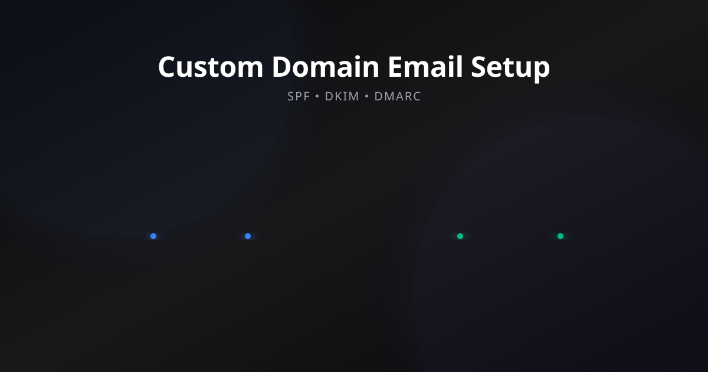
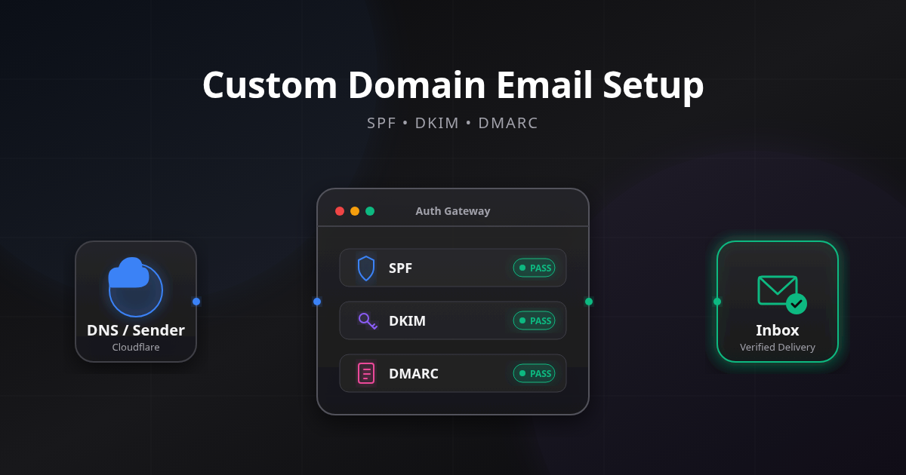
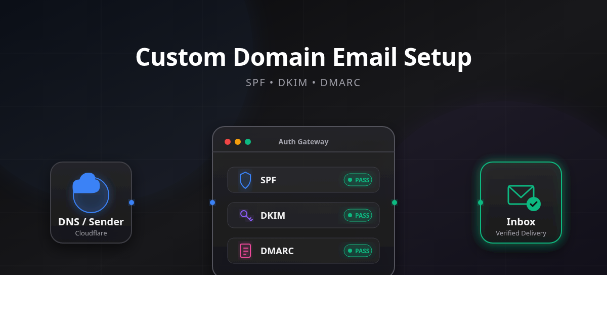
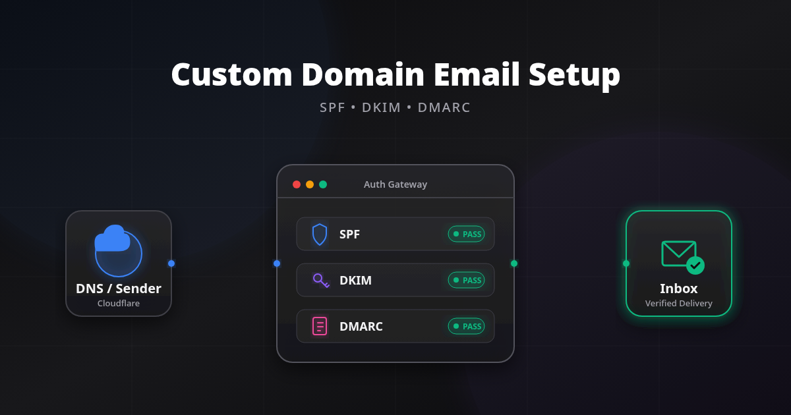
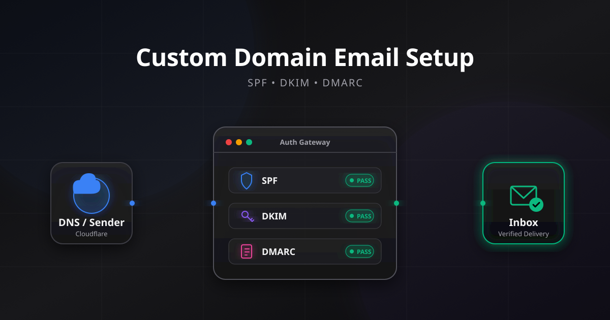


If you are automating SVG-to-PNG conversions on a Linux server and notice your colors look washed out or your drop shadows are missing, this post is for you.


| Engine | Browser CSS | SVG Filters | Emoji | Speed | Best Use |
| --- | :---: | :---: | :---: | :---: | --- |
| Headless Chrome | ✅ | ✅ | ✅ | Medium | Browser-accurate rendering |
| Inkscape | ⚠️ SVG 1.1 | ✅ (SVG 1.1) | ❌ | Fast | Standards-compliant SVG |
| ImageMagick (`librsvg`) | ⚠️ SVG 1.1 | ✅ (SVG 1.1) | ❌ | Very Fast | Batch rasterization |

When building out the DesignOps pipeline for this blog (as detailed in my guide on [Fixing Broken Hugo Open Graph Previews](/blog/hugo-svg-webp-social-fallback/)), my goal was simple: use a Python script to automatically read my vector `featured.svg` images, inject my branding, and convert them to `social-fallback.webp` thumbnails for LinkedIn and Twitter.

The pipeline worked flawlessly, until I started using modern SVG features like `feGaussianBlur`, `rgba` alpha blending, and complex neon gradients. Suddenly, the automated images didn't look right. The colors were muddy, and some CSS filters disappeared entirely.

This led me down a rabbit hole of testing three different command-line rendering engines. Here is what I found.

## Phase 1: The Browser-Oriented SVG Test

*(Want to follow along? Download the [old.svg](media/old.svg) and [new.svg](media/new.svg) files used in this test to compare the source code yourself.)*

To test the engines, I started with a browser-oriented SVG that used modern CSS concepts (like `rgba()`) and newer shorthand filters (like `feDropShadow`). It featured dark transparent cards layered over a neon linear gradient, with a heavy `feGaussianBlur` applied to a background circle.

> **Test environment:** Debian 13 (Trixie) · Inkscape 1.4 · ImageMagick 7.1.1-43 (librsvg 2.60) · Google Chrome 148. Cross-validated on Fedora 44 (Inkscape 1.4.4, ImageMagick 7.1.2-13, librsvg 2.62, Chrome 149) with identical results.
>
> Results may differ slightly with newer rendering engines, but the underlying compatibility differences described here remain relevant.

Here is how the three major Linux rasterization tools handled this browser-oriented SVG. All screenshots below were generated from the same source SVG without any manual edits.

### 1. ImageMagick (librsvg)

On many Linux distributions, ImageMagick relies on `librsvg` to render SVG files. The exact renderer depends on how ImageMagick was built, but `librsvg` is the most common delegate on modern systems.


**The Verdict:** `librsvg` failed to render several of the browser-oriented filters, stripping away the glows and drop shadows.

### 2. Inkscape (Command Line)

Inkscape is a phenomenal vector graphics editor, but let's see how its command-line renderer handled the CSS values.



**The Verdict:** Inkscape ignored the `rgba()` attribute values, causing those fills to disappear, and failed to process the `feDropShadow` filter.

### 3. Headless Google Chrome

SVGs are fundamentally a web technology. By using Chrome's built-in headless screenshot feature, we can force a literal web browser to render the SVG exactly as intended. Unlike standalone SVG renderers, Chrome uses the same rendering engine that powers modern web pages (Blink/Skia), so CSS, filters, fonts, gradients, and SVG features behave exactly as they do in the browser.



**The Verdict:** The colors are pixel-perfect, and it handled the web CSS flawlessly.

### Gotcha: Chrome Bottom Cutoff

There is one critical trap with Headless Chrome that cost me hours of debugging. If you wrap your SVG in a simple HTML page like this:

```html
<style>body{margin:0;overflow:hidden}</style>
<body><!-- SVG here --></body>
```

Chrome treats the SVG as a responsive element. It scales the SVG to fill the viewport width, then calculates the height from the aspect ratio. If the calculated height exceeds `--window-size`, **the bottom of the image gets silently clipped**. 



You end up with a screenshot that looks correct at first glance but is missing content at the bottom edge.

The fix is a single CSS rule that locks the SVG to exact pixel dimensions:

```html
<style>
  html, body { margin:0; padding:0; overflow:hidden; }
  svg { display:block; width:1200px; height:630px; }
</style>
```

This forces Chrome to render the SVG at exactly 1200×630 pixels, matching the `--window-size` boundary perfectly. Here is the same SVG rendered again with the CSS fix applied:



No more clipping. The full image is captured edge-to-edge.


**Chrome Version matters!** During testing, older Chrome versions (specifically `v147.x`) had a bug where SVG filters (like `feDropShadow`) confused the headless screenshot engine's bounding box calculations, causing the bottom of the image to clip *despite* the CSS fix. Upgrading to Chrome `v148` or newer (tested on `148.0.7778.215` and `150.0.7871.181`) resolves this layout bug entirely. If you still see clipping, check your browser version!


## Why Inkscape and ImageMagick Break (Code Analysis)

After seeing Inkscape and ImageMagick fail so spectacularly on the first test, I traced the rendering failures back to the source code. The issue was not the engines; it was my browser-oriented authoring style. Here is the exact code that broke them, and the strict SVG 1.1 equivalent that fixed it.

### Root Cause 1: `rgba()` CSS Colors

This is the single most common cause of invisible elements in Inkscape/ImageMagick exports.

```xml
<!-- ❌ This works in browsers but breaks in Inkscape/ImageMagick -->
<rect fill="rgba(255,255,255,0.03)" />
<stop stop-color="rgba(39, 39, 42, 0.8)" />

<!-- ✅ SVG-native equivalent that works everywhere -->
<rect fill="#ffffff" fill-opacity="0.03" />
<stop stop-color="#27272a" stop-opacity="0.8" />
```

`rgba()` is a CSS color function, **not a valid SVG attribute value**. Browsers support it because they blend CSS and SVG rendering. Inkscape and `librsvg` follow the SVG spec more strictly and either ignore these values or render them as fully transparent, making entire cards, rows, and subtle fills disappear.

### Root Cause 2: `feDropShadow`

```xml
<!-- ❌ Shorthand filter. Inkscape 1.4 warns: "unknown type: svg:feDropShadow" -->
<filter id="shadow">
  <feDropShadow dx="0" dy="10" stdDeviation="15" flood-color="#000" flood-opacity="0.6"/>
</filter>

<!-- ✅ SVG 1.1 compatible equivalent -->
<filter id="shadow" x="-10%" y="-10%" width="130%" height="140%">
  <feFlood flood-color="#000000" flood-opacity="0.6" result="flood" />
  <feComposite in="flood" in2="SourceAlpha" operator="in" result="shadow-shape" />
  <feGaussianBlur in="shadow-shape" stdDeviation="15" result="shadow-blur" />
  <feOffset dx="0" dy="10" result="shadow-offset" />
  <feMerge>
    <feMergeNode in="shadow-offset" />
    <feMergeNode in="SourceGraphic" />
  </feMerge>
</filter>
```

`feDropShadow` is a newer shorthand filter supported by modern browsers but not consistently implemented by non-browser renderers. When Inkscape encounters an unknown filter type, **it silently drops the entire filtered element**. If your shadow filter is applied to a card group, the whole card vanishes.

### Root Cause 3: Emoji and `system-ui` Fonts

```xml
<!-- Emoji renders as colored icons in Chrome, empty boxes in Inkscape/Magick -->
<text font-family="monospace" font-size="20">🎨</text>
<text font-family="monospace" font-size="20">✅</text>

<!-- system-ui is a browser-only alias. Inkscape does not recognize it -->
<text font-family="system-ui, -apple-system, sans-serif">Title</text>
```

Inkscape and ImageMagick have no access to color emoji fonts and don't understand browser-only font aliases like `system-ui`. Text positioning may shift due to different font metrics.

## Phase 2: The Strict SVG 1.1 Rematch

Once I refactored the code to use strict SVG 1.1 attributes (no `rgba()`, verbose filter chains, and vector paths instead of emoji fonts), I ran the exact same file through Inkscape and ImageMagick again.

Here is the result.

### ImageMagick (Strict SVG 1.1)



**The Verdict:** Flawless. The filters and gradients render perfectly.

### Inkscape (Strict SVG 1.1)


**The Verdict:** Absolutely perfect. It is visually indistinguishable from the Chrome render.

## The Ultimate Automation Script

You don't need a heavy Node.js/Puppeteer installation to use Headless Chrome. If you have Google Chrome installed on your Linux server, you can execute it directly from a Python script using `subprocess`.

Here is the exact Python snippet I use in my DesignOps pipeline to generate pixel-perfect WebP fallbacks from SVGs:

```python
import os
import subprocess

svg_path = "featured.svg"
temp_png = "temp-screenshot.png"
final_webp = "social-fallback.webp"

# 1. Read the SVG content
with open(svg_path, "r") as f:
    svg_content = f.read()

# 2. Wrap it in an HTML page with CRITICAL CSS sizing.
#    Without `svg { width:1200px; height:630px; }`, Chrome treats the SVG
#    as responsive and the bottom gets clipped by the viewport!
temp_html = "temp-social.html"
html_wrapper = f"""<!DOCTYPE html>
<html>
<head>
<style>
  html, body {{ margin:0; padding:0; overflow:hidden; background:transparent; }}
  svg {{ display:block; width:1200px; height:630px; }}
</style>
</head>
<body>
{svg_content}
</body>
</html>"""
with open(temp_html, "w") as f:
    f.write(html_wrapper)

# 3. Use Headless Chrome to take a pixel-perfect screenshot.
#    The absolute file:// URI is required for Chrome to load local files.
abs_html_uri = f"file://{os.path.abspath(temp_html)}"

subprocess.run([
    "google-chrome", 
    "--headless", 
    f"--screenshot={temp_png}", 
    "--window-size=1200,630",
    "--default-background-color=00000000",
    "--disable-gpu",
    "--no-sandbox",
    abs_html_uri
], check=True)

# 4. Strip metadata and convert to lossy WebP (q=90 VP8 for Twitter card compatibility)
subprocess.run(
    ["exiftool", "-all=", "-overwrite_original", temp_png],
    check=True
)
subprocess.run([
    "cwebp", 
    "-q", "90", 
    temp_png, 
    "-o", final_webp
], check=True)

# 5. Cleanup
os.remove(temp_png)
os.remove(temp_html)
```

> **Key detail:** The CSS rule `svg { display:block; width:1200px; height:630px; }` is critical. Without it, Chrome treats the SVG as a responsive element that scales to the viewport width and calculates height from the aspect ratio, which can cause the bottom of your image to be cut off by the `--window-size` boundary.

> **Performance note:** This script starts a new Chrome process for every image. For a handful of Open Graph images that is perfectly fine. For large batches, keeping Chrome alive through the [Chrome DevTools Protocol](https://chromedevtools.github.io/devtools-protocol/) or using Puppeteer/Playwright can reduce startup overhead.

## Conclusion

So, which engine should you use for your DesignOps pipeline?

**Option A: Headless Chrome**
If you want to design SVGs like web pages (using CSS, `rgba()`, and emojis), you **must** use Headless Chrome. It gives you maximum flexibility and guarantees that what you see in the browser is what you get in the exported image.

**Option B: Inkscape or ImageMagick**
If you want the speed and low overhead of Inkscape or ImageMagick, you **must** author strict, disciplined SVG 1.1 code. No CSS colors, no shorthand filters. 

The takeaway: Each renderer targets a different subset of the SVG ecosystem. Pick the engine that matches your authoring style.
