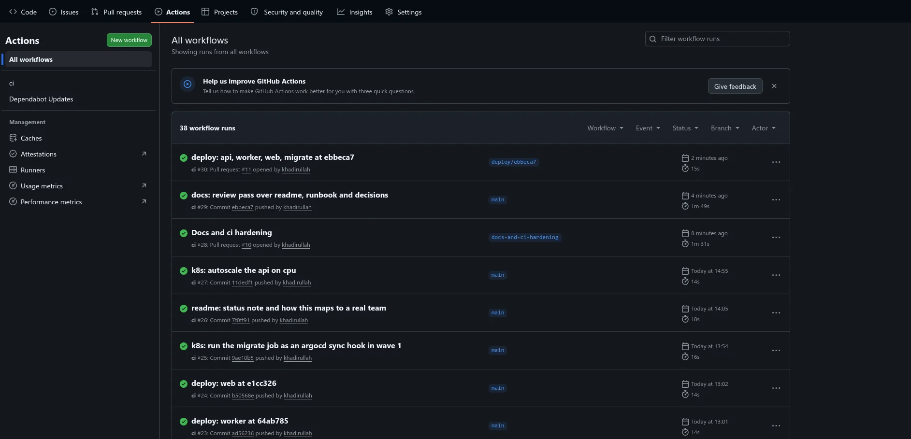
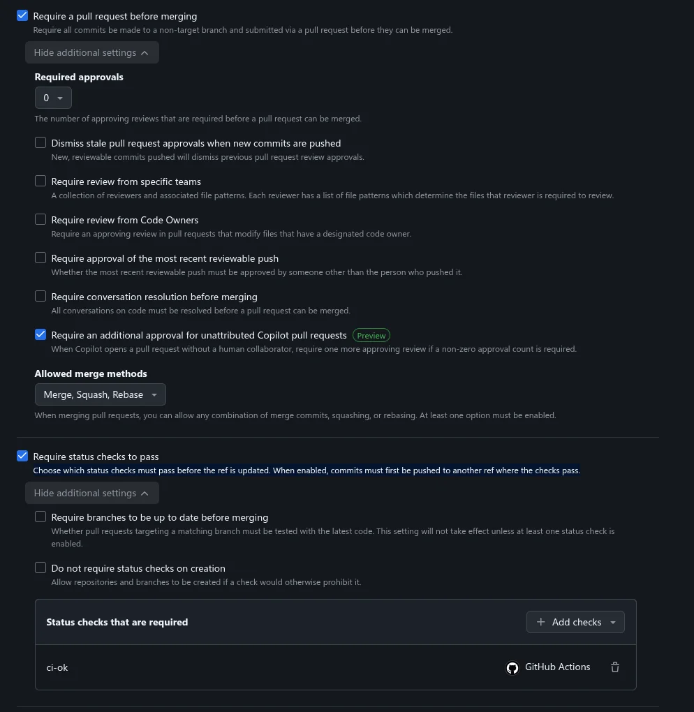
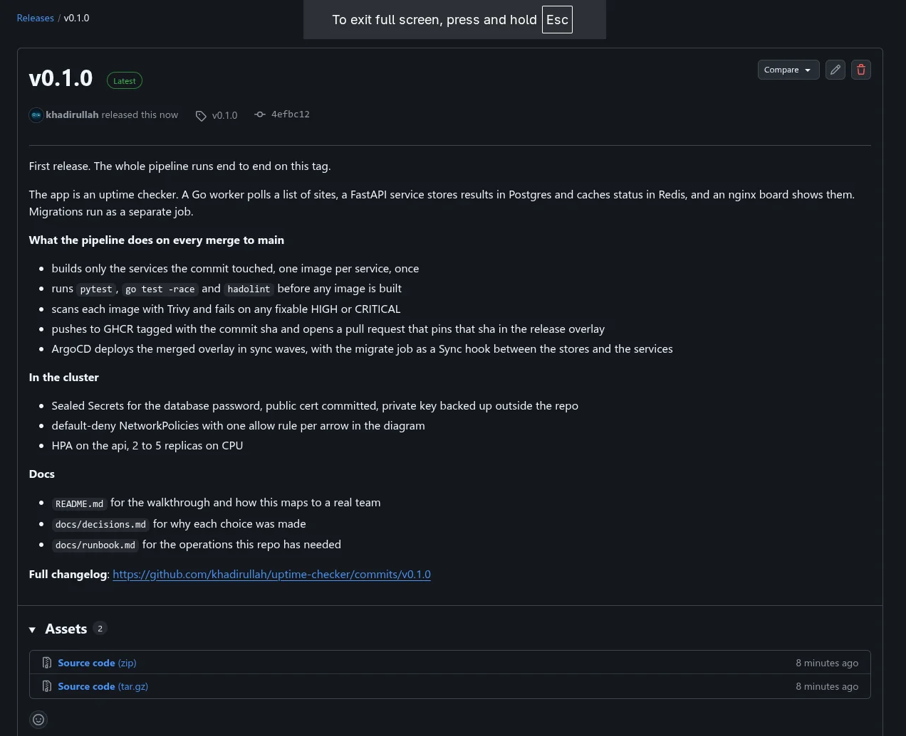
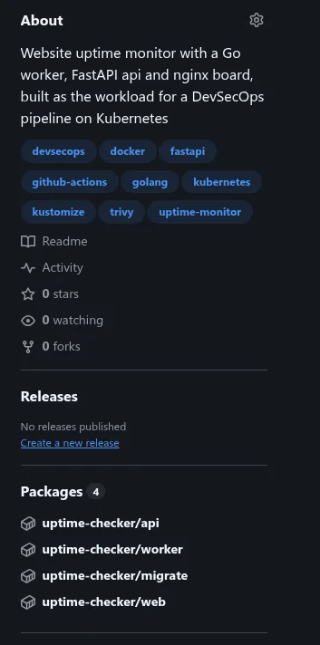


Six services, one pipeline, and the four things that broke on the way to a green deploy.


Most pipeline demos build a hello world. That hides the interesting problems,
because a hello world has no database to migrate, no password to keep out of
git, and no reason to talk to the internet. So I built a small application
first and then the pipeline around it.

The application is [uptime-checker](https://github.com/khadirullah/uptime-checker).
You add URLs, a worker fetches each one every minute, and a board shows which
are up and how fast they answered. Six services in two languages: a FastAPI
api, a Go worker, an nginx board, a one-shot migration job, Postgres 18 and
Redis 8 as both the check queue and the status cache. Deliberately small. The
point is everything around it.


graph LR
    browser(["browser"])
    subgraph runtime ["namespace uptime"]
        web["web nginx, static page"]
        api["api FastAPI, 2 to 5 replicas"]
        worker["worker Go"]
        redis[("redis queue and latest status")]
        postgres[("postgres sites and check history")]
        migrate["migrate job once per deploy"]
    end
    sites(["monitored sites"])
    browser -->|"GET / every 5s"| web
    web -->|"proxy /api/"| api
    api -->|"sites, history"| postgres
    api -->|"status, enqueue"| redis
    worker -->|"pop queue, write status"| redis
    worker -->|"read urls, write results"| postgres
    worker -->|"GET every 60s"| sites
    migrate -->|"apply migrations"| postgres


## What the app does

You open the board, paste a URL, and a tile appears. A minute later the tile
is green with a response time, or red with the reason. That is the whole
product. Six pieces make it happen, and each one exists because the pipeline
needed something real to exercise.



- **web** is nginx serving one static page. The page polls the api every five
  seconds and repaints the tiles. nginx also proxies `/api/` to the api, so
  the browser only ever talks to one host.
- **api** is FastAPI. Add, list and delete sites, read a site's check history,
  and two probe endpoints that are deliberately different: `/healthz` only
  says the process is alive, `/readyz` checks Postgres and Redis. When the
  database goes away the api pods drop out of the Service and come back when
  it returns, with zero restarts. Wiring both probes to the same check is the
  common mistake that turns a database blip into a restart storm.
- **worker** is Go, and the only thing that talks to the internet. Its
  scheduler pushes every site id onto a Redis list once per interval, behind
  a Redis lock so only one replica does it per tick and you can scale the
  worker out without multiplying the checks. Any replica pops an id, fetches
  the URL with a timeout, and writes the result to Postgres and the latest
  status to Redis.
- **redis** is the check queue and the status cache. It has no volume on
  purpose. If it restarts, the queue refills on the next tick and the cache
  is rebuilt from Postgres. At most one minute of checks is lost.
- **postgres** holds the sites and the full check history.
- **migrate** is a 21MB alpine image with `psql` that applies the SQL
  migrations in order and exits. It runs once per deploy. The migrations are
  idempotent, so running it again is harmless, which matters later when
  ArgoCD runs it on every sync.

Adding a site enqueues it immediately, so the first result arrives within
seconds instead of a minute. There are two timers and they are separate
things: the check interval, sixty seconds by default and shown in the board's
footer, and the board refresh, five seconds, which is only how often the
browser asks.

The whole thing runs with `docker compose up --build` on port 8080 for
development, and the same six services run on Kubernetes from the manifests
in `k8s/`. The rest of this post is about the second path.



## What the pipeline does

One GitHub Actions workflow, path filtered. The first job asks which services
a change touched, and everything downstream keys off that answer. A change to
the web page builds and scans the web image and nothing else. A change to
`k8s/` builds nothing.

For each service that changed:

1. Lint the Dockerfile with hadolint.
2. Run the tests. flake8 and pytest with a coverage gate for the api, gofmt,
   vet and the race detector for the worker. Nothing is optional and nothing
   has `--exit-zero`.
3. Build the image once and load it into the runner.
4. Scan that image by its sha tag with Trivy. A fixable HIGH or CRITICAL
   fails the job. Unfixed findings are printed but cannot block, because
   there is nothing a contributor can do about them.
5. Push the same image, the one that was scanned, to GHCR.
6. Open a pull request that pins the release manifests to the new tag.

Merging that pull request is the deploy. ArgoCD watches the release overlay
on `main` and rolls the cluster forward within its next poll.



That scan is also the argument for building on every merge rather than
building once and promoting forever. An image does not get worse, but the
world around it does, and a rebuild picks up the base image fixes for free.

The whole path from a branch to a running pod. Amber is the pull request,
blue is build and scan, green is deploy.



The same path with every job and wave named:


graph TD
    dev["push a branch, open a pull request"] --> ci1["ci on the pull request lint, test, build, scan nothing is pushed"]
    ci1 -->|"ci-ok green, rebase and merge"| main["main"]
    main --> changes["changes which services did this touch?"]
    changes -->|"api/"| ta["test-api"]
    changes -->|"worker/"| tw["test-worker"]
    ta --> build
    tw --> build
    changes -->|"web/, db/"| build["build, one job per service hadolint, build once, trivy, push that image"]
    build --> ghcr[("ghcr.io image:sha")]
    build --> um["update-manifests pin the release overlay, open a deploy/sha pull request"]
    um -->|"ci-ok green, merge"| main2["main release overlay points at :sha"]
    main2 --> argo["argocd polls main every 3 min"]
    argo --> w0["wave 0 namespace, config, sealed secret, policies, postgres, redis"]
    w0 -->|"healthy"| w1["wave 1 migrate job, a sync hook"]
    w1 -->|"completed"| w2["wave 2 api, worker, web rolled to :sha"]
    ghcr -.->|"pulled by"| w2


The last step was not the first design. Originally the pipeline committed the
pin straight to `main` with the workflow's own token. That works until you
protect the branch. A required status check blocks direct pushes of commits
that have no passing check, and the bot's commit never has one. So the deploy
became a pull request. It runs through the same check as everything else, and
a human clicks merge. That is also how most teams do it, for the same reason.


A pull request opened with the built-in workflow token does not trigger any workflow. GitHub does that on purpose to stop loops. The deploy pull request uses a fine-grained token scoped to the one repository, stored as a secret, and it expires yearly. A GitHub App is the version that does not expire.


What that looked like on the day, in order.




The first Dependabot run failed on the path filter step with "Resource not accessible by integration". On a pull request the filter lists changed files through the API, and the workflow token only had read access to contents. Pushes to main were green the whole time, which is what made it confusing.




Fine-grained, one repository, Contents and Pull requests read and write, one year. Stored as a repository secret. The built-in token cannot be used here because pull requests it opens never trigger workflows.




pip, Go modules, the nginx base image and the Actions group, all opened within minutes of the first push, all red for the same reason. Adding pull-requests: read fixed the workflow on main, but an existing pull request does not rerun on its own. Each one got a @dependabot rebase comment.




After the rebase every check passed and the first bot deploy pull request appeared at the top of the list.




Three merges in a row, three one-line pull requests from the pipeline, each pinning one service to its new sha. Merge one, wait for its sync, merge the next. Two from overlapping runs can conflict on the same overlay line.




Eight jobs pass, and update-manifests shows as skipped. It only runs on a push to main, because a pull request must never push an image or touch the release overlay.





## Secrets in a GitOps repo

If ArgoCD applies the manifests from git, the database password has to be
in git. It is, encrypted, as a SealedSecret. The controller in the cluster
holds the only key that can open it. The public half of that key is committed
so anyone can seal a value without cluster access. The private half is backed
up outside git and restored when the cluster is rebuilt, because deleting the
cluster deletes the key and the committed secret becomes unreadable.

Nobody knows the password, including me. `make seal` draws random bytes,
pipes them through kubeseal and writes only the encrypted result. Postgres and
its three clients all read the same Secret, so no human ever needs the value.


graph LR
    seal["make seal openssl rand -hex 24"] --> kubeseal["kubeseal --cert docker image, offline"]
    cert["cert.pem public, committed"] --> kubeseal
    kubeseal --> ss["sealed-secret.yaml encrypted, committed"]
    ss -->|"argocd applies"| ctrl["sealed-secrets controller holds the private key"]
    key["key.yaml private, gitignored, restored on cluster rebuild"] -.-> ctrl
    ctrl --> secret["Secret uptime-db"]
    secret --> postgres["postgres"]
    secret --> api["api"]
    secret --> worker["worker"]
    secret --> migrate["migrate"]





The first version of that target produced base64, and the worker crashed on start with `invalid port ":8n0tV9l" after host`. The password contained a slash.


The api and worker put the password inside a `postgresql://` URL, and
everything after the slash was parsed as a port. The migration job kept
working because it passes the password as a plain environment variable, which
made the failure confusing for a few minutes. The generator now emits hex.
The general lesson is older than Kubernetes. Anything that ends up inside a
URL has to be URL-safe.

Sealed-secrets is the right tool when the cluster is the only thing you have.
With Vault or a cloud secret manager, External Secrets Operator replaces it.
The repo holds a reference, the operator fetches the value at runtime, and
rotation happens in the store. This project has no store, so it has no ESO.

## Network policies, and the CNI that ignored them

The architecture diagram says only the worker reaches the internet, only the
api and the worker reach the database, and the only way in from outside is
the web NodePort. Network policies enforce exactly that. Default deny in both
directions for every pod, then one allow per arrow in the diagram, plus DNS
for everyone.


graph LR
    internet(["internet"])
    nodeport(["nodeport"])
    subgraph ns ["namespace uptime, default deny both ways"]
        web["web"]
        api["api"]
        worker["worker"]
        migrate["migrate"]
        postgres[("postgres")]
        redis[("redis")]
    end
    dns["coredns"]
    nodeport -->|"8080"| web
    web -->|"8000"| api
    api -->|"5432"| postgres
    api -->|"6379"| redis
    worker -->|"5432"| postgres
    worker -->|"6379"| redis
    migrate -->|"5432"| postgres
    worker -->|"80, 443, not private ranges"| internet
    web -.->|"53"| dns
    api -.->|"53"| dns
    worker -.->|"53"| dns
    migrate -.->|"53"| dns


Solid arrows are the only connections allowed. Anything not drawn is dropped.

I wrote the policies, applied a deny-all to a test namespace, and a pod in it
could still reach CoreDNS. kind's default CNI, kindnet, routes packets and
does nothing else. A deny-all policy on it changes nothing. The fix was the
kubernetes-sigs enforcer, a single daemonset that adds enforcement on top of
the existing CNI. The policies themselves are plain `networking.k8s.io/v1`
and move unchanged to Calico, Cilium or a managed cluster.


Then the deny-all still reported "reachable". The test pod was a one-shot that probed in its first hundred milliseconds, before the enforcer had learned the pod's IP. A long-lived pod with `kubectl exec` gave the true answer, blocked, and the enforcer's log showed the drop verdict. Test from a pod that sleeps.


The final check was a matrix of fourteen probes from pods labelled as each
service. All fourteen allowed or blocked as intended, and three sites added
through the NodePort were checked by the worker under policy.



## ArgoCD, and the order things start in

One Application, watching the release overlay on `main`, automated sync with
prune and self heal. Scale a deployment by hand and ArgoCD scales it back in
about ten seconds. `main` is the only way to change what runs.

The migration job needed thought. Kubernetes Jobs are immutable, so the job
is an ArgoCD hook that gets deleted before each new run. And it has to run
after Postgres is up and before the services start. Sync waves do that:
stores in wave 0, the migration in wave 1, the three services in wave 2, and
ArgoCD waits for each wave to be healthy before starting the next.


It is a `Sync` hook, not `PreSync`, on purpose. On a first install Postgres does not exist until the Sync phase, and a PreSync migration would wait for it forever.


The first sync on a fresh namespace took 65 seconds and the pod creation
times showed the order exactly. Postgres and Redis first, the migration
eleven seconds later once they were healthy, the three services ten seconds
after the job completed.





The result of the last sync. Wave 0 is the namespace, config, policies, services and stores. Wave 1 is the migrate Job, a `Sync` hook, Succeeded. Wave 2 is api, web and worker, configured with the new image.



Every deploy is a git revision with its commit message. The top entry is the deploy pull request merge, ten seconds from poll to healthy.



Worker, Postgres with its volume claim, the SealedSecret with the Secret it produced, and the network policies.



One Application. Repository, target revision, path and namespace are the whole configuration.




## Autoscaling on a laptop

The api has a HorizontalPodAutoscaler, 2 to 5 replicas at 60 percent of a
50m CPU request. The target is low on purpose so the behaviour can be seen
on a laptop. Under load from three pods it went 2, 4, 5 within a minute, and
back to 2 about seventy seconds after the load pods were gone.



The Deployment has no replica count of its own. A number there is reapplied
by ArgoCD on every sync and the two fight forever. Remove the field,
Kubernetes defaults to one, and the autoscaler lifts it to its minimum within
one metrics cycle.

## What a company changes

This repo is public, runs on one machine, and has one contributor. A team
setup differs in known places, and each one is a swap rather than a redesign.

- The repo is private, so ArgoCD needs a repository credential and the
  cluster needs an image pull secret.
- Secrets come from a store through External Secrets, not from sealed files.
- The cluster is managed, and its CNI enforces policies without the extra
  daemonset kind needs.
- The deploy token is a GitHub App.
- Images go to the company registry, which scans on push. Trivy in the
  pipeline stays, because failing the build is earlier and cheaper than an
  alert after the push.
- There is no Prometheus, Grafana or alerting yet. The HPA reads
  metrics-server, nothing reads the app. That is the next thing to add, and
  in a company it already exists and the services just expose `/metrics`.

## What I would tell myself at the start

- Protect the branch before designing how the bot writes to it. It changes
  the design.
- Test network policies from a pod that sleeps.
- Check what your CNI actually enforces before trusting a green test.
- Anything that goes into a URL has to be URL-safe. Hex is the easy answer.
- Merge one pull request at a time when each merge opens another one. Two
  deploy pull requests from overlapping runs edit the same line of the
  overlay, and the second one conflicts.
- Write the decision down when you make it. The repo has a
  [decisions file](https://github.com/khadirullah/uptime-checker/blob/main/docs/decisions.md)
  and a [runbook](https://github.com/khadirullah/uptime-checker/blob/main/docs/runbook.md),
  and both were easier to write on the day than they would be a month later.

The code, the pipeline and the manifests are all in the repository, and
`make kind-up` brings the whole thing up on a laptop in about four minutes.








View on GitHub

