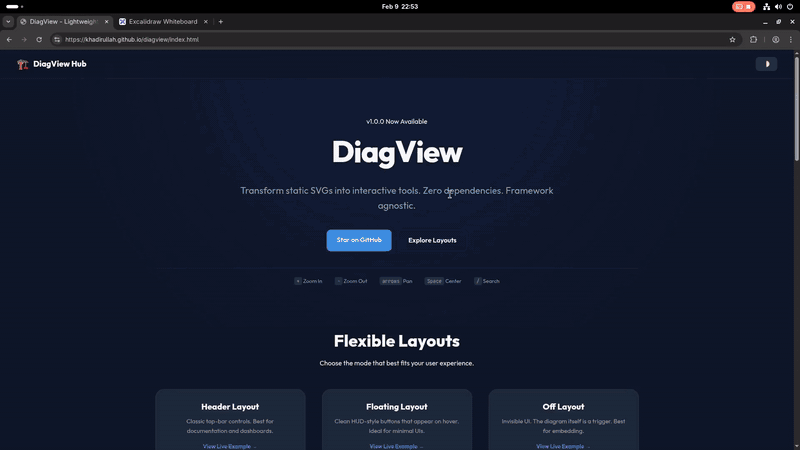
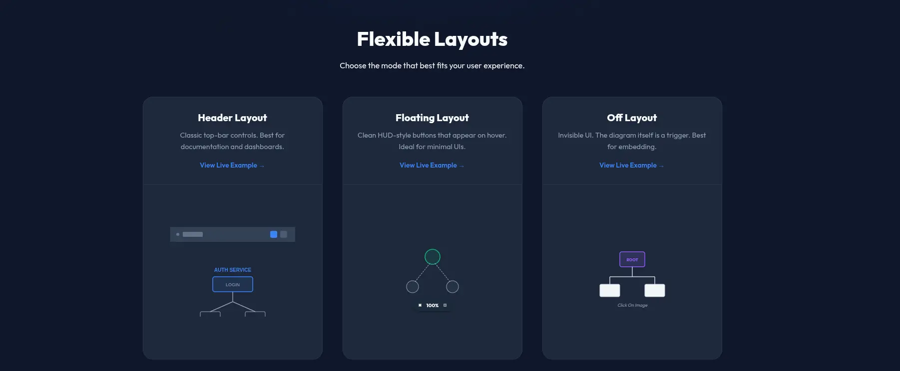

As developers, we love clear documentation. Use Case diagrams, Cloud Architectures, Flowcharts — they are the lifeblood of understanding complex systems. Tools like Mermaid.js, PlantUML, and Draw.io are fantastic for *creating* them.

But **viewing** them? That experience is often stuck in the past.

If you export a complex architecture diagram as an SVG and embed it on your docs site, it's just a static image. The text is too small to read, you can't search for that one specific microservice, and if you zoom with your browser, the whole page breaks.

I looked for a library to solve this. I found **D3.js** (too complex for just viewing) and **Leaflet** (too heavy for a diagram). I didn't want to write hundreds of lines of code just to let a user zoom into a flowchart.

So, I built **DiagView**.

## Demo



## What is DiagView?

**DiagView** is a feature-rich, interactive wrapper that gives your static SVGs superpowers.

It is built on top of the excellent [panzoom](https://github.com/timmywil/panzoom) library, which handles the low-level matrix math for smooth 60fps zooming and panning. But while panzoom gives you the engine, DiagView gives you the entire car.

### Feature Overview

| Feature | Description |
|---------|-------------|
| 🔍 **Deep Search** | Traverses the SVG DOM to find and highlight matching nodes |
| 📤 **Multi-Format Export** | PNG, SVG, PDF, WebP, or copy to clipboard |
| 🎯 **Meeting Mode** | Built-in laser pointer for remote presentations |
| 🔗 **Share Links** | Generate URLs that preserve zoom/pan state |
| ⌨️ **Keyboard Navigation** | Arrows to pan, +/- to zoom, F to search |
| 🌗 **Auto-Theming** | Detects light/dark mode automatically |
| 📱 **Mobile-First Touch** | Pinch-to-zoom, double-tap to reset |

## The Landscape: Why Wasn't This Already Solved?

Before writing any code, I scoured npm and GitHub. Here's what I found:

**D3.js** — The titan of data visualization. But D3 is for *creating* graphics from data, not for *viewing* pre-made SVGs.

**svg-pan-zoom** — A focused library for adding pan/zoom to SVGs. But it's just the engine — no UI, no search, no export.

**Leaflet.js** — The standard for interactive maps. Overkill for a simple flowchart.

**The gap was clear:** I needed a batteries-included solution — something that would just *work* with a single `init()` call.

## Quick Start

### CDN (Fastest)

```html
<!-- Panzoom (optional, for zoom/pan) -->
<script src="https://cdn.jsdelivr.net/npm/@panzoom/panzoom@4.5.1/dist/panzoom.min.js"></script>

<!-- DiagView -->
<script src="https://cdn.jsdelivr.net/npm/diagview@1.0.0/dist/diagview.umd.min.js"></script>

<!-- Your diagram -->
<div class="diagram">
  <svg><!-- Your SVG content --></svg>
</div>

<!-- Initialize -->
<script>
  DiagView.init();
</script>
```

### NPM

```bash
npm install diagview @panzoom/panzoom
```

```javascript
import DiagView from 'diagview';

DiagView.init({
  layout: 'floating',
  accentColor: '#3b82f6',
});
```

## Flexible Layouts

DiagView supports three layout modes to fit your design:



| Layout | Best For |
|--------|----------|
| **Header** | Classic top-bar controls, documentation sites |
| **Floating** | Clean HUD-style buttons on hover, minimal UIs |
| **Off** | Invisible UI, the diagram itself is the trigger |

## Under the Hood: Technical Decisions

### The Search Engine

This was the feature I was most proud of. The search system:

1. **Pre-Caches Candidates** — On first open, queries all text elements and stores them in a WeakMap
2. **Uses Dirty Checking** — Before writing to the DOM, checks if values have changed
3. **Batches Updates** — All DOM mutations are wrapped in requestAnimationFrame

The result? Searching through diagrams with **2,500+ nodes** is instant.

### The Export System

The export module handles edge cases:

- **Robust Dimension Calculation** — Uses getBBox() to find actual content area
- **Cross-Origin Font Handling** — Inlines Google Fonts for consistent exports
- **High-DPI Scaling** — Up to 6x resolution for print-quality images

### Optional Panzoom Dependency

I made panzoom an **optional** peer dependency:

- **With panzoom:** Full zoom, pan, touch gestures
- **Without panzoom:** Fullscreen, search, and export still work

This keeps DiagView usable even in constrained environments.

## Bundle Size

| Metric | Size |
|--------|------|
| **Raw Minified** | ~70 KB |
| **Gzipped (Transfer)** | **~19 KB** |

For context, that's smaller than a single hero image. And it includes all CSS, SVG icons, and the entire UI framework.

## Try It Out

I built this to scratch my own itch. If you write technical documentation for a living, I think you'll find it useful too.

- 🧪 **Live Demo:** [khadirullah.github.io/diagview](https://khadirullah.github.io/diagview/)
- ⭐ **GitHub:** [github.com/khadirullah/diagview](https://github.com/khadirullah/diagview)
- 📦 **NPM:** [npmjs.com/package/diagview](https://www.npmjs.com/package/diagview)

Have feedback or found a bug? [Open an issue on GitHub](https://github.com/khadirullah/diagview/issues).

---

